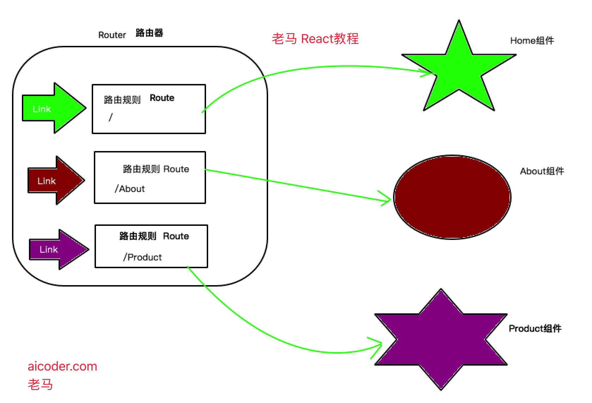

# React Router教程

React项目的可用的路由库是`React-Router`,当然这也是官方支持的。它也分为：

- react-router 核心组件
- react-router-dom 应用于浏览器端的路由库（单独使用包含了react-router的核心部分）
- react-router-native 应用于native端的路由

> 以下教程我们都以Web端为主，所以所有的教程内容都是默认关于`react-router-dom`的介绍。

进行网站（将会运行在浏览器环境中）构建，我们应当安装`react-router-dom`。`react-router-dom`暴露出`react-router`中暴露的对象与方法，因此你只需要安装并引用`react-router-dom`即可。

## Installation | 安装

安装：

```sh
yarn add react-router-dom
# 或者，不使用 yarn
npm install react-router-dom
```

## 路由的基本概念

现在的React Router版本中已不需要路由配置，现在一切皆组件。

ReactRouter中提供了以下三大组件：

- Router是所有路由组件共用的底层接口组件，它是路由规则制定的最外层的容器。
- Route路由规则匹配，并显示当前的规则对应的组件。
- Link路由跳转的组件

当然每个组件下又会有几种不同的子类组件实现。比如：
Router组件就针对不同功能和平台对应用：

- `<BrowserRouter>`  浏览器的路由组件
- `<HashRouter>`    URL格式为Hash路由组件
- `<MemoryRouter>`  内存路由组件
- `<NativeRouter>`  Native的路由组件
- `<StaticRouter>` 地址不改变的静态路由组件

三大组件使用的关系：



如果说我们的应用程序是一座小城的话，那么Route就是一座座带有门牌号的建筑物，而Link就代表了到某个建筑物的路线。有了路线和目的地，那么就缺一位老司机了，没错Router就是这个老司机。

## 第一个Demo

现在你可以复制任意的示例代码，并粘贴到 `src/App.js`。如下：

```jsx
import React, { Component } from 'react';
import { HashRouter as Router, Link, Route } from 'react-router-dom';
import './App.css';

const Home = () => (
  <div>
    <h2>Home</h2>
  </div>
)

const About = () => (
  <div>
    <h2>About</h2>
  </div>
)

const Product = () => (
  <div>
    <h2>Product</h2>
  </div>
)


class App extends Component {
  render() {
    return (
      <Router>
        <div className="App">
          <Link to="/">Home</Link>
          <Link to="/About">About</Link>
          <Link to="/Product">Product</Link>
          <hr/>
          <Route path="/" exact component={Home}></Route>
          <Route path="/about" component={About}></Route>
          <Route path="/product" component={Product}></Route>
        </div>
      </Router>
    );
  }
}

export default App;
```

## Router组件

### BrowserRouter组件

`BrowserRouter`主要使用在浏览器中，也就是WEB应用中。它利用HTML5 的history API来同步URL和UI的变化。当我们点击了程序中的一个链接之后,`BrowserRouter`就会找出与这个`URL`匹配的`Route`，并将他们对应的组件渲染出来。 `BrowserRouter`是用来管理我们的组件的，那么它当然要被放在最顶级的位置，而我们的应用程序的组件就作为它的一个子组件而存在。

```js
import * as React from 'react';
import * as ReactDOM from 'react-dom';
import { BrowserRouter } from 'react-router-dom';

ReactDOM.render(
    <BrowserRouter>
        <App/>
    </BrowserRouter>,
    document.body);

```

`BrowserRouter`组件提供了四个属性。

- `basename`: 字符串类型，路由器的默认根路径
- `forceRefresh`: 布尔类型，在导航的过程中整个页面是否刷新
- `getUserConfirmation`: 函数类型，当导航需要确认时执行的函数。默认是：`window.confirm`
- `keyLength`: 数字类型`location.key` 的长度。默认是 6

#### basename 属性

当前位置的基准 URL。如果你的页面部署在服务器的二级（子）目录，你需要将 `basename` 设置到此子目录。正确的 URL 格式是前面有一个前导斜杠，但不能有尾部斜杠。

例如：有时候我们的应用只是整个系统中的一个模块，应用中的URL总是以 http://localhost/admin/ 开头。这种情况下我们总不能每次定义Link和Route的时候都带上admin吧？react-router已经考虑到了这种情况，所以为我们提供了一个basename属性。为BrowserRouter设置了basename之后，Link中就可以省略掉admin了，而最后渲染出来的URL又会自动带上admin。

```js
<BrowserRouter basename="/admin"/>
    ...
    <Link to="/home"/> // 被渲染为 <a href="/admin/home">
    ...
</BrowserRouter>
```

#### getUserConfirmation: func

当导航需要确认时执行的函数。默认使用 [`window.confirm`](https://developer.mozilla.org/en-US/docs/Web/API/Window/confirm)。

```js
// 使用默认的确认函数
const getConfirmation = (message, callback) => {
  const allowTransition = window.confirm(message)
  callback(allowTransition)
}

<BrowserRouter getUserConfirmation={getConfirmation}/>
```

#### forceRefresh: bool

当设置为 `true` 时，在导航的过程中整个页面将会刷新。
只有当浏览器不支持 [HTML5 的 history API](http://caniuse.com/#feat=history) 时，才设置为 `true`。

```js
const supportsHistory = 'pushState' in window.history
<BrowserRouter forceRefresh={!supportsHistory}/>
```

#### keyLength: number

`location.key` 的长度。默认是 6。

```js
<BrowserRouter keyLength={12}/>
```

#### children: node

渲染[单一子组件（元素）](https://facebook.github.io/react/docs/react-api.html#react.children.only)。

### HashRouter

`HashRouter` 使用 URL 的 hash (例如：`window.location.hash`) 来保持 UI 和 URL 的同步。

>**注意：** 使用 hash 的方式记录导航历史不支持 `location.key` 和`location.state`。在以前的版本中，我们为这种行为提供了 shim，但是仍有一些问题我们无法解。任何依赖此行为的代码或插件都将无法正常使用。由于该技术仅用于支持传统的浏览器，因此在用于浏览器时可以使用 `<BrowserHistory>` 代替。

跟`BrowserRouter`类似，它也有：`basename`、`getUserConfirmation`、`children`属性，而且是一样的。

#### hashType: string

`window.location.hash` 使用的 hash 类型。有如下几种：

- `"slash"` - 后面跟一个斜杠，例如 `#/` 和 `#/sunshine/lollipops`
- `"noslash"` - 后面没有斜杠，例如 `#` 和 `#sunshine/lollipops`
- `"hashbang"` - Google 风格的 ["ajax crawlable"](https://developers.google.com/webmasters/ajax-crawling/docs/learn-more)，例如 `#!/` 和 `#!/sunshine/lollipops`

默认为 `"slash"`。

### MemoryRouter

主要用在ReactNative这种非浏览器的环境中，因此直接将URL的history保存在了内存中。
StaticRouter 主要用于服务端渲染。

## Link组件

Link就像是一个个的路牌，为我们指明组件的位置。Link使用声明式的方式为应用程序提供导航功能，定义的Link最终会被渲染成一个a标签。Link使用to这个属性来指明目标组件的路径，可以直接使用一个字符串，也可以传入一个对象。

```js
import { Link } from 'react-router-dom'
// 字符串参数
<Link to="/query">查询</Link>

// 对象参数
<Link to={{
  pathname: '/query',
  search: '?key=name',
  hash: '#hash',
  state: { fromDashboard: true }
}}>查询</Link>
```

### 属性： to

需要跳转到的路径(pathname)或地址（location）。

### 属性：replace: bool

当设置为 `true` 时，点击链接后将使用新地址替换掉访问历史记录里面的原地址。

当设置为 `false` 时，点击链接后将在原有访问历史记录的基础上添加一个新的纪录。

默认为 `false`。

```js
<Link to="/courses" replace />
```

## NavLink组件

NavLink是一个特殊版本的Link，可以使用activeClassName来设置Link被选中时被附加的class，使用activeStyle来配置被选中时应用的样式。此外，还有一个exact属性,此属性要求location完全匹配才会附加class和style。这里说的匹配是指地址栏中的URl和这个Link的to指定的location相匹配。

```js
// 选中后被添加class selected
<NavLink to={'/'} exact activeClassName='selected'>Home</NavLink>
// 选中后被附加样式 color:red
<NavLink to={'/gallery'} activeStyle={{color:red}}>Gallery</NavLink>
```

> `activeClassName`默认值为 `active`

### 属性

- to 可以是字符串或者对象，同Link组件
- exact 布尔类型，完全匹配时才会被附件class和style
- activeStyle Object类型
- activeClassName 字符串类型
- strict: bool类型，当值为 `true` 时，在确定位置是否与当前 URL 匹配时，将考虑位置 `pathname` 后的斜线。

## Route组件

Route应该是react-route中最重要的组件了，它的作用是当location与Route的path匹配时渲染Route中的Component。如果有多个Route匹配，那么这些Route的Component都会被渲染。

与Link类似，Route也有一个exact属性，作用也是要求location与Route的path**绝对匹配**。

```js
// 当location形如 http://location/时，Home就会被渲染。
// 因为 "/" 会匹配所有的URL，所以这里设置一个exact来强制绝对匹配。
<Route exact path="/" component={Home}/>
<Route path="/about" component={About}/>
```

### Route的三种渲染方式

1. component: 这是最常用也最容易理解的方式，给什么就渲染什么。
1. render: render的类型是function，Route会渲染这个function的返回值。因此它的作用就是附加一些额外的逻辑。

```js
<Route path="/home" render={() => {
    console.log('额外的逻辑');
    return (<div>Home</div>);
    }/>
```

1. children: 这是最特殊的渲染方式。

一、它同render类似,是一个function。不同的地方在于它会被传入一个match参数来告诉你这个Route的path和location匹配上没有。  
二、第二个特殊的地方在于，即使path没有匹配上，我们也可以将它渲染出来。秘诀就在于前面一点提到的match参数。我们可以根据这个参数来决定在匹配的时候渲染什么，不匹配的时候又渲染什么。

```js
// 在匹配时，容器的calss是light，<Home />会被渲染
// 在不匹配时，容器的calss是dark，<About />会被渲染
<Route path='/home' children={({ match }) => (
    <div className={match ? 'light' : 'dark'}>
      {match ? <Home/>:<About>}
    </div>
  )}/>
```

所有路由中指定的组件将被传入以下三个 props 。

- match.
- location.
- history.

这里主要说下match.params.透过这个属性，我们可以拿到从location中解析出来的参数。当然，如果想要接收参数，我们的Route的path也要使用特殊的写法。

如下示例，三个Link是一个文章列表中三个链接，分别指向三篇id不同的文章。而Route用于渲染文章详情页。注意path='/p/:id' ，location中的对应的段会被解析为id=1 这样的键值。最终这个键值会作为param的键值存在。Route中的组件可以使用this.props.match.params.id来获取，示例中使用了结构赋值。

```js
<Link to='/p/1' />
<Link to='/p/2' />
<Link to='/p/3' />
......
<Route path='/p/:id' render={(match)=<h3>当前文章ID:{match.params.id}</h3>)} />
```

### location

Location 是指你当前的位置，下一步打算去的位置，或是你之前所在的位置，形式大概就像这样：

```js
{
  key: 'ac3df4', // 在使用 hashHistory 时，没有 key
  pathname: '/somewhere'
  search: '?some=search-string',
  hash: '#howdy',
  state: {
    [userDefined]: true
  }
}
```

你使用以下几种方式来获取 location 对象：

- 在 [Route component](./Route.md#component) 中，以 `this.props.location` 的方式获取，
- 在 [Route render](./Route.md#render-func) 中，以 `({ location }) => ()` 的方式获取，
- 在 [Route children](./Route.md#children-func) 中，以 `({ location }) => ()` 的方式获取，
- 在 [withRouter](./withRouter.md) 中，以 `this.props.location` 的方式获取。

你也可以在 `history.location` 中获取 location 对象，但是别那么写，因为 history 是可变的。更多信息请参见 [history 文档](./history.md)。

location 对象不会发生改变，因此你可以在生命周期的钩子函数中使用 location 对象来查看当前页面的位置是否发生改变，这种技巧在获取远程数据以及使用动画时非常有用。

```js
componentWillReceiveProps(nextProps) {
  if (nextProps.location !== this.props.location) {
    // 已经跳转了！
  }
}
```

通常情况下，你只需要给一个字符串当做 location ，但是，当你需要添加一些 location 的状态时，你可以对象的形式使用 location 。并且当你需要多个 UI ，而这些 UI 取决于历史时，例如弹出框（modal），使用location 对象会有很大帮助。

```jsx
// 通常你只需要这样使用 location
<Link to="/somewhere"/>

// 但是你同样可以这么用
const location = {
  pathname: '/somewhere'
  state: { fromDashboard: true }
}

<Link to={location}/>
<Redirect to={location}/>
history.push(location)
history.replace(location)
```

最后，你可以把 location 传入一下组件：

- [Route]
- [Switch]

这样做可以让组件不使用路由状态（router state）中的真实 location，因为我们有时候需要组件去渲染一个其他的 location 而不是本身所处的真实 location，比如使用动画或是等待跳转时。

### history

本文档中的「history」以及「`history`对象」请参照 [`history` 包](https://github.com/ReactTraining/history)中的内容。
History 是 React Router 的两大重要依赖之一（除去 React 本身），在不同的 Javascript 环境中，`history` 以多种形式实现了对于 session 历史的管理。

我们会经常使用以下术语：

- 「browser history」 - history 在 DOM 上的实现，经常使用于支持 HTML5 history API 的浏览器端。
- 「hash history」 - history 在 DOM 上的实现，经常使用于旧版本浏览器端。
- 「memory history」 - 一种存储于内存的 history 实现，经常用于测试或是非 DOM 环境（例如 React Native）。

`history` 对象通常会具有以下属性和方法：

- `length` -（ number 类型）指的是 history 堆栈的数量。
- `action` -（ string 类型）指的是当前的动作（action），例如 `PUSH`，`REPLACE` 以及 `POP` 。
- `location` -（ object类型）是指当前的位置（location），location 会具有如下属性：
  - `pathname` -（ string 类型）URL路径。
  - `search` -（ string 类型）URL中的查询字符串（query string）。
  - `hash` -（ string 类型）URL的 hash 分段。
  - `state` -（ string 类型）是指 location 中的状态，例如在 `push(path, state)` 时，state会描述什么时候 location 被放置到堆栈中等信息。这个 state 只会出现在 browser history 和 memory history 的环境里。
- `push(path, [state])` -（ function 类型）在 hisotry 堆栈顶加入一个新的条目。
- `replace(path, [state])` -（ function 类型）替换在 history 堆栈中的当前条目。
- `go(n)` -（ function 类型）将 history 对战中的指针向前移动 `n` 。
- `goBack()` -（ function 类型）等同于 `go(-1)` 。
- `goForward()` -（ function 类型）等同于 `go(1)` 。
- `block(prompt)` -（ function 类型）阻止跳转，（请参照 [history 文档](https://github.com/ReactTraining/history#blocking-transitions)）

### match

`match` 对象包含了 `<Route path>` 如何与URL匹配的信息。`match` 对象包含以下属性：

- `params` -（ object 类型）即路径参数，通过解析URL中动态的部分获得的键值对。
- `isExact` - 当为 `true` 时，整个URL都需要匹配。
- `path` -（ string 类型）用来做匹配的路径格式。在需要嵌套 `<Route>` 的时候用到。
- `url` -（ string 类型）URL匹配的部分，在需要嵌套 `<Link>` 的时候会用到。

你可以在以下地方获取 `match` 对象：

- 在 Route component 中，以 `this.props.match` 方式。
- 在 Route render中，以 `({ match }) => ()` 方式。
- 在 Route children中，以 `({ match }) => ()` 方式

## Redirect组件

当这个组件被渲染是，location会被重写为Redirect的to指定的新location。它的一个用途是登录重定向，比如在用户点了登录并验证通过之后，将页面跳转到个人主页。

```js
<Redirect to="/new"/>
```

## Switch组件

渲染匹配地址(location)的第一个 `<Route>`或者`<Redirect>`

**这与只使用一堆`<Route>`有什么不同？**

`<Switch>`的独特之处是独它*仅仅*渲染一个路由。相反地，*每一个包含*匹配地址(location)的`<Route>`都会被渲染。思考下面的代码：

```js
<Route path="/about" component={About}/>
<Route path="/:user" component={User}/>
<Route component={NoMatch}/>
```

如果现在的URL是 `/about` ，那么  `<About>`, `<User>`, 还有 `<NoMatch>` 都会被渲染，因为它们都与路径(path)匹配。这种设计，允许我们以多种方式将多个 `<Route>` 组合到我们的应用程序中，例如侧栏(sidebars)，面包屑(breadcrumbs)，bootstrap tabs等等。
然而，偶尔我们只想选择一个`<Route>` 来渲染。如果我们现在处于 `/about` ，我们也不希望匹配 `/:user` （或者显示我们的 "404" 页面 ）。以下是使用 `Switch` 的方法来实现：

```js
import { Switch, Route } from 'react-router'

<Switch>
  <Route exact path="/" component={Home}/>
  <Route path="/about" component={About}/>
  <Route path="/:user" component={User}/>
  <Route component={NoMatch}/>
</Switch>
```

现在，如果我们处于 `/about`, `<Switch>` 将开始寻找匹配的 `<Route>`。 `<Route path="/about"/>` 将被匹配， `<Switch>` 将停止寻找匹配并渲染`<About>`。 同样，如果我们处于 `/michael` ， `<User>` 将被渲染。

这对于过渡动画也是起作用的，因为匹配的 `<Route>` 在与前一个相同的位置被渲染。

```js
<Fade>
  <Switch>
    {/* there will only ever be one child here */}
    {/* 这里只会有一个子节点 */}
    <Route/>
    <Route/>
  </Switch>
</Fade>

<Fade>
  <Route/>
  <Route/>
  {/* there will always be two children here,
      one might render null though, making transitions
      a bit more cumbersome to work out */}
   {/* 这里总是有两个子节点,
      一个可能会渲染为null, 使计算过渡增加了一点麻烦 */}    
</Fade>
```

## 路由配置

```js
import React from "react";
import { BrowserRouter as Router, Route, Link } from "react-router-dom";

// Some folks find value in a centralized route config.
// A route config is just data. React is great at mapping
// data into components, and <Route> is a component.

////////////////////////////////////////////////////////////
// first our route components
const Main = () => <h2>Main</h2>;

const Sandwiches = () => <h2>Sandwiches</h2>;

const Tacos = ({ routes }) => (
  <div>
    <h2>Tacos</h2>
    <ul>
      <li>
        <Link to="/tacos/bus">Bus</Link>
      </li>
      <li>
        <Link to="/tacos/cart">Cart</Link>
      </li>
    </ul>

    {routes.map((route, i) => <RouteWithSubRoutes key={i} {...route} />)}
  </div>
);

const Bus = () => <h3>Bus</h3>;
const Cart = () => <h3>Cart</h3>;

////////////////////////////////////////////////////////////
// then our route config
const routes = [
  {
    path: "/sandwiches",
    component: Sandwiches
  },
  {
    path: "/tacos",
    component: Tacos,
    routes: [
      {
        path: "/tacos/bus",
        component: Bus
      },
      {
        path: "/tacos/cart",
        component: Cart
      }
    ]
  }
];

// wrap <Route> and use this everywhere instead, then when
// sub routes are added to any route it'll work
const RouteWithSubRoutes = route => (
  <Route
    path={route.path}
    render={props => (
      // pass the sub-routes down to keep nesting
      <route.component {...props} routes={route.routes} />
    )}
  />
);

const RouteConfigExample = () => (
  <Router>
    <div>
      <ul>
        <li>
          <Link to="/tacos">Tacos</Link>
        </li>
        <li>
          <Link to="/sandwiches">Sandwiches</Link>
        </li>
      </ul>

      {routes.map((route, i) => <RouteWithSubRoutes key={i} {...route} />)}
    </div>
  </Router>
);

export default RouteConfigExample;
```
