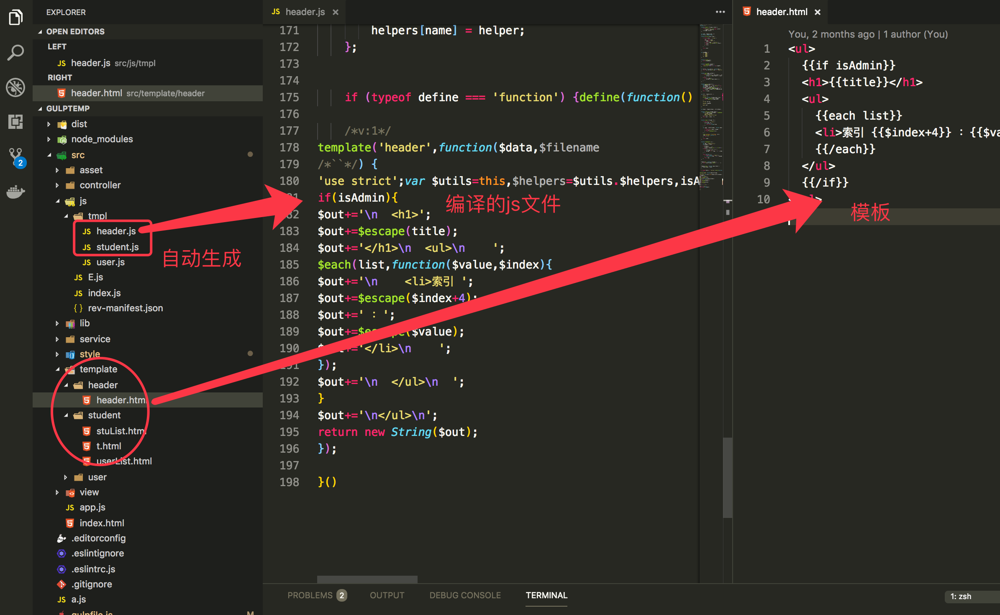

# 高性能前端 art-template 模板

官网： https://aui.github.io/art-template/zh-cn/index.html

## nodejs 服务器端使用

第一步： 引入 art-template 的包

```shell
npm install --save art-template
npm install --save express-art-template
```

第二步：项目中设置 express 的应用 art-template 模板引擎

```js
const art_express = require('express-art-template');

const app = express(); // 创建app对象。

// 设置art的模板引擎
app.engine('art', art_express);

app.get('/user/list', (req, res) => {
  res.render('users/userlist2.art', {
    title: '你好啊！',
    users: userService.getUsers()
  });
});
```

## 核心方法

```js
// 基于模板名渲染模板
template(filename, data);

// 将模板源代码编译成函数
template.compile(source, options);

// 将模板源代码编译成函数并立刻执行
template.render(source, data, options);
```

## 浏览器端使用

下载：[lib/template-web.js（gzip: 6kb）](https://raw.githubusercontent.com/aui/art-template/master/lib/template-web.js)

因为浏览器不支持文件系统，所以 `template(filename, data)` 不支持传入文件路径，它内部使用 `document.getElementById(filename).innerHTML` 来获取模板，例如：

```html
<script src="lib/template-web.js"></script>
<script id="tpl-user" type="text/html">
{{if user}}
  <h2>{{user.name}}</h2>
{{/if}}
</script>
```

兼容到 IE8 的实例：

```html
<!DOCTYPE HTML>
<html>
<head>
<meta charset="UTF-8">
<title>IE</title>

<!--<script src="https://cdnjs.cloudflare.com/ajax/libs/es5-shim/4.5.7/es5-shim.min.js"></script>
<script src="https://cdnjs.cloudflare.com/ajax/libs/es5-shim/4.5.7/es5-sham.min.js"></script>
<script src="https://cdnjs.cloudflare.com/ajax/libs/json3/3.3.2/json3.min.js"></script>-->
<script src="es5-shim.min.js"></script>
<script src="es5-sham.min.js"></script>
<script src="json3.min.js"></script>

<script src="../../lib/template-web.js"></script>
</head>

<body>
<div id="content"></div>
<script id="test" type="text/html">
{{if isAdmin}}

<h1>{{title}}</h1>
<ul>
    {{each list value i}}
        <li>索引 {{i + 1}} ：{{value}}</li>
    {{/each}}
</ul>

{{/if}}
{{$data}}
</script>

<script>
var data = {
	title: '基本例子',
	isAdmin: true,
	list: ['文艺', '博客', '摄影', '电影', '民谣', '旅行', '吉他']
};
var html = template('test', data);
document.getElementById('content').innerHTML = html;
</script>
</body>
</html>
```

## 基本语法

### 输出

- 输出标准语法

```html
{{value}}
{{data.key}}
{{data['key']}}
{{a ? b : c}}
{{a || b}}
{{a + b}}
```

- 原始语法

```html
<%= value %>
<%= data.key %>
<%= data['key'] %>
<%= a ? b : c %>
<%= a || b %>
<%= a + b %>
```

模板一级特殊变量可以使用 `$data` 加下标的方式访问：

`{{$data['user list']}}`

### 原文输出

- 原文输出标准语法

`{{@ value }}`

- 原始语法

`<%- value %>`

> 原文输出语句不会对 HTML 内容进行转义处理，可能存在安全风险，请谨慎使用。

### 条件语法

- 条件标准语法

```html
{{if value}} ... {{/if}}
{{if v1}} ... {{else if v2}} ... {{/if}}
```

- 原始语法

```html
<% if (value) { %> ... <% } %>
<% if (v1) { %> ... <% } else if (v2) { %> ... <% } %>
```

### 循环

- 循环标准语法

```html
{{each target}}
{{$index}} {{$value}}
{{/each}}
```

- 原始语法

```html
<% for(var i = 0; i < target.length; i++){ %>
<%= i %> <%= target[i] %>
<% } %>
```

`target` 支持 `array` 与 `object` 的迭代，其默认值为 $data。
`$value` 与 `$index` 可以自定义：`{{each target val key}}`。变量标准语法

`{{set temp = data.sub.content}}`
原始语法

`<% var temp = data.sub.content; %>`

### 模板继承

- 模板继承标准语法

```html
{{extend './layout.art'}}
{{block 'head'}} ... {{/block}}
```

- 原始语法

```html
<% extend('./layout.art') %>
<% block('head', function(){ %> ... <% }) %>
```

模板继承允许你构建一个包含你站点共同元素的基本模板“骨架”。范例：

```html
<!--layout.art-->
<!doctype html>
<html>
<head>
    <meta charset="utf-8">
    <title>{{block 'title'}}My Site{{/block}}</title>

    {{block 'head'}}
    <link rel="stylesheet" href="main.css">
    {{/block}}

</head>
<body>
    {{block 'content'}}{{/block}}
</body>
</html>
<!--index.art-->
{{extend './layout.art'}}

{{block 'title'}}{{title}}{{/block}}

{{block 'head'}}

<link rel="stylesheet" href="custom.css">
{{/block}}

{{block 'content'}}

<p>This is just an awesome page.</p>
{{/block}}
```

渲染 index.art 后，将自动应用布局骨架。

### 子模板

- 子模板标准语法

```html
{{include './header.art'}}
{{include './header.art' data}}
```

- 原始语法

```html
<% include('./header.art') %>
<% include('./header.art', data) %>
```

`data` 数默认值为 `$data`；标准语法不支持声明 `object` 与 `array`，只支持引用变量，而原始语法不受限制。
`art-template` 内建 HTML 压缩器，请避免书写 HTML 非正常闭合的子模板，否则开启压缩后标签可能会被意外“优化。过滤器注册过滤器

`template.defaults.imports.dateFormat = function(date, format){/_[code..]_/};`
`template.defaults.imports.timestamp = function(value){return value \* 1000};`

### 过滤器函数

过滤器函数第一个参数接受目标值。

- 标准语法

```html
{{date | timestamp | dateFormat 'yyyy-MM-dd hh:mm:ss'}}
{{value | filter}} 过滤器语法类似管道操作符，它的上一个输出作为下一个输入。
```

- 原始语法

```html
<%= $imports.dateFormat($imports.timestamp(date), 'yyyy-MM-dd hh:mm:ss') %>
```

## 配合 gulp 自动化预编译

前端使用`art-template`的时候非常不方便，不能把模板拆成单独的模板文件，[TmodJS](https://github.com/aui/tmodjs)（原名 atc)可以把模板预编译成 js，直接解放了生产力。
当然如果你用 webpack，自然有对应的 loader。但是我们这次要讲的是 gulp。

对应 gulp 的插件：[gulp-tmod](https://github.com/lichunqiang/gulp-tmod)

### 安装 gulp-tmod

```sh
$ npm install gulp-tmod --save-dev
```

### 配置 gulpfile.js 文件

```js
const tmodjs = require('gulp-tmod');
gulp.task('tpl', function() {
  gulp
    .src('src/template/**/*.html') // 找到所有的html模板
    .pipe(
      tmodjs({
        templateBase: 'src/template/', // 模板根目录
        runtime: 'tpl.js', // 输出的js文件
        compress: false // 是否压缩
      })
    )
    // 自动生成的模板文件，进行babel转换，会报错，此转换插件已经停更，所以间接改这个bug
    // 参考bug：https://github.com/aui/tmodjs/issues/112 主要是this  →  window
    .pipe(replace('var String = this.String;', 'var String = window.String;'))
    .pipe(gulp.dest('src/js/tmpl/'));
});
```

使用选项设置：

- output
  Default: false

We use gulp steam other than tmodjs output, so set it to false prevent tmodjs create files.

- runtime
  Type: String

Default: template.js

This will be use as a path pass to gulp-util File

- templateBase
  Default: \_\_dirname

Your template basepath.

- minify
  Minify is deprecated, we should use gulp-uglify

如果想把不同的模板文件夹生成不同的 js 文件，那么下面的例子：

```js
const tmodjs = require('gulp-tmod');
gulp.task('tpl', function() {
  // 拿到所有的路径
  let basePath = path.join(__dirname, 'src/template');
  let files = fs.readdirSync(basePath);
  files.forEach((val, index) => {
    let dirPath = path.join(basePath, val);
    let stat = fs.statSync(dirPath);
    if (!stat.isDirectory()) {
      // 判断是否是文件夹
      return;
    }
    var fileter = 'src/template/' + val + '/**/*.html';
    console.log(fileter);
    gulp
      .src('src/template/' + val + '/**/*.html')
      .pipe(
        tmodjs({
          templateBase: 'src/template/' + val,
          runtime: val + '.js',
          compress: false
        })
      )
      // 自动生成的模板文件，进行babel转换，会报错，此转换插件已经停更，所以间接改这个bug
      // 参考bug：https://github.com/aui/tmodjs/issues/112 主要是this  →  window
      .pipe(replace('var String = this.String;', 'var String = window.String;'))
      .pipe(gulp.dest('src/js/tmpl/'));
  });
});
```



### 配合 require.js

```js
/*
 * @Author: malun
 * @Date: 2018-04-18 01:14:20
 * @Last Modified by: malun
 * @Last Modified time: 2018-06-11 19:57:24
 */

require(['template', 'jquery', 'js/tmpl/user', 'js/tmpl/header'], function(
  template,
  $,
  userTpl,
  headTpl
) {
  document.getElementById('dt').innerHTML = headTpl('header', data);

  $.ajax({
    url: '/api/shoplist',
    type: 'GET',
    success: function(data) {
      document.getElementById('dt2').innerHTML = userTpl('footer', data);
    }
  });
});
```
