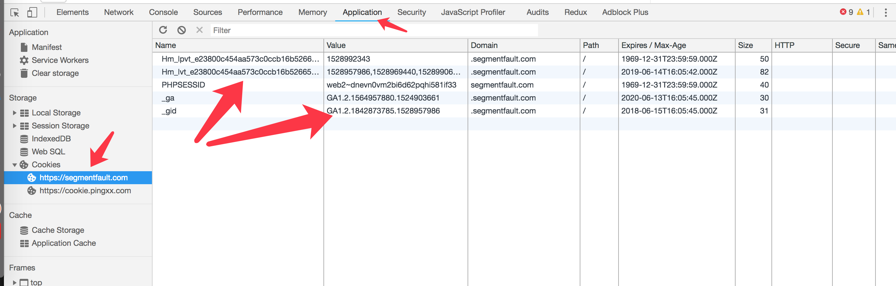

# cookie 详解

HTTP Cookie（也叫 Web Cookie 或浏览器 Cookie）是服务器发送到用户浏览器并保存在本地的一小块数据，它会在浏览器下次向同一服务器再发起请求时被携带并发送到服务器上。通常，它用于告知服务端两个请求是否来自同一浏览器，如保持用户的登录状态。Cookie 使基于无状态的 HTTP 协议记录稳定的状态信息成为了可能。

Cookie 曾一度用于客户端数据的存储，因当时并没有其它合适的存储办法而作为唯一的存储手段，但现在随着现代浏览器开始支持各种各样的存储方式，Cookie 渐渐被淘汰。由于服务器指定 Cookie 后，浏览器的每次请求都会携带 Cookie 数据，会带来额外的性能开销（尤其是在移动环境下）。新的浏览器 API 已经允许开发者直接将数据存储到本地，如使用 Web storage API （本地存储和会话存储）或 IndexedDB 。

## cookie 的应用

Cookie 用于以下几个方面：

- 购物车（网购）
- 自动登录（登录账号时的自动登录）
- 精准广告
- 平常浏览网页时有时会推出商品刚好是你最近浏览过，买过的类似东西，这些是通过 cookie 记录的。
- 记住登录状态

## cookie 的构成

- 名称：一个唯一确定 cookie 的名称，部分大小写，cookie 的名字必须是经过 URL 编码的，一般可以采用某个前缀在加上当前时间的做法，这样的话名称能够确保是唯一的，也比较方便。
- 值：存储在 cookie 中的字符串值，必须经过被 URL 编码
- 域：对于哪个域是有效的，如果没有设置的话，默认来自设置 cookie 的那个域，在上诉例子中就是.Mozilla.org
- 失效时间：表示 cookie 何时应该被删除的时间戳，这个日期是 GMT 格式的日期，如果设置是以前的时间，cookie 会被立刻删除。
- 路径：指定域中的那个路径，应该想服务器发送 cookie，/ 表示没有限制
- 安全标志：指定以后，cookie 只有在使用 SSL 连接的时候才可以发送到服务器。

chrome 的实际截图如：


## cookie 的管理

cookie 可以通过服务器端返回响应头`Set-Cookie: <cookie名>=<cookie值>`来修改浏览器的端的 cookie，当然这个就不展开了，每种后台语言都很容易处理。

客户端处理 cookie，可以用原生的 js 来控制，另外也可以通过[js-cookie](https://github.com/js-cookie/js-cookie)插件。

### 添加 cookie

引入脚本

```html
<script src="https://cdn.jsdelivr.net/npm/js-cookie@2/src/js.cookie.min.js"></script>
```

添加 cookie

```js
// Create a cookie, valid across the entire site:
Cookies.set('name', 'value');

// Create a cookie that expires 7 days from now, valid across the entire site:
Cookies.set('name', 'value', { expires: 7 });

// Create an expiring cookie, valid to the path of the current page:
Cookies.set('name', 'value', { expires: 7, path: '' });
```

## 读取 cookie

读取具名的 cookie

```js
Cookies.get('name'); // => 'value'
Cookies.get('nothing'); // => undefined
```

读取所有的 cookie

```js
Cookies.get(); // => { name: 'value' }
```

## 移除 cookie

```js
Cookies.set('name', 'value', { path: '' });
Cookies.remove('name'); // fail!
Cookies.remove('name', { path: '' }); // removed!
```

## json 数据

```js
Cookies.set('name', { foo: 'bar' });
Cookies.get('name'); // => '{"foo":"bar"}'
Cookies.get(); // => { name: '{"foo":"bar"}' }

Cookies.getJSON('name'); // => { foo: 'bar' }
Cookies.getJSON(); // => { name: { foo: 'bar' }
```

## 设置过期时间

```js
Cookies.set('name', 'value', { expires: 365 });
Cookies.get('name'); // => 'value'
Cookies.remove('name');
```

## 设置路径

```js
Cookies.set('name', 'value', { path: '' });
Cookies.get('name'); // => 'value'
Cookies.remove('name', { path: '' });
```

## 设置 domain

```js
Cookies.set('name', 'value', { domain: 'subdomain.site.com' });
Cookies.get('name'); // => undefined (need to read at 'subdomain.site.com')
```

## cookie 的相关限制

- IE6 以及更低版本限制每个域名最多 20 个 cookie
- IE7 之后的版本每个域名最多 50 个。
- Firefox 限制每个与最多 50 个 cookie（未确认）
- Safari 和 Chrome 对于每个域的 cookie 数量限制没有硬性规定。
- 大多数浏览器 4096B 的长度限制，为了兼容多种浏览器，最好将长度限制在 4095B 以内.
- 每个 domain 最多只能有 20 条 cookie
- cookie 会随着 http 请求发送到后台，增加了额外的请求流量

## 总结

已经被淘汰的东西了，请使用 Web storage API （本地存储和会话存储）或 IndexedDB
