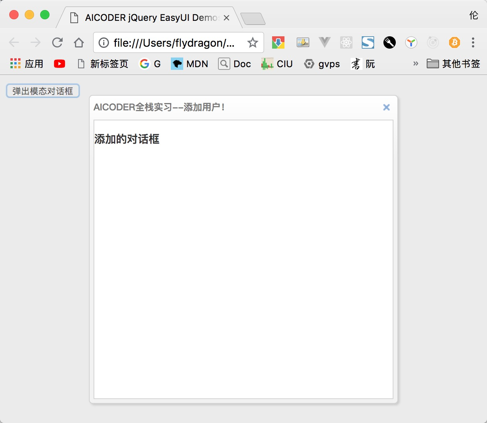
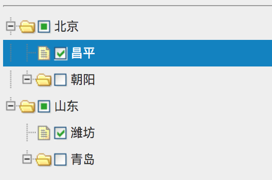

# jQuery EasyUI 详解

## EasyUI 简介

`easyui` 是一种基于 `jQuery` 的用户界面插件集合。

`easyui` 为创建现代化，互动，JavaScript 应用程序，提供必要的功能。

使用 `easyui` 你不需要写很多代码，你只需要通过编写一些简单 HTML 标记，就可以定义用户界面。

`easyui` 是个完美支持 HTML5 网页的完整框架。

`easyui` 节省您网页开发的时间和规模。

`easyui` 很简单但功能强大的。

官网地址：[http://www.jeasyui.com/index.php](http://www.jeasyui.com/index.php)

文档地址：

- [中文文档](http://www.jeasyui.net/tutorial/)
- [英文文档](http://www.jeasyui.com/documentation/index.php)

## 快速入门 弹出对话框 demo

**第一步： 下载** [Jquery EasyUI](https://files.cnblogs.com/files/fly_dragon/jquery-easyui-1.5.5.2.zip)

你在使用和进行开发时，请遵守官方相应的条款，尊重他们的知识版权。

目前官方最新版本是：jQuery EasyUI 1.5，官方提供了两个版本供下载，GPL 版本和商业版本，你根据自己的需要下载

- GPL 版本
  GPL 版本在 GPl 协议下有效，你能在任何遵循 GPl 协议的项目下使用它。
- 商业版本
  商业版在 Commercial 协议下有效，你能在任何非 GPL/专有的协议下使用。

**第二步：创建 html 文件，并添加相关引用**

创建项目的文件夹

```dir
easydemo                            // 项目根目录
├── index.html                      // 我们的测试页面
└── lib                             // 第三方组件
    └── jquery-easyui-1.5.5.2       // 下载的easyui的压缩包解压后的文件夹
        ├── easyloader.js           // easyui的动态加载组件的js
        ├── jquery.easyui.min.js    // 压缩后的包！！！关键！！
        ├── jquery.easyui.mobile.js
        ├── jquery.min.js           // 依赖的jq的文件
        ├── locale                  // 本地语言的文件夹
        ├── plugins                 // 拆分的组件
        └── themes                  // 样式主题文件夹
```

**第三步： 修改 index.html 文件**

```html
<!DOCTYPE html>
<html lang="en">
<head>
  <meta charset="UTF-8">
  <meta name="viewport" content="width=device-width, initial-scale=1.0">
  <meta http-equiv="X-UA-Compatible" content="ie=edge">
  <!-- easyui的样式，可以选择其他主题 -->
  <link rel="stylesheet" href="./lib/jquery-easyui-1.5.5.2/themes/bootstrap/easyui.css">
  <!-- easyui的图标css文件 -->
  <link rel="stylesheet" href="./lib/jquery-easyui-1.5.5.2/themes/icon.css">
  <!-- easyui 依赖jq -->
  <script src="./lib/jquery-easyui-1.5.5.2/jquery.min.js"></script>
  <!-- jq easyui的js脚本 -->
  <script src="./lib/jquery-easyui-1.5.5.2/jquery.easyui.min.js"></script>
  <!-- 引用语言包 -->
  <script src="./lib/jquery-easyui-1.5.5.2/locale/easyui-lang-zh_CN.js"></script>

  <title>AICODER jQuery EasyUI Demos</title>
</head>
<body>
  <!-- 功能：点击按钮弹出模态对话框 -->
  <input type="button" value="弹出模态对话框" id="btnOpenDialog">

  <!-- 设置弹出来的对话框div，首先设置为隐藏 -->
  <div id="addDialog" style="display: none;">
    <h3>添加的对话框</h3>
  </div>
  <script>
    $(function () {
      $('#btnOpenDialog').on('click', function () {
        // 弹出对话框
        $('#addDialog').dialog({
          modal: true,  // 是否是模态对话框
          title: 'AICODER全栈实习--添加用户！',  // 弹出来的窗口的标题
          width: 400, // 窗口的宽度
          height: 400, // 窗口的高度
        });
      });
    });
  </script>
</body>
</html>
```

结果如下：



## easyui 的布局

jq easyui 把网页分成了 `上`、`下`、`左`、`中`、`右`，分别对应：`North`、`South`、`West`、`Center`、`East`。

easyui 增加了自定义的属性：`data-options`，通过它可以设置 easyui 组件的选项。

```html
<body class="easyui-layout">
  <div data-options="region:'north',split:true" style="height:100px;"></div>
  <div data-options="region:'south',split:true" style="height:100px;"></div>
  <div data-options="region:'east',title:'East',split:true" style="width:100px;"></div>
  <div data-options="region:'west',title:'West',split:true" style="width:100px;"></div>
  <div data-options="region:'center',title:'center title'" style="padding:5px;background:#eee;">
    <input type="button" value="弹出模态对话框" id="btnOpenDialog">
  </div>
</body>
```

### 布局区域选项说明

| 选项          | 类型      | 说明                                                | 默认值   |
|-------------|---------|---------------------------------------------------|-------|
| region      | String  | 所处的方位，可取值：`North`、`South`、`West`、`Center`、`East`  | null  |
| title       | String  | 区域的标题                                             | null  |
| split       | Boolean | 是否跟其他区域进行分离（增加外边距)                                | false |
| href        | String  | 从后台获取 html，并显示在此区域                                | null  |
| collapsible | Boolean | 是否显示可折叠按钮                                         | true  |
| iconCls     | string  | An icon CSS class to show a icon on panel header. | null  |
| minWidth    | Number  | 区域的最小宽度                                           | 10    |
| minHeight   | Number  | 区域的最小高度                                           | 10    |
| maxWidth    | Number  | 区域的最大宽度                                           | 10000 |
| maxHeight   | Number  | 区域的最大高度                                           | 10000 |

### 布局的方法

| 方法名      | 参数      | 描述                                                                          |
|----------|---------|-----------------------------------------------------------------------------|
| resize   | param   | 改变布局的大小. 参数 `param` 对象可以设置以下属性: <br>**width**: 布局的宽度.<br>**height**: 布局的高度. |
| collapse | region  | 折叠区域, `region` 参数可以取值：`north`,`south`,`east`,`west`.                        |
| expand   | region  | 展开区域面板,  `region` 参数可以取值：`north`,`south`,`east`,`west`.                     |
| add      | options | 添加一个面板                                                                      |
| remove   | region  | 移除一个区域面板, 参数 `region` 可以取值:`north`,`south`,`east`,`west`.                   |
| split    | region  | 移除区域        参数 `region` 可以取值:`north`,`south`,`east`,`west`                  |
| unsplit  | region  | 取消移除区域   参数 `region` 可以取值:`north`,`south`,`east`,`west`                     |
例如：

```js
// 改变大小
$('#cc').layout('resize', {
  width: '80%',
  height: 300
});

// 折叠区域
$('#btnCloseEast').click(function () {
  $(document.body).layout('collapse', 'east');
});

// 展开区域
$('#btnExpandEast').click(function () {
  $(document.body).layout('expand', 'east');
});
```

### 布局的事件

| 事件名        | 参数     | 描述         |
|------------|--------|------------|
| onCollapse | region | 当折叠区域的时候触发 |
| onExpand   | region | 当展开区域的时候触发 |
| onAdd      | region | 当添加区域的时候触发 |
| onRemove   | region | 当移除区域的时候触发 |

```js
// 注册监听事件
$(document.body).layout({
  onCollapse: function (region) {
    $.messager.alert('消息标题', '消息内容：折叠了面板：' + region, 'info');
  },
  onExpand: function (region) {
    $.messager.alert('消息标题', '消息内容：展开了面板：' + region, 'warning');
  }
});
```

## easyui 的消息组件

easyui提供了丰富的弹出消息框的方法。

### 弹出消息框

`$.messager.alert` 方法提供了弹出消息的功能，类似`window.alert`的功能。

此方法接受的参数：

| 参数名   | 说明                                                       |
|-------|----------------------------------------------------------|
| title | 显示消息框的标题                                                 |
| msg   | 消息内容.                                                    |
| icon  | 消息的内容前面的图标，可以用图标名为: `error`,`question`,`info`,`warning`. |
| fn    | 点击ok按钮后的回调函数                                             |

两种调用模式

```js
// 第一种： 传入三个字符串参数
$.messager.alert('My Title','Here is a info message!','info');

// 第二种： 传入对象参数
$.messager.alert({
  title: 'My Title',
  msg: 'Here is a message!',
  fn: function(){
    //...
  }
});
```

### 弹出确认对话框

`$.messager.confirm` 方法提供了弹出消息的功能，类似`window.confirm`的功能。

此方法接受的参数：

| 参数名   | 说明           |
|-------|--------------|
| title | 显示消息框的标题     |
| msg   | 消息内容.        |
| fn    | 点击ok按钮后的回调函数 |

两种调用模式

```js
// 第一种： 传入三个字符串参数
$.messager.confirm('Confirm', 'Are you sure to exit this system?', function(r){
  if (r){ // 如果用户点击确认，那么  r就是true，否则fals
    // exit action;
  }
});

// 第二种： 传入对象参数
$.messager.confirm({
  title: 'My Title',
  msg: 'Are you confirm this?',
  fn: function(r){
    if (r){  // 如果用户点击确认，那么  r就是true，否则fals
      alert('confirmed: '+r);
    }
  }
});
```

## easyui 的树组件

easyui 树形菜单（Tree）也可以定义在 `<ul>` 元素中。

初始化树有两种方式：

- 通过标签初始化

- 通过js初始化

以下是通过js初始化的案例

```js
$('#tt').tree({
  checkbox: true, // 是否显示多选框
  data: [{
    id: 1,
    text: '北京',
    state: 'open',
    attributes: {
      url: "/demo/book/abc",
      price: 100
    },
    children: [{
      id: 7,
      text: "昌平",
      checked: true
    }, {
      id: 8,
      text: "朝阳",
      state: "closed"
    }]
  }, {
    id: 2,
    text: '山东',
    state: 'open',
    attributes: {
      url: "/demo/book/abc",
      price: 100
    },
    children: [{
      id: 9,
      text: "潍坊",
      checked: true
    }, {
      id: 10,
      text: "青岛",
      state: "closed"
    }]
  },],
  animate: true,  // 节点折叠和展开是否使用动画
  lines: true, // 是否显示 节点之间的线条
  dnd: true, // 是否可拖拽
});
```

结果：



## easyui 表格组件

表格是easyui里面使用最广的组件。

`DataGrid`  数据表格,扩展自 `$.fn.panel.defaults` ，用 `$.fn.datagrid.defaults` 重写了 `defaults` 。

### 依赖

- panel
- resizable
- linkbutton
- pagination

### 用法

```html
<table id="tt"></table>  
<script>
$('#tt').datagrid({
   url:'datagrid_data.json',
   columns:[[  
     {field:'code',title:'Code',width:100},
     {field:'name',title:'Name',width:100},  
     {field:'price',title:'Price',width:100,align:'right'}
   ]]  
});
</script>
```

### 数据表格（DataGrid）的特性

其特性扩展自 panel，下列是为 datagrid 增加的特性。

| 名称            | 类型       | 说明                                                                                        | 默认值              |
|---------------|----------|-------------------------------------------------------------------------------------------|------------------|
| columns       | array    | datagrid 的 column 的配置对象，更多详细请参见 column 的特性。                                               | null             |
| frozenColumns | array    | 和列的特性一样，但是这些列将被冻结在左边。                                                                     | null             |
| fitColumns    | boolean  | True 就会自动扩大或缩小列的尺寸以适应表格的宽度并且防止水平滚动。                                                       | false            |
| striped       | boolean  | True 就把行条纹化。（即奇偶行使用不同背景色）                                                                 | false            |
| method        | string   | 请求远程数据的 method 类型。                                                                        | post             |
| nowrap        | boolean  | True 就会把数据显示在一行里。                                                                         | true             |
| idField       | string   | 标识字段。                                                                                     | null             |
| url           | string   | 从远程站点请求数据的 URL。                                                                           | null             |
| loadMsg       | string   | 当从远程站点加载数据时，显示的提示信息。	Processing, please wait                                              | …                |
| pagination    | boolean  | True 就会在 datagrid 的底部显示分页栏。                                                               | false            |
| rownumbers    | boolean  | True 就会显示行号的列。                                                                            | false            |
| singleSelect  | boolean  | True 就会只允许选中一行。                                                                           | false            |
| pageNumber    | number   | 当设置了 pagination 特性时，初始化页码。                                                                | 1                |
| pageSize      | number   | 当设置了 pagination 特性时，初始化页码尺寸。                                                              | 10               |
| pageList      | array    | 当设置了 pagination 特性时，初始化页面尺寸的选择列表。                                                         | [10,20,30,40,50] |
| queryParams   | object   | 当请求远程数据时，发送的额外参数。                                                                         | {}               |
| sortName      | string   | 定义可以排序的列。                                                                                 | null             |
| sortOrder     | string   | 定义列的排序顺序，只能用 `asc` 或 `desc`。                                                              | asc              |
| remoteSort    | boolean  | 定义是否从服务器给数据排序。                                                                            | true             |
| showFooter    | boolean  | 定义是否显示一行页脚。                                                                               | false            |
| rowStyler     | function | 返回例如 'background:red' 的样式，该函数需要两个参数：<br> `rowIndex`： 行的索引，从0 开始。<br>`rowData`：此行相应的记录。    | null             |
| loadFilter    | function | 返回过滤的数据去显示。这个函数需要一个参数 `data` ，表示原始数据。 你可以把原始数据变成标准数据格式，此函数必须返回标准数据对象，含有`total`和 `rows`特性。 | null             |
| editors       | object   | 定义编辑行时的 editor 。	预定义的 editor                                                              | null             |
| view          | object   | 定义 datagrid 的 view 。	默认的 view                                                             | null             |

### 列（Column）的特性

DataGrid 的 Column 是一个数组对象，它的每个元素也是一个数组。数组元素的元素是一个配置对象，它定义了每个列的字段。

| 名称        | 类型            | 说明                                                                                                                                                                                                                                           | 默认值       |
|-----------|---------------|----------------------------------------------------------------------------------------------------------------------------------------------------------------------------------------------------------------------------------------------|-----------|
| title     | string        | 列的标题文字。                                                                                                                                                                                                                                      | undefined |
| field     | string        | 列的字段名。                                                                                                                                                                                                                                       | undefined |
| width     | number        | 列的宽度。                                                                                                                                                                                                                                        | undefined |
| rowspan   | number        | 指一个单元格占据多少行。                                                                                                                                                                                                                                 | undefined |
| colspan   | number        | 指一个单元格占据多少列。                                                                                                                                                                                                                                 | undefined |
| align     | string        | 指如何对齐此列的数据，可以用 `left`、`right`、`center`。                                                                                                                                                                                                      | undefined |
| sortable  | boolean       | True 就允许此列被排序。                                                                                                                                                                                                                               | undefined |
| resizable | boolean       | True 就允许此列被调整尺寸。                                                                                                                                                                                                                             | undefined |
| hidden    | boolean       | True 就隐藏此列。                                                                                                                                                                                                                                  | undefined |
| checkbox  | boolean       | True 就显示 checkbox。                                                                                                                                                                                                                           | undefined |
| formatter | function      | 单元格的格式化函数，需要三个参数：`value`: 字段的值。`rowData`: 行的记录数据。 `rowIndex`: 行的索引。                                                                                                                                                                          | undefined |
| styler    | function      | 单元格的样式函数，返回样式字符串来自定义此单元格的样式，例如 `background:red` 。此函数需要三个参数： <br>`value`： 字段的值。 <br>`rowData`： 行的记录数据。 <br>`rowIndex`： 行的索引。                                                                                                                  | undefined |
| sorter    | function      | 自定义字段的排序函数，需要两个参数： <br>`a`： 第一个字段值。 <br>`b`： 第二个字段值。                                                                                                                                                                                         | undefined |
| editor    | string,object | 指编辑类型。当是 string 时指编辑类型，当 object 时包含两个特性：                                              <br>`type`：string，编辑类型，可能的类型是：  `text`、`textarea`、`checkbox`、`numberbox`、`validatebox`、`datebox`、`combobox`、`combotree`。<br>`options`：对象，编辑类型对应的编辑器选项。 | undefined |

```js
columns : [
  [
    {
      field: 'itemid',
      title: 'Item ID',
      rowspan: 2,
      width: 80,
      sortable: true
    }, {
      field: 'productid',
      title: 'Product ID',
      rowspan: 2,
      width: 80,
      sortable: true
    }, {
      title: 'Item Details',
      colspan: 4
    }
  ],
  [
    {
      field: 'listprice',
      title: 'List Price',
      width: 80,
      align: 'right',
      sortable: true
    }, {
      field: 'unitcost',
      title: 'Unit Cost',
      width: 80,
      align: 'right',
      sortable: true
    }, {
      field: 'attr1',
      title: 'Attribute',
      width: 100
    }, {
      field: 'status',
      title: 'Status',
      width: 60
    }
  ]
]
```

### 编辑器（Editor）

用 $.fn.datagrid.defaults.editors 重写了 defaults。

每个编辑器有下列行为：

| 名称       | 参数                 | 说明              |
|----------|--------------------|-----------------|
| init     | container, options | 初始化编辑器并且返回目标对象。 |
| destroy  | target             | 如果必要就销毁编辑器。     |
| getValue | target             | 从编辑器的文本返回值。     |
| setValue | target , value     | 给编辑器设置值。        |
| resize   | target , width     | 如果必要就调整编辑器的尺寸。  |

```js
$.extend($.fn.datagrid.defaults.editors, {
  text: {
    init: function (container, options) {
      var input = $('<input type="text" class="datagrid-editable-input">').appendTo(container);
      return input;
    },
    destroy: function (target) {
      $(target).remove();
    },
    getValue: function (target) {
      return $(target).val();
    },
    setValue: function (target, value) {
      $(target).val(value);
    },
    resize: function (target, width) {
      $(target)._outerWidth(width);
    }
  }
});
```

### 数据表格视图（DataGrid View）

用 $.fn.datagrid.defaults.view 重写了 defaults。

view 是一个对象，它告诉 datagrid 如何呈现行。这个对象必须定义下列方法。

| 名称             | 参数                                        | 说明                                                                   |
|----------------|-------------------------------------------|----------------------------------------------------------------------|
| render         | target, container, frozen                 | 当数据加载时调用。target：DOM 对象，datagrid 对象。container：行的容器。frozen：表示是否呈现冻结容器。 |
| renderFooter   | target, container, frozen                 | 这是呈现行脚选项的函数。                                                         |
| renderRow      | target, fields, frozen, rowIndex, rowData | 这是选项的函数，将会被 render 函数调用。                                             |
| refreshRow     | target, rowIndex                          | 定义如何刷新指定的行。                                                          |
| onBeforeRender | target, rows                              | 视图被呈现前触发。                                                            |
| onAfterRender  | target                                    | 视图被呈现后触发。                                                            |

### 事件

其事件扩展自 panel，下列是为 datagrid 增加的事件。

| 名称                  | 参数                         | 说明                                                                        |
|---------------------|----------------------------|---------------------------------------------------------------------------|
| onLoadSuccess       | data                       | 当数据加载成功时触发。                                                               |
| onLoadError         | none                       | 加载远程数据发生某些错误时触发。                                                          |
| onBeforeLoad        | param                      | 发送加载数据的请求前触发，如果返回 false加载动作就会取消。                                          |
| onClickRow          | rowIndex, rowData          | 当用户点击一行时触发，参数包括： rowIndex：被点击行的索引，从 0 开始。rowData：被点击行对应的记录。               |
| onDblClickRow       | rowIndex, rowData          | 当用户双击一行时触发，参数包括： rowIndex：被双击行的索引，从 0 开始。rowData：被双击行对应的记录。               |
| onClickCell         | rowIndex, field, value     | 当用户单击一个单元格时触发。                                                            |
| onDblClickCell      | rowIndex, field, value     | 当用户双击一个单元格时触发。                                                            |
| onSortColumn        | sort, order                | 当用户对一列进行排序时触发，参数包括： sort：排序的列的字段名order：排序的列的顺序                            |
| onResizeColumn      | field, width               | 当用户调整列的尺寸时触发。                                                             |
| onSelect            | rowIndex, rowData          | 当用户选中一行时触发，参数包括： rowIndex：选中行的索引，从 0 开始rowData：选中行对应的记录                   |
| onUnselect          | rowIndex, rowData          | 当用户取消选择一行时触发，参数包括： rowIndex：取消选中行的索引，从 0 开始rowData：取消选中行对应的记录             |
| onSelectAll         | rows                       | 当用户选中全部行时触发。                                                              |
| onUnselectAll       | rows                       | 当用户取消选中全部行时触发。                                                            |
| onBeforeEdit        | rowIndex, rowData          | 当用户开始编辑一行时触发，参数包括： rowIndex：编辑行的索引，从 0 开始rowData：编辑行对应的记录                 |
| onAfterEdit         | rowIndex, rowData, changes | 当用户完成编辑一行时触发，参数包括： rowIndex：编辑行的索引，从 0 开始rowData：编辑行对应的记录changes：更改的字段/值对 |
| onCancelEdit        | rowIndex, rowData          | 当用户取消编辑一行时触发，参数包括： rowIndex：编辑行的索引，从 0 开始rowData：编辑行对应的记录                 |
| onHeaderContextMenu | e, field                   | 当 datagrid 的头部被右键单击时触发。                                                   |
| onRowContextMenu    | e, rowIndex, rowData       | 当右键点击行时触发。                                                                |

### 方法

| 名称                       | 参数      | 说明                                                                                     |
|--------------------------|---------|----------------------------------------------------------------------------------------|
| options                  | none    | 返回 options 对象。                                                                         |
| getPager                 | none    | 返回 pager 对象。                                                                           |
| getPanel                 | none    | 返回 panel 对象。                                                                           |
| getColumnFields          | frozen  | 返回列的字段，如果 frozen 设定为 true，冻结列的字段被返回。                                                   |
| getColumnOption          | field   | 返回指定列的选项。                                                                              |
| resize                   | param   | 调整尺寸和布局。                                                                               |
| load                     | param   | 加载并显示第一页的行，如果指定 param 参数，它将替换 queryParams 特性。                                          |
| reload                   | param   | 重新加载行，就像 load 方法一样，但是保持在当前页。                                                           |
| reloadFooter             | footer  | 重新加载脚部的行。                                                                              |
| loading                  | none    | 显示正在加载状态。                                                                              |
| loaded                   | none    | 隐藏正在加载状态。                                                                              |
| fitColumns               | none    | 使列自动展开/折叠以适应 datagrid 的宽度。                                                             |
| fixColumnSize            | none    | 固定列的尺寸。                                                                                |
| fixRowHeight             | index   | 固定指定行的高度。                                                                              |
| loadData                 | data    | 加载本地数据，旧的行会被移除。                                                                        |
| getData                  | none    | 返回加载的数据。                                                                               |
| getRows                  | none    | 返回当前页的行。                                                                               |
| getFooterRows            | none    | 返回脚部的行。                                                                                |
| getRowIndex              | row     | 返回指定行的索引，row 参数可以是一个行记录或者一个 id 字段的值。                                                   |
| getSelected              | none    | 返回第一个选中的行或者 null。                                                                      |
| getSelections            | none    | 返回所有选中的行，当没有选中的记录时，将返回空数组。                                                             |
| clearSelections          | none    | 清除所有的选择。                                                                               |
| selectAll                | none    | 选中当前页所有的行。                                                                             |
| unselectAll              | none    | 取消选中当前页所有的行。                                                                           |
| selectRow                | index   | 选中一行，行索引从 0 开始。                                                                        |
| selectRecord             | idValue | 通过 id 的值做参数选中一行。                                                                       |
| unselectRow              | index   | 取消选中一行。                                                                                |
| beginEdit                | index   | 开始对一行进行编辑。                                                                             |
| endEdit                  | index   | 结束对一行进行编辑。                                                                             |
| cancelEdit               | index   | 取消对一行进行编辑。                                                                             |
| getEditors               | index   | 获取指定行的编辑器们。每个编辑器有下列特性：actions：编辑器能做的动作们。target：目标编辑器的 jQuery 对象。field：字段名。type：编辑器的类型。 |
| getEditor                | options | 获取指定的编辑器， options 参数包含两个特性： index：行的索引。field：字段名。                                      |
| refreshRow               | index   | 刷新一行。                                                                                  |
| validateRow              | index   | 验证指定的行，有效时返回 true。                                                                     |
| updateRow                | param   | 更新指定的行， param 参数包含下列特性：index：更新行的索引。row：行的新数据。                                         |
| appendRow                | row     | 追加一个新行。                                                                                |
| insertRow                | param   | 插入一个新行， param 参数包括下列特性：index：插入进去的行的索引，如果没有定义，就追加此新行。row：行的数据。                         |
| deleteRow                | index   | 删除一行。                                                                                  |
| getChanges               | type    | 获取最后一次提交以来更改的行，type 参数表示更改的行的类型，可能的值是：inserted、deleted、updated，等等。                     |
| 当 type 参数没有分配时，返回所有改变的行。 |         |                                                                                        |
| acceptChanges            | none    | 提交自从被加载以来或最后一次调用acceptChanges以来所有更改的数据。                                                |
| rejectChanges            | none    | 回滚自从创建以来或最后一次调用acceptChanges以来所有更改的数据。                                                 |
| mergeCells               | options | 把一些单元格合并为一个单元格，options 参数包括下列特性：index：列的索引。field：字段名。rowspan：合并跨越的行数。colspan：合并跨越的列数。  |
| showColumn               | field   | 显示指定的列。                                                                                |
| hideColumn               | field   | 隐藏指定的列。                                                                                |


以下为demo：

```js
$('#tt').datagrid({
  url: '/UserInfo/GetAllUserInfos',//rows:一页有多少条，page：请求当前页
  title: '用户信息列表',
  width: 700,
  height: 400,
  fitColumns: true,
  idField: 'ID',
  loadMsg: '正在加载用户的信息...',
  pagination: true,
  singleSelect: false,
  pageSize: 10,
  pageNumber: 1,
  pageList: [10, 20, 30],
  queryParams: queryParam,//让表格在加载数据的时候，额外传输的数据。
  columns: [[
    { field: 'ck', checkbox: true, align: 'left', width: 50 },
    { field: 'ID', title: '用户的编号', width: 80 },
    { field: 'UName', title: '用户名', width: 120 },
    { field: 'Pwd', title: '密码', width: 120 },
    { field: 'Remark', title: '备注', width: 120 },
    {
      field: 'SubTime', title: '提交时间', width: 80, align: 'right',
      formatter: function (value, row, index) {
        return (eval(value.replace(/\/Date\((\d+)\)\//gi, "new Date($1)"))).pattern("yyyy-M-d h:m:s");
      }
    },
    {
      field: 'ModfiedOn', title: '操作', width: 120, formatter: function (value, row, index) {
        var str = "";
        str += "<a href='javascript:void(0)' class='editLink' uid='" + row.ID + "'>修改</a> &nbsp;&nbsp;";
        str += "<a href='javascript:void(0)' class='deletLink' uid='" + row.ID + "'>删除</a>";
        return str;
      }
    }
  ]],
  toolbar: [{
    id: 'btnDownShelf',
    text: '添加',
    iconCls: 'icon-add',
    handler: function () {
      //alert("dd");
      //弹出一个添加的对话框
      addClickEvent();
    }
  }, {
    id: 'btnDelete',
    text: '删除',
    iconCls: 'icon-cancel',
    handler: function () {
      deleteEvent();
    }
  }, {
    id: 'btnEdit',
    text: '修改',
    iconCls: 'icon-edit',
    handler: function () {
      //校验你是否只选中一个 用户
      var selectedRows = $('#tt').datagrid("getSelections");
      if (selectedRows.length != 1) {
        //error,question,info,warning.
        $.messager.alert("错误提醒", "请选中1行要修改数据！", "question");
        return;
      }

      editEvent(selectedRows[0].ID);
    }
  }, {
    id: 'btnSetRole',
    text: '设置角色',
    iconCls: 'icon-redo',
    handler: function () {
      //判断是否选中一个用户进行角色设置。弹出一个设置角色的对话框出来。
      setRole();
    }
  }, {
    id: 'btnSetAction',
    text: '设置特殊权限',
    iconCls: 'icon-redo',
    handler: function () {
      //判断是否选中一个用户进行角色设置。弹出一个设置角色的对话框出来。
      setAction();
    }
  }],
  onHeaderContextMenu: function (e, field) {

  },
  onLoadSuccess: function (data) {
    $(".editLink").click(function () {//
      editEvent($(this).attr("uid"));
      return false;
    });
  }
});

```

自定义ajax请求的`loader`的方法，如下demo是`jQuery EasyUI`配合后端的`json-server`返回数据的demo：

```js
      $(function () {
        $('#dtTable').datagrid({
          loadMsg: '正在加载数据中....',
          emptyMsg: '没有数据',
          pagination: true,
          singleSelect: true,
          striped: true,
          idField: 'id',
          checkOnSelect: true,
          pageNumber: 1,
          rownumbers: true,
          pageSize: 10,
          pageList: [10, 20, 30],
          method: 'GET',
          onBeforeLoad: function (param) {
            // 请求之前还可以对参数进行修改和添加，_limit和_page是json-server的后台参数数据
            param._limit = param.rows;
            param._page = param.page;
          },
          loader: function (param, successCallback, errorCallback) {
            // 自定义ajax请求加载数据， param是请求的参数
            // successCallback:是请求成功后的回调函数
            // errorCallback:是请求失败后的回到函数
            $.ajax({
              url: 'http://localhost:53000/course',
              data: param,
              type: 'GET',
              dataType: 'json',
              success: function (res, status, xhr) {
                successCallback({
                  total: xhr.getResponseHeader('X-Total-Count'),
                  rows: res
                });
              },
              error: function (data) {
                errorCallback(data);
              }
            });
          },
          onLoadSuccess: function (data, status, xhr) {
            console.log(data);
          },
          columns: [[
            { field: 'id', title: '主键', width: 100 },
            { field: 'author', title: '作者', width: 100 },
            { field: 'author', title: '作者', width: 100 },
            { field: 'author', title: '作者', width: 100 },
            { field: 'author', title: '作者', width: 100 },
            { field: 'college', title: '大学', width: 100, align: 'right' }
          ]]
        });;
      });
```

## easyui 的 Tab 组件

tab可以直接通过html标签创建。

```html
<div id="tt" class="easyui-tabs" style="height:250px;" data-options="fit: true">
  <div title="Tab1" style="padding:20px;display:none;">
    tab1
  </div>
  <div title="Tab2" data-options="closable:true" style="overflow:auto;padding:20px;display:none;">
    tab2
  </div>
  <div title="Tab3" data-options="iconCls:'icon-reload',closable:true" style="display:none;">
    tab3
  </div>
</div>
```

其他常用的方法：

- 通过js控制添加tab标签

```js
$('#tt').tabs('add',{
    title:'New Tab',
    content:'Tab Body',
    closable:true,
    tools:[{
        iconCls:'icon-mini-refresh',
        handler:function(){
            alert('refresh');
        }
    }]
});
```

- 判断tab是存在

```js
// exists 可以接受一个 tab的索引，或者是tab的title的字符串
$('#tt').tabs('exists', 1);
$('#tt').tabs('exists', 'tab1');
```

- 选中某个tab页签

```js
$('#tt').tabs('select', 1);
$('#tt').tabs('select', 'tab1');
```

- 获取选中的tab页签

```js
$('#tt').tabs('getSelected');  // 返回tab的索引
```

- 在body中设置铺满式布局

```html
<body class="easyui-layout">
  <div data-options="region:'west',href:'west_content.php'" style="width:180px" ></div>
  <div data-options="region:'center',href:'center_content.php'" ></div>
</body>
```