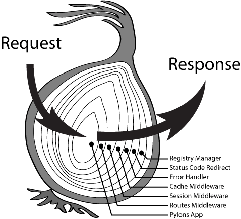

# koa2快速入门教程

`Koa` 是一个新的基于`node`平台的`web` 框架，由 `Express` 幕后的原班人马打造， 致力于成为 `web` 应用和 `API` 开发领域中的一个更小、更富有表现力、更健壮的基石。 通过利用 `async` 函数，`Koa` 帮你丢弃回调函数，并有力地增强错误处理。 `Koa` 并没有捆绑任何中间件， 而是提供了一套优雅的方法，帮助您快速而愉快地编写服务端应用程序。

因为`node.js`从 `v7.6.0`开始完全支持`async/await`，不需要加`flag`，所以`node.js`环境都要`7.6.0`以上

建议：直接安装`node.js 8+`：`node.js`官网地址 [https://nodejs.org](https://nodejs.org)

## 安装koa

```sh
$ npm i koa
```

## helloword

第一步： 创建项目目录和安装项目依赖

```sh
$ mkdir koademo
$ cd koademo
$ npm init -y
$ npm i -P koa@2.7.0
```

第二步： 创建`app.js`文件，并添加代码如下：

```js
// 引入koa框架
const Koa = require('koa');
// 创建koa的app实例，全局的应用程序是一个包含一组中间件函数的对象。它提供了注册中间件，缓存清理，代理支持和重定向等常见任务的方法
const app = new Koa();

// 注册一个中间件
app.use(async ctx => {
  ctx.body = 'Hello World , from aicoder.com'; // 设置最终的响应的内容
});

// 设置开启监听并设置监听端口为3006
app.listen(3006);
```

第三步： 启动运行

```sh
$ node app.js
```

第四步：打开浏览器测试

浏览器输入地址： `http://localhost:3006/`

如果输出：

```js
'Hello World , from aicoder.com'
```

## 补充async与await

async可以修饰函数声明、匿名函数、函数表达式、自执行函数、类等。用async修饰的函数返回值都是promise，如果返回值不是promise对象会被包裹成Promise.resolve()。

await 后面可以跟一个promise对象，会等待promise状态发送改变后拿到promise的值, await只能放到async函数中。

```js
const demo = async function Demo() {
  return 1;
}

async function Add() {
  var t = await demo(); // 会拿到t， t = 1；
}

(async fuction() {
  await Add();
})();
```

## 关于app

`app`是koa的核心对象，提供了注册中间件，监听http等相关功能。

### app.listen(...)

Koa通过listen方法启动HTTP服务器监听，开启HTT服务。

```js
const Koa = require('koa');
const app = new Koa();
app.listen(3006);
```

### app.use(function)

将给定的中间件方法添加到此应用程序。中间件函数会收到两个参数`ctx`和`next`，两个参数的详细在下面。

### app.keys=

设置签名的 `Cookie` 密钥。

这些被传递给 KeyGrip，但是你也可以传递你自己的 KeyGrip 实例。

例如，以下是可以接受的：

```js
app.keys = ['im a newer secret', 'i like turtle'];
app.keys = new KeyGrip(['im a newer secret', 'i like turtle'], 'sha256');
```

这些密钥可以倒换，并在使用 { signed: true } 参数签名 Cookie 时使用。

```js
ctx.cookies.set('name', 'tobi', { signed: true });
```

### app.context

app.context 是从其创建 ctx 的原型。您可以通过编辑 app.context 为 ctx 添加其他属性。这对于将 ctx 添加到整个应用程序中使用的属性或方法非常有用，这可能会更加有效（不需要中间件）和/或 更简单（更少的 require()），而更多地依赖于ctx，这可以被认为是一种反模式。

例如，要从 ctx 添加对数据库的引用：

```js
app.context.db = db();

app.use(async ctx => {
  console.log(ctx.db);
});
```

>注意: ctx 上的许多属性都是使用 getter ，setter 和 Object.defineProperty() 定义的。你只能通过在 app.context 上使用 Object.defineProperty() 来编辑这些属性（不推荐）。

### 错误处理

默认情况下，将所有错误输出到 stderr，除非 app.silent 为 true。 当 err.status 是 404 或 err.expose 是 true 时默认错误处理程序也不会输出错误。 要执行自定义错误处理逻辑，如集中式日志记录，您可以添加一个 “error” 事件侦听器：

```js
app.on('error', err => {
  log.error('server error', err)
});
```

如果 req/res 期间出现错误，并且 _无法_ 响应客户端，Context实例仍然被传递：

```js
app.on('error', (err, ctx) => {
  log.error('server error', err, ctx)
});
```

当发生错误 _并且_ 仍然可以响应客户端时，也没有数据被写入 socket 中，Koa 将用一个 500 “内部服务器错误” 进行适当的响应。在任一情况下，为了记录目的，都会发出应用级 “错误”。

## context 上下文

`Koa` 提供一个 `Context` 对象，表示一次对话的上下文（包括HTTP请求req和响应res）。通过加工这个对象，获取请求的内容，还可以控制返回给用户的内容。

```js
// 引入koa框架
const Koa = require('koa');
// 创建koa的app实例，全局的应用程序是一个包含一组中间件函数的对象。它提供了注册中间件，缓存清理，代理支持和重定向等常见任务的方法
const app = new Koa();

// 注册一个中间件
app.use(async ctx => {
  ctx.body = 'Hello World , from aicoder.com'; // 设置最终的响应的内容
});
```

例如在上面这个例子中，`ctx`被传入到 `app.use(fn)`的中间件函数中。

我们可以获取请求的内容和响应的内容：

```js
app.use(async ctx => {
  // ctx.body = 'Hello World , from aicoder.com'; // 设置最终的响应的内容
  ctx.response.body = 'hi, aicoder.com'; // 设置响应内容
  console.log(ctx.request.url); // 获取请求的url地址。
});
```

### ctx.request

koa 的 Request 对象.见下文。

### ctx.response

koa 的 Response 对象.见下文。

### ctx.state

推荐的命名空间，用于通过中间件传递信息和你的前端视图。

```js
ctx.state.user = await User.find(id);
```

### ctx.app

应用程序实例引用。

### cookie操作

```js
ctx.cookies.get(name, [options])
```

通过 options 获取 cookie name:

```js
ctx.cookies.set(name, value, [options])
```

通过 options 设置 cookie name 的 value :

- maxAge 一个数字表示从 Date.now() 得到的毫秒数
- signed cookie 签名值
- expires cookie 过期的 Date
- path cookie 路径, 默认是'/'
- domain cookie 域名
- secure 安全 cookie
- httpOnly 服务器可访问 cookie, 默认是 true
- overwrite 一个布尔值，表示是否覆盖以前设置的同名的 cookie (默认是 false). 如果是 true, 在同一个请求中设置相同名称的所有 Cookie（不管路径或域）是否在设置此Cookie 时从 Set-Cookie 标头中过滤掉。

## HTTP Response 的类型

Koa 默认的返回类型是text/plain，如果想返回其他类型的内容，可以先用ctx.request.accepts判断一下，客户端希望接受什么数据（根据 HTTP Request 的Accept字段），然后使用ctx.response.type指定返回类型。请看下面的例子（完整代码看这里）

```js
const main = ctx => {
  if (ctx.request.accepts('xml')) {
    ctx.response.type = 'xml';
    ctx.response.body = '<data>Hello World</data>';
  } else if (ctx.request.accepts('json')) {
    ctx.response.type = 'json';
    ctx.response.body = { data: 'Hello World' };
  } else if (ctx.request.accepts('html')) {
    ctx.response.type = 'html';
    ctx.response.body = '<p>Hello World</p>';
  } else {
    ctx.response.type = 'text';
    ctx.response.body = 'Hello World';
  }
};
app.use(main);
```

> 其实可以直接通过ctx直接访问response的方法和属性,名字等价，例如：

```js
ctx.body
ctx.body=
ctx.status
ctx.status=
ctx.message
ctx.message=
ctx.length=
ctx.length
ctx.type=
ctx.type
ctx.headerSent
ctx.redirect()
ctx.attachment()
ctx.set()
ctx.append()
ctx.remove()
ctx.lastModified=
ctx.etag=
```

其他参考请参与文档： [https://koa.bootcss.com/](https://koa.bootcss.com/)

## HTTP Request 的类型

Koa Request 对象是在 node 的 vanilla 请求对象之上的抽象，提供了诸多对 HTTP 服务器开发有用的功能。

### request.header

获取，请求标头对象。

### request.method

获取请求的方法。

### request.querystring

获取请求的查询字符串

....

其他参考文档：[https://koa.bootcss.com/](https://koa.bootcss.com/)

## koa中间件机制

koa通过app.use方法注册一个中间件，中间件是一个函数。函数可以是async也可以是普通函数。可以接受两个参数`ctx`和`next`.
ctx是上下文， next是执行下一个中间件。

中间件可以注册多个，每个中间件都会放到一个中间件数组中。

中间件的执行过程是：
中间件按照注册顺序依次执行，当一个中间件调用 next() 则该函数暂停并将控制传递给定义的下一个中间件。当在下游没有更多的中间件执行后，堆栈将展开并且每个中间件恢复执行其上游行为。



例如代码：

```js
const Koa = require('koa');
const app = new Koa();

app.use( async (ctx, next) => {
  console.log(1)
  await next();
  console.log(2)
  ctx.body = 'hi, aicoder.com';
});
app.use( async (ctx, next) => {
  console.log(3)
  await next();
  console.log(4)
});
app.use( async (ctx, next) => {
  console.log(5)
  await next();
  console.log(6)
});

app.listen(3006);

// 请求执行打印的顺序
1
3
5
6
4
2
```

原理剖析：

参考文章：[深入理解 Koa2 中间件机制](https://segmentfault.com/a/1190000012881491)

## 静态文件中间件

静态目录的中间件，`koa-static`

安装

```sh
npm i -P koa-static
```

```js
const Koa = require('koa')
const path = require('path')
const static = require('koa-static')

const app = new Koa()

// 静态资源目录对于相对入口文件index.js的路径
const staticPath = './static'

app.use(static(
  path.join( __dirname,  staticPath)
))


app.use( async ( ctx ) => {
  ctx.body = 'hello world'
})

app.listen(3000, () => {
  console.log('[demo] static-use-middleware is starting at port 3000')
})
```

## 路由中间件

路由中间件`koa-router`.

安装：

```sh
$ npm i -P koa-router
```

后端：

```js
const Koa = require('koa')
const app = new Koa()

const Router = require('koa-router')
const router = new Router();

router.get('/userid/:id',  async (ctx, next) => {
  ctx.body = ctx.params.id; // 获取路由的参数
  await next();
  console.log('over')
})

// 加载路由中间件
app.use(router.routes()).use(router.allowedMethods())

app.listen(3000, () => {
  console.log('[demo] route-use-middleware is starting at port 3000')
})
```

## 请求数据获取和处理

### GET请求数据获取

在koa中，获取GET请求数据源头是koa中request对象中的query方法或querystring方法，query返回是格式化好的参数对象，querystring返回的是请求字符串。

```js
// server.js
const Koa = require('koa');
const Router = require('koa-router');
const app = new Koa();
const router = new Router();
router.prefix('/api');

router.get('/data', async (ctx) => {
  ctx.body = ctx.query;
})

app.use(router.routes());
app.use(router.allowedMethods());

app.listen(3006);
```

启动

```sh
node server.js
```

发送请求： `http://localhost:3006/api/data?id=9&name=990`
返回内容：

```json
{
  id: "9",
  name: "990"
}
```

### post请求数据处理

对于`POST`请求的处理，`koa-bodyparser`中间件可以把`koa2`上下文的`formData`数据解析到`ctx.request.body`中

安装`koa2`版本的`koa-bodyparser@3`中间件

```sh
npm install --save koa-bodyparser@3
```

```js

const Koa = require('koa')
const app = new Koa()
const bodyParser = require('koa-bodyparser')

// 使用ctx.body解析中间件
app.use(bodyParser())

app.use(async ctx => {
  // the parsed body will store in ctx.request.body
  // if nothing was parsed, body will be an empty object {}
  ctx.body = ctx.request.body;
});

app.listen(3000, () => {
  console.log('[demo] request post is starting at port 3000')
})
```

## 加载静态资源

`koa-static`中间件使用.

安装：

```sh
npm i -P koa-static
```

```js
const Koa = require('koa')
const path = require('path')
const static = require('koa-static')

const app = new Koa()

// 静态资源目录对于相对入口文件index.js的路径
const staticPath = './static'

app.use(static(
  path.join( __dirname,  staticPath)
))


app.use( async ( ctx ) => {
  ctx.body = 'hello world'
})

app.listen(3000, () => {
  console.log('[demo] static-use-middleware is starting at port 3000')
})
```

## 使用模板引擎

适用于 `koa2` 的模板引擎选择非常多，比如 `jade`、`ejs`、`nunjucks`、`art-template`等。

`art-template` 是一个简约、超快的模板引擎。

`art-template`支持`ejs`的语法，也可以用自己的类似`angular`数据绑定的语法

官网：[http://aui.github.io/art-template/](http://aui.github.io/art-template/)
中文文档: [http://aui.github.io/art-template/zh-cn/docs/](http://aui.github.io/art-template/zh-cn/docs/)

安装`art-template` 和 `koa-art-template`

```sh
npm install --save art-template
npm install --save koa-art-template
```

配置Koa2中间件：

```js
const Koa = require('koa');
const Router = require('koa-router');
const render = require('koa-art-template');
const static = require('koa-static');
const path = require('path');

const app = new Koa();
const router = new Router();

// 静态资源目录对于相对入口文件index.js的路径
const staticPath = './public'
app.use(static(
  path.join( __dirname,  staticPath)
))

render(app, {
  root: path.join(__dirname, 'view'),
  extname: '.art',
  debug: process.env.NODE_ENV !== 'production'
})

router.prefix('/api');

router.get('/userid/:id',  async (ctx, next) => {
  ctx.body = ctx.params.id;
  await next();
  console.log('over')
})
router.get('/data', async (ctx) => {
  ctx.body = ctx.query;
})

router.get('/templ', async (ctx) => {
  await ctx.render('user', { name: 'aicoder.com', age: 18}); // 渲染页面
})

app.use(router.routes());
app.use(router.allowedMethods());

app.listen(3006);
```


目录结构：

```sh
├── app.js
├── node_modules
│──────....
├── package-lock.json
├── package.json
├── public
└── view
    └── user.art
```

`user.art`文件的内容为：

```html
<!DOCTYPE html>
<html lang="en">
<head>
  <meta charset="UTF-8">
  <meta name="viewport" content="width=device-width, initial-scale=1.0">
  <meta http-equiv="X-UA-Compatible" content="ie=edge">
  <title>aicoder.com</title>
</head>
<body>
  <h3>name: {{ name }}</h3>  
  <h3>age: {{ age }}</h3>
</body>
</html>
```

请求地址： `http://localhost:3006/api/templ`

结果：

```sh
name: aicoder.com
age: 18
```

## koa中使用cookie和session

### koa2使用cookie

使用方法
koa提供了从上下文直接读取、写入cookie的方法

```js
ctx.cookies.get(name, [options]) 读取上下文请求中的cookie
ctx.cookies.set(name, value, [options]) 在上下文中写入cookie
```

koa2 中操作的cookies是使用了npm的cookies模块，源码在https://github.com/pillarjs/cookies，所以在读写cookie的使用参数与该模块的使用一致。

例子代码

```js
const Koa = require('koa')
const app = new Koa()

app.use( async ( ctx ) => {

  if ( ctx.url === '/index' ) {
    ctx.cookies.set(
      'cid', 
      'hello world',
      {
        domain: 'localhost',  // 写cookie所在的域名
        path: '/index',       // 写cookie所在的路径
        maxAge: 10 * 60 * 1000, // cookie有效时长
        expires: new Date('2017-02-15'),  // cookie失效时间
        httpOnly: false,  // 是否只用于http请求中获取
        overwrite: false  // 是否允许重写
      }
    )
    ctx.body = 'cookie is ok'
  } else {
    ctx.body = 'hello world' 
  }

})

app.listen(3000, () => {
  console.log('[demo] cookie is starting at port 3000')
})

```

### koa中使用session

koa2原生功能只提供了cookie的操作，但是没有提供session操作。session就只用自己实现或者通过第三方中间件实现。在koa2中实现session的方案有一下几种

- 如果session数据量很小，可以直接存在内存中
- 如果session数据量很大，则需要存储介质存放session数据

以下是简单koa-session的使用介绍

```sh
$ npm install koa-session
```

```js
const session = require('koa-session');
const Koa = require('koa');
const app = new Koa();

app.keys = ['some secret hurr']; // 设置加密的字符串

const CONFIG = {
  key: 'koa:sess', /** (string) cookie key (default is koa:sess) */
  /** (number || 'session') maxAge in ms (default is 1 days) */
  /** 'session' will result in a cookie that expires when session/browser is closed */
  /** Warning: If a session cookie is stolen, this cookie will never expire */
  maxAge: 86400000,
  autoCommit: true, /** (boolean) automatically commit headers (default true) */
  overwrite: true, /** (boolean) can overwrite or not (default true) */
  httpOnly: true, /** (boolean) httpOnly or not (default true) */
  signed: true, /** (boolean) signed or not (default true) */
  rolling: false, /** (boolean) Force a session identifier cookie to be set on every response. The expiration is reset to the original maxAge, resetting the expiration countdown. (default is false) */
  renew: false, /** (boolean) renew session when session is nearly expired, so we can always keep user logged in. (default is false)*/
};

app.use(session(CONFIG, app));
// or if you prefer all default config, just use => app.use(session(app));

app.use(ctx => {
  // ignore favicon
  if (ctx.path === '/favicon.ico') return;

  let n = ctx.session.views || 0;
  ctx.session.views = ++n;
  ctx.body = n + ' views';
});

app.listen(3000);
console.log('listening on port 3000');
```

## 上传文件multer模块使用

类似express的multer模块， koa下的koa-multer也是用于上传文件，用法跟express一致。

安装

```sh
$ npm install --save koa-multer
```

```js
const Koa = require('koa');
const route = require('koa-route');
const multer = require('koa-multer');

const app = new Koa();

//配置
var storage = multer.diskStorage({
    //文件保存路径
    destination: function (req, file, cb) {
        cb(null, 'public/uploads/')  //注意路径必须存在
    },
    //修改文件名称
    filename: function (req, file, cb) {
        var fileFormat = (file.originalname).split(".");
        cb(null,Date.now() + "_" + file.originalname);
    }
})


//加载配置
var upload = multer({ storage: storage })

router.post('/doAdd', upload.single('face'), async (ctx, next) => {  // html 表单上传的input:file标签的name必须是 face
    ctx.body = {
        filename: ctx.req.file.filename,//返回文件名
        body:ctx.req.body
    }
});

app.listen(3000);
```

## 参考：

1. [深入理解 Koa2 中间件机制](https://segmentfault.com/a/1190000012881491)
1. [《Koa2进阶学习笔记》](https://chenshenhai.github.io/koa2-note/)
1. [Koa 框架教程](http://www.ruanyifeng.com/blog/2017/08/koa.html)