# Postman 接口测试神器

Postman 是一个接口测试和 http 请求的神器，非常好用。

官方 github 地址: [https://github.com/postmanlabs](https://github.com/postmanlabs)

Postman 的**优点：**

- 支持各种的请求类型: get、post、put、patch、delete 等
- 支持在线存储数据，通过账号就可以进行迁移数据
- 很方便的支持请求 header 和请求参数的设置
- 支持不同的认证机制，包括 Basic Auth，Digest Auth，OAuth 1.0，OAuth 2.0 等
- 响应数据是自动按照语法格式高亮的，包括 HTML，JSON 和 XML

> 以下内容主要参考： [Github: api_tool_postman ](https://github.com/crifan/api_tool_postman)

## 安装

Postman 可以单独作为一个应用安装，也可以作为 chrome 的一个插件安装。

- chrome 插件安装, [Postman 插件地址](https://chrome.google.com/webstore/detail/postman/fhbjgbiflinjbdggehcddcbncdddomop)

- [单独应用安装下载](http://files.cnblogs.com/files/mafly/postman-4.1.2.rar)

下面主要介绍下载安装独立版本**app 软件**的 Postman 的过程：

去主页[Postman 官网](https://www.getpostman.com)找到：[Postman | Apps](https://www.getpostman.com/apps)

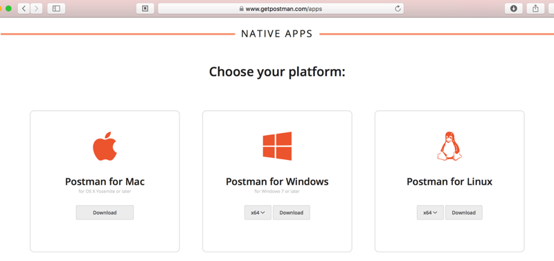

去下载自己平台的版本：

- Mac
- Windows（x86/x64）
- Linux（x86/x64）
  即可。

## 快速入门，总体使用方略

安装成功后，打开软件。

### 新建接口

对应的**Request**：`New -> Request`

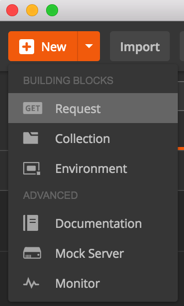

或，在右边的 Tab 页面中点击加号**+**：

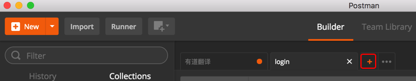

即可看到新建的 Tab 页：

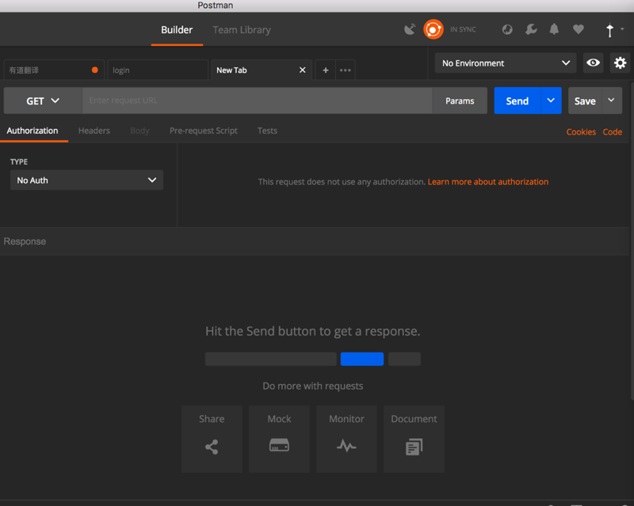

### 设置 HTTP 请求的方法

设置 HTTP 的 Method 方法和输入 api 的地址

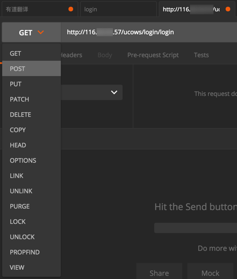

### 设置相关请求头信息

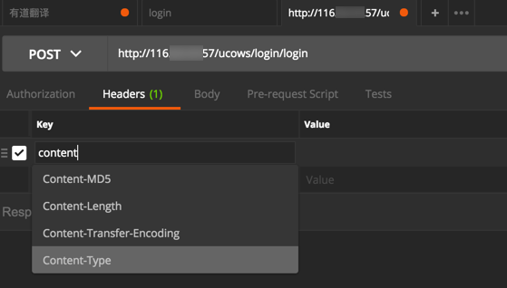

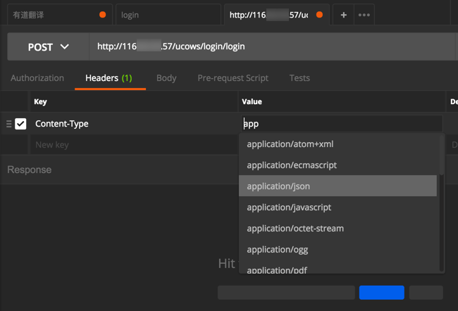

### 设置相关 GET 或 POST 等的参数

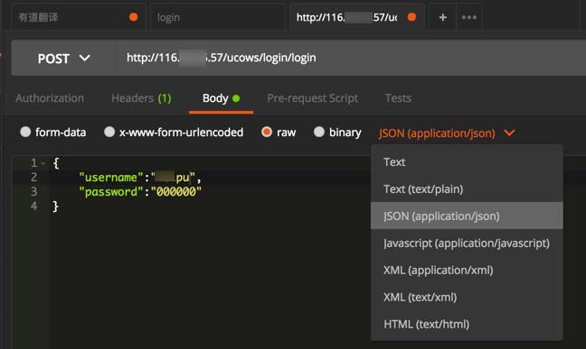

### 发送请求

都填写好之后，点击 Send 去发送**请求 Request**：

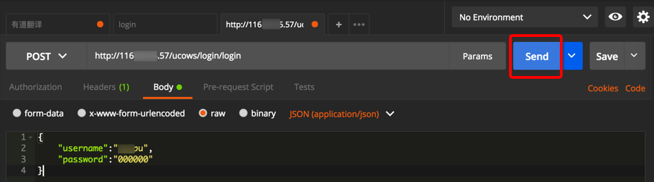

### 查看**响应 Response**的信息

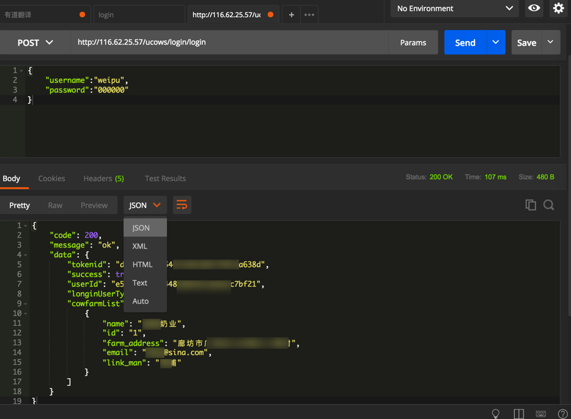

然后可以重复上述修改 Request 的参数，点击 Send 去发送请求的过程，以便调试到 API 接口正常工作为止。

### 保存接口配置

待整个接口都调试完毕后，记得点击 Save 去保存接口信息：

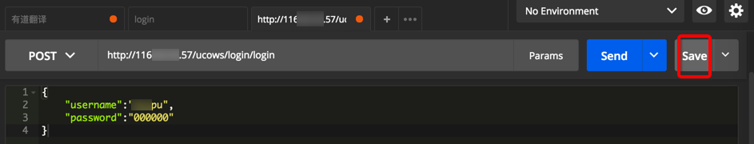

去保存当前 API 接口，然后需要填写相关的接口信息：

- Request Name: 请求的名字
  - 我一般习惯用保存为 接口的最后的字段名，比如`http://{{server_address}}/ucows/login/login`中的`/login/login`
- Request Description: 接口的描述
  - `可选` 最好写上该接口的要实现的基本功能和相关注意事项
  - 支持 Markdown 语法
- Select a collection or folder to save: 选择要保存到哪个分组（或文件夹）
  - 往往保存到某个 API 接口到所属的该项目名的分组

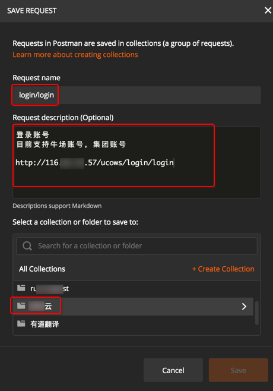

填写好内容，选择好分组，再点击保存：

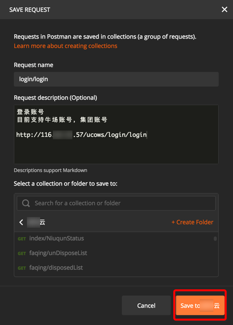

此时，Tab 的右上角的黄色点（表示没有保存）消失了，表示已保存。

且对应的分组中可以看到对应的接口了：

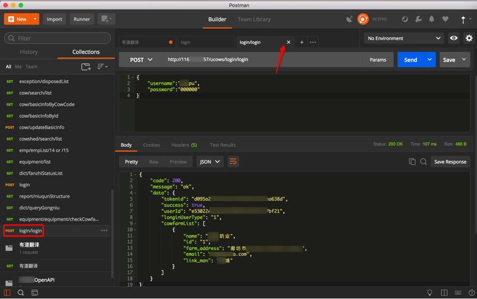

> **[warning] 默认不保存返回的 Response 数据**
>
> - 直接点击 Save 去保存，只能保存 API 本身（的 Request 请求），不会保存 Response 的数据
> - 想要保存 Response 数据，需要用后面要介绍的 [多个 Example](http://book.crifan.com/books/api_tool_postman/website/postman_func_resp/save_multi_example.html)

## Request 的多参数操作详解

### 自动解析多个参数 Params

比如，对于一个 GET 的请求的 url 是：
`http://openapi.youdao.com/api?q=纠删码(EC)的学习&from=zh_CHS&to=EN&appKey=152e0e77723a0026&salt=4&sign=6BE15F1868019AD71C442E6399DB1FE4`

对应着其实是`?key=value`形式中包含多个 Http 的 GET 的 query string=query parameters

Postman 可以自动帮我们解析出对应参数，可以点击 Params：

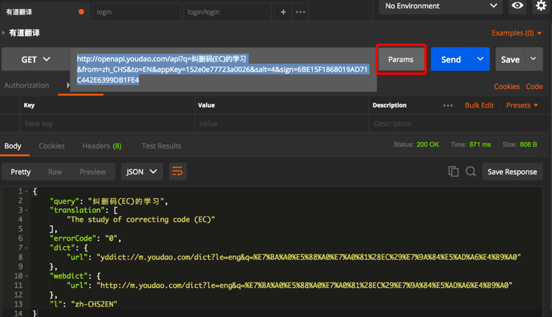

看到展开的多个参数：

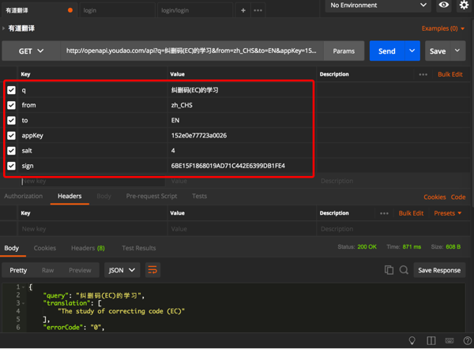

如此就可以很方便的修改，增删对应的参数了。

### 临时禁用参数

且还支持，在不删除某参数的情况下，如果想要暂时不传参数，可以方便的通过不勾选的方式去实现：

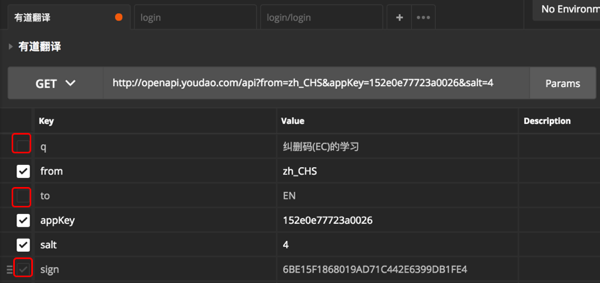

### 批量编辑 GET 的多个参数

当然，如果想要批量的编辑参数，可以点击右上角的**Bulk Edit**，去实现批量编辑。

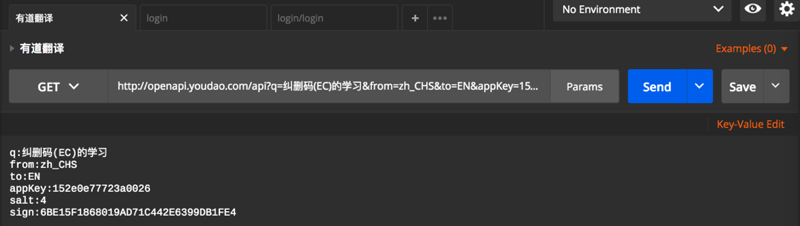

## 接口描述与自动生成文档

API 的描述中，也支持 Markdown，官方的接口说明文档：[Intro to API documentation](https://www.getpostman.com/docs/postman/api_documentation/intro_to_api_documentation)。

所以，可以很方便的添加有条理的接口描述，尤其是参数解释了：

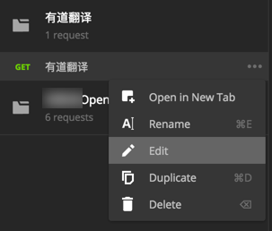

### 描述支持 markdown 语法

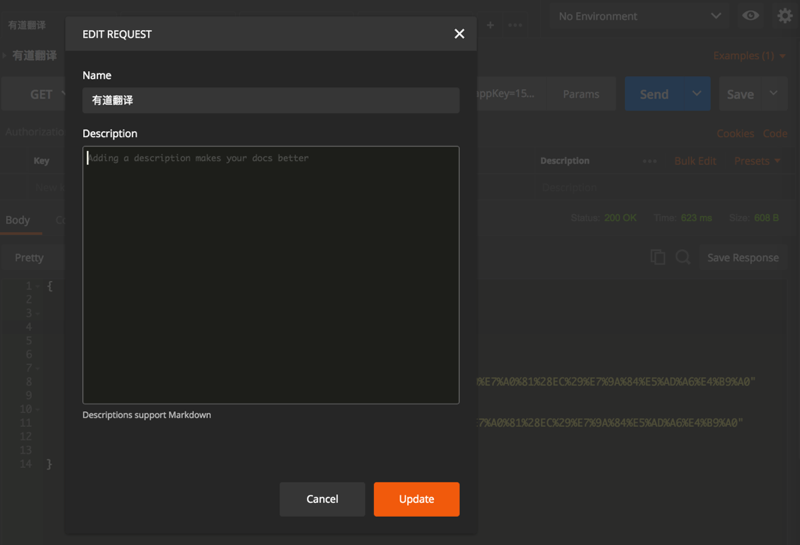

而对于要解释的参数，可以通过之前的`Param -> Bulk Edit`的内容：

拷贝过来，再继续去编辑：

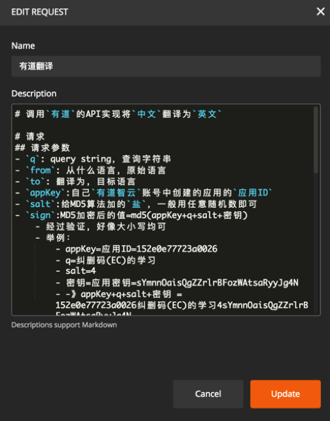

以及添加更多解释信息：

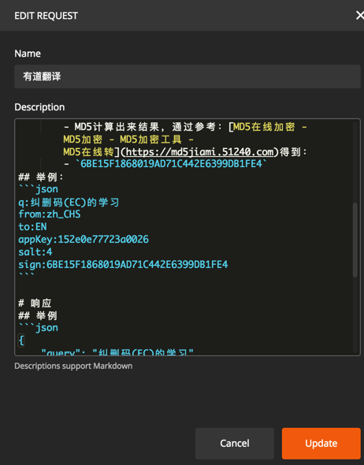

点击 Update 后，即可保存。

### 发布接口并生成 markdown 的描述文件

去发布后：

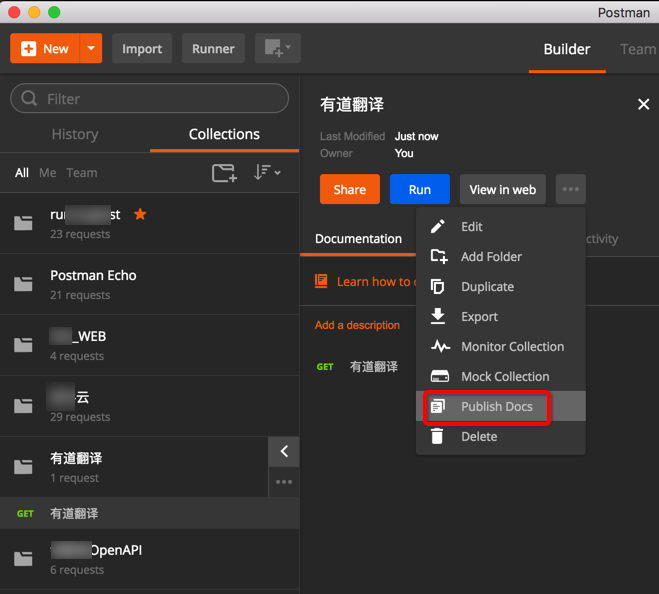

对应的效果：[有道翻译](https://documenter.getpostman.com/view/669382/collection/77fd4ek)

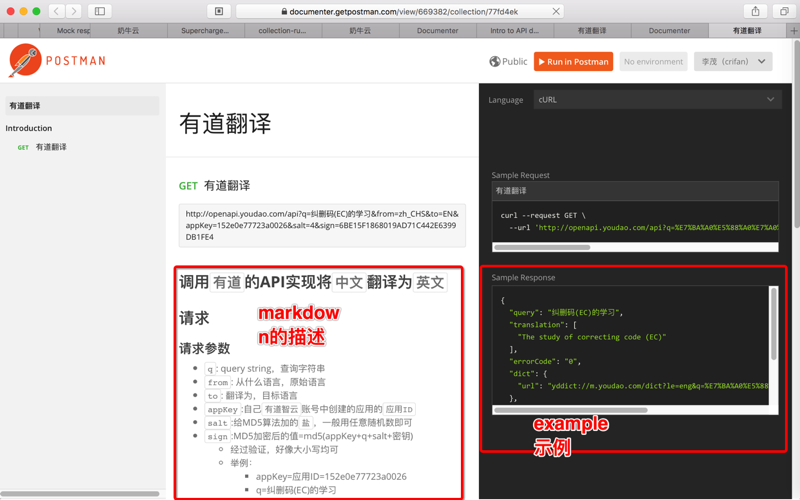

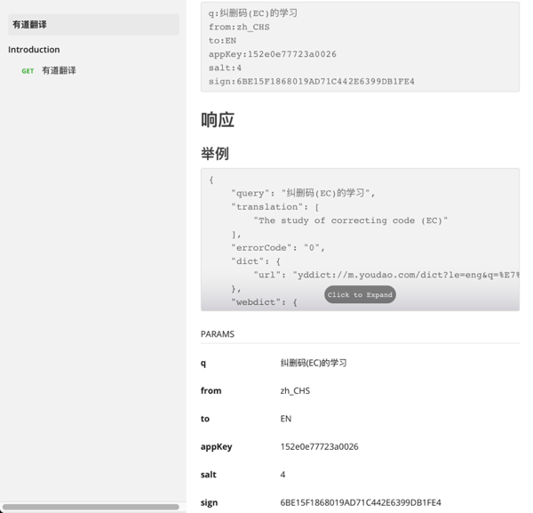

## Response 深入

### Response 数据显示模式

Postman 对于返回的 Response 数据，支持三种显示模式。

- `默认`格式化后的 Pretty 模式

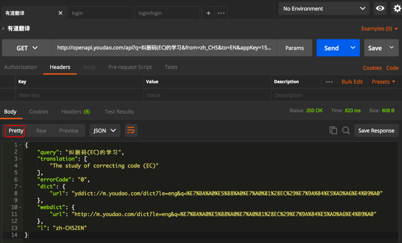

- Raw 原始模式

点击**Raw**，可以查看到返回的没有格式化之前的原始数据：

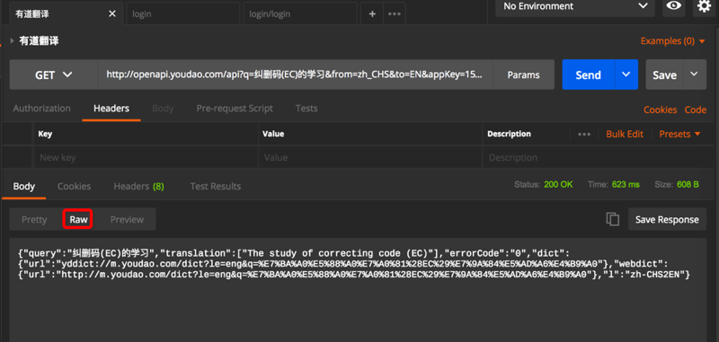

- Preview 预览模式

以及 Preview，是对应 Raw 原始格式的预览模式：

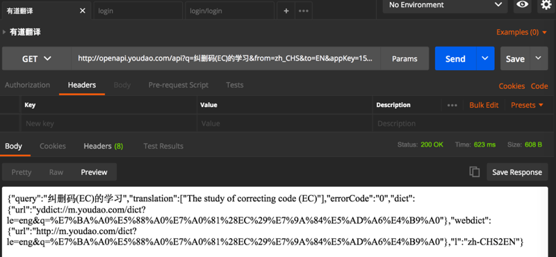

Preview 这种模式的显示效果，好像是对于返回的是 html 页面这类，才比较有效果。

### Response 的 Cookies

很多时候普通的 API 调用，倒是没有 Cookie 的：

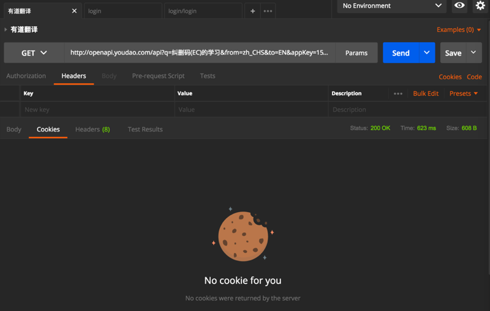

### Response 的 Headers 头信息

举例，此处返回的是有 Headers 头信息的：

可以从中看到服务器是 Nginx 的。

## 保存多个 Example

之前想要实现，让导出的 API 文档中能看到接口返回的 Response 数据。后来发现是**Example**这个功能去实现此效果的。

### 如何添加 Example

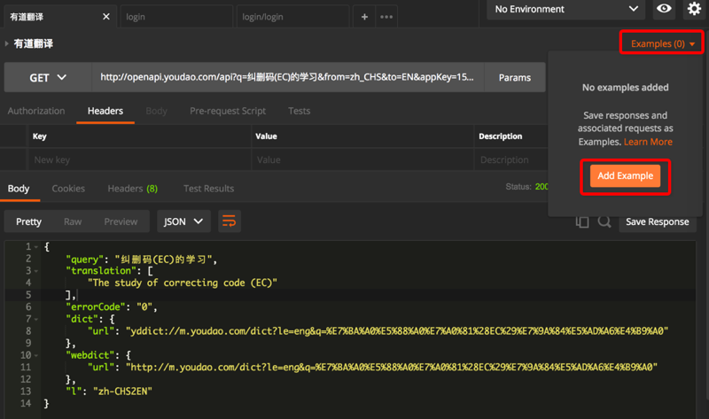

继续点击**Save Example**：

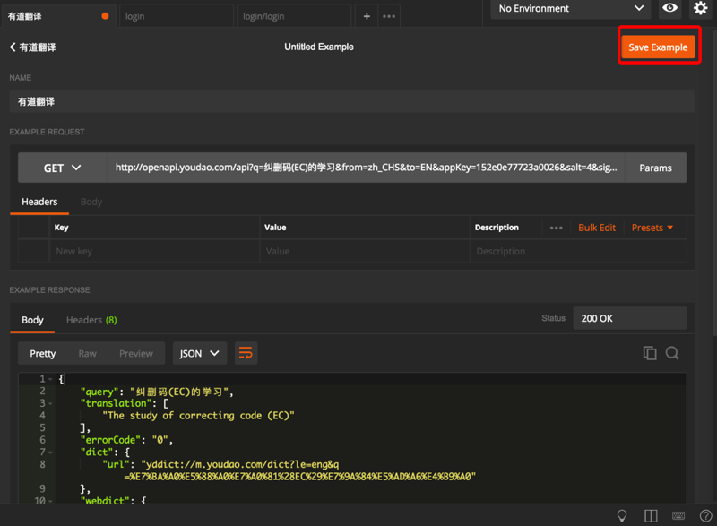

保存后，就能看到**Example(1)**了：

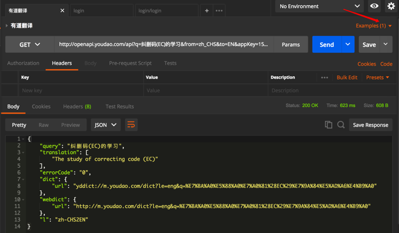

### 单个 Example 在导出的 API 文档中的效果

然后再去导出文档，导出文档中的确能看到返回数据的例子：
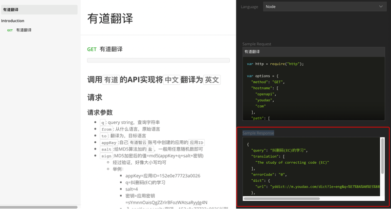

### 多个 Example 在导出的 API 文档中的效果

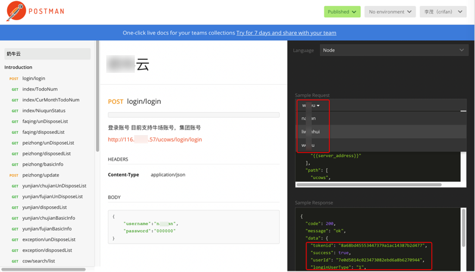

## 其他好用的功能及工具

### 分组 Collection

在刚开始一个项目时，为了后续便于组织和管理，把同属该项目的多个 API，放在一组里

所以要先去新建一个 Collection: `New -> Collection`

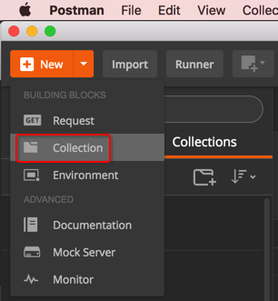

使用了段时间后，建了多个分组的效果：

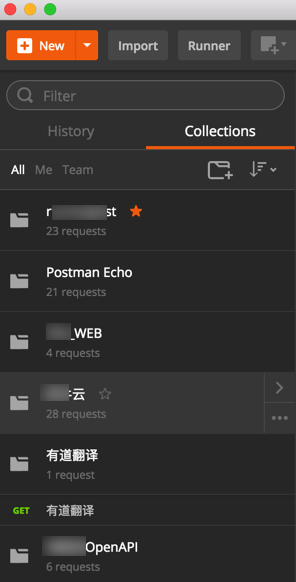

单个分组展开后的效果：

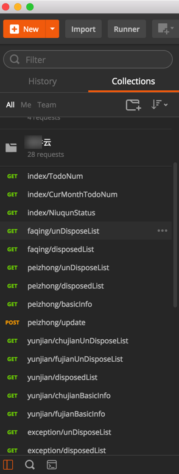

### 历史记录 History

Postman 支持 history 历史记录，显示出最近使用过的 API：
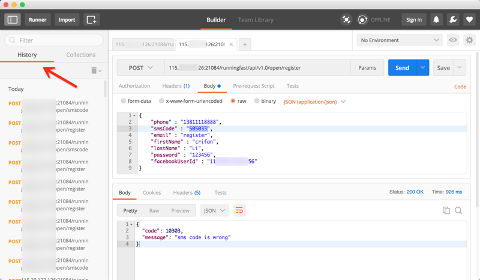

### 用环境变量实现多服务器版本

#### 现存问题

在测试 API 期间，往往存在多种环境，对应 IP 地址（或域名也不同）

比如：

- **Prod**: `http://116.62.25.57/ucows`
  - 用于开发完成发布到生产环境
- **Dev**: `http://123.206.191.125/ucows`
  - 用于开发期间的线上的 Development 的测试环境
- **LocalTest**: `http://192.168.0.140:80/ucows`
  - 用于开发期间配合后台开发人员的本地局域网内的本地环境，用于联合调试 API 接口

而在测试 API 期间，往往需要手动去修改 API 的地址：

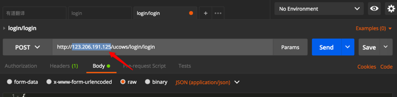

效率比较低，且地址更换后之前地址就没法保留了。

另外，且根据不同 IP 地址（或者域名）也不容易识别是哪套环境。

### Postman 支持用 Environment 环境变量去实现多服务器版本

后来发现 Postman 中，有 Environment 和 Global Variable，用于解决这个问题，实现不同环境的管理：

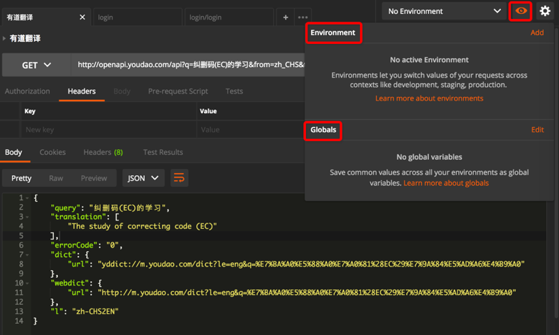

> 很明显，就可以用来实现不用手动修改 url 中的服务器地址，从而动态的实现，支持不同服务器环境:

- Production 生产环境
- Development 开发环境
- Local 本地局域网环境

#### 如何使用 Enviroment 实现多服务器版本

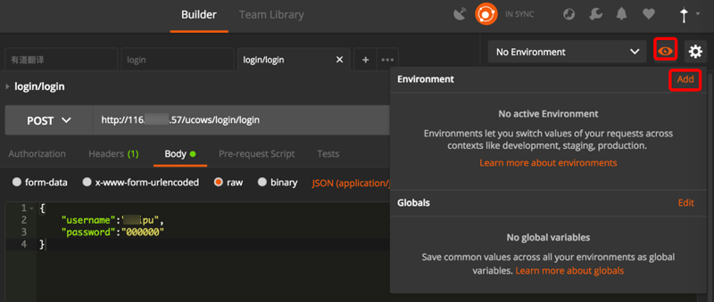

或者：

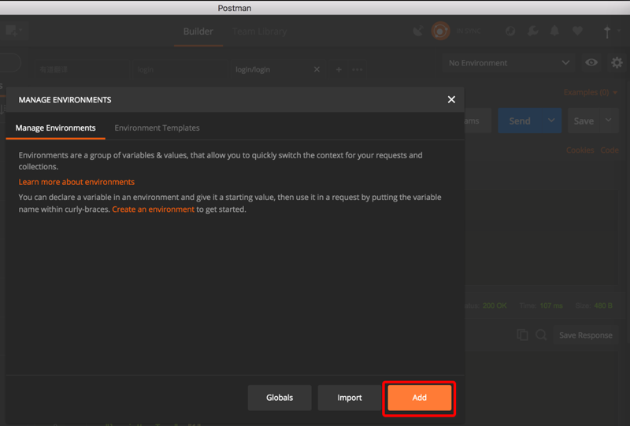

> Environments are a group of variables & values, that allow you to quickly switch the context for your requests and collections.
>
> Learn more about environments
>
> You can declare a variable in an environment and give it a starting value, then use it in a request by putting the variable name within curly-braces. Create an environment to get started.

输入 Key 和 value：

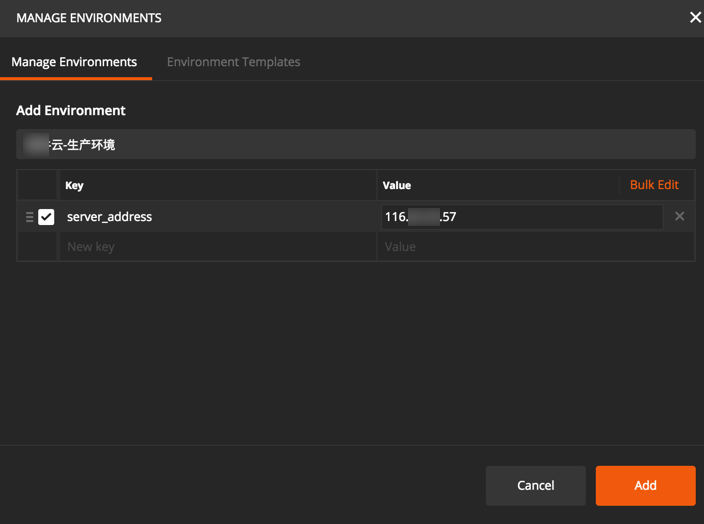

点击 Add 后：

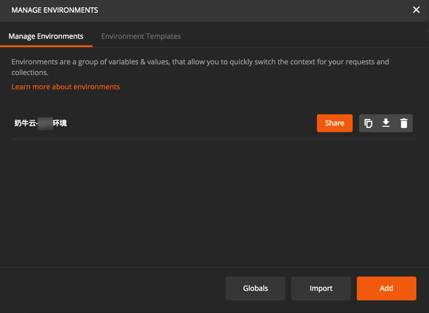

> **[info] 环境变量可以使用的地方**
>
> - URL
> - URL params
> - Header values
> - form-data/url-encoded values
> - Raw body content
> - Helper fields
> - 写 test 测试脚本中
> - 通过 postman 的接口，获取或设置环境变量的值。

此处把之前的在 url 中的 IP 地址（或域名）换成环境变量：

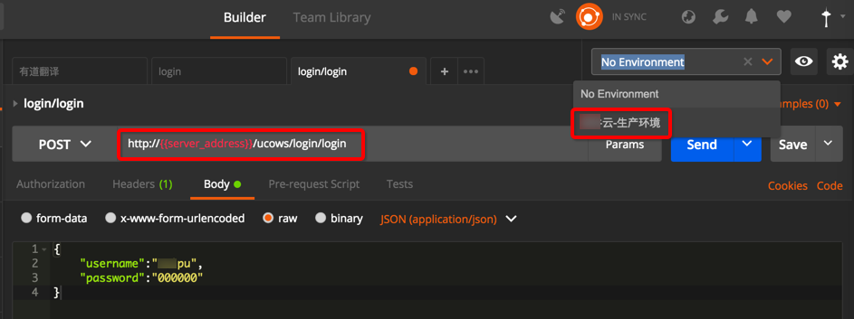

鼠标移动到环境变量上，可以动态显示出具体的值：

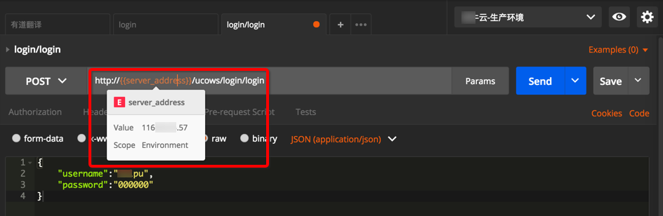

再去添加另外一个开发环境：

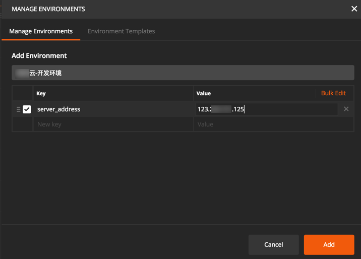

则可添加完 2 个环境变量，表示两个服务器地址，两个版本：

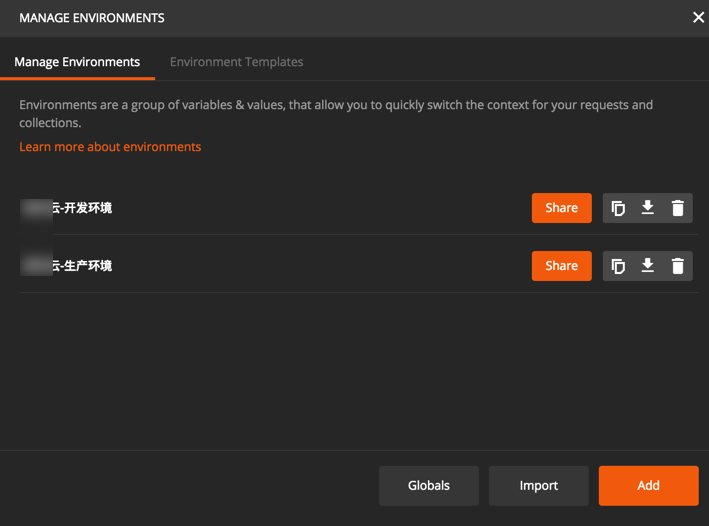

然后就可以切换不同服务器环境了：

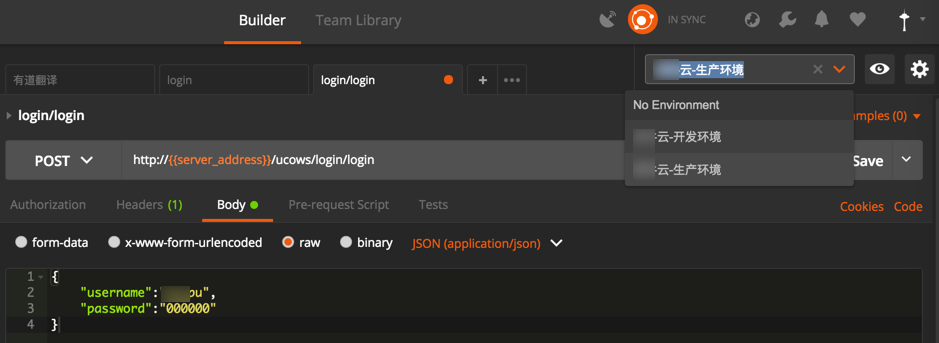

可以看到，同样的变量 server_address，在切换后对应 IP 地址就变成希望的开发环境的 IP 了：

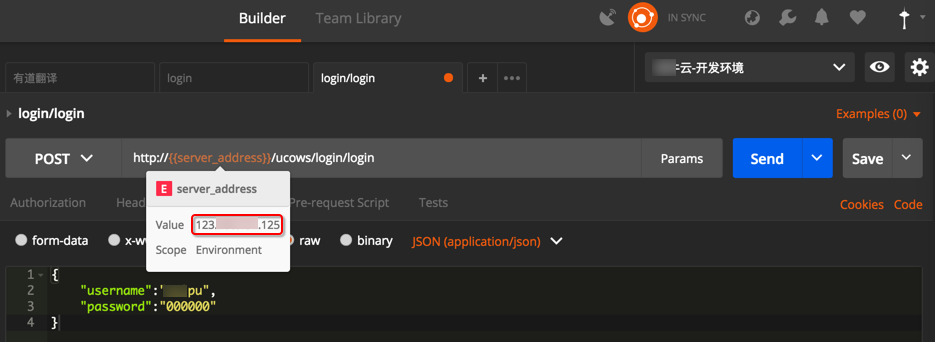

#### Postman 导出 API 文档中多个环境变量的效果

顺带也去看看，导出为 API 文档后，带了这种 Environment 的变量的接口，文档长什么样子：

发现是在发布之前，需要选择对应的环境的：


发布后的文档，可以看到所选环境和对应服务器的 IP 的：


当然发布文档后，也可以实时切换环境：


#### 环境变量的好处

当更换服务器时，直接修改变量的 IP 地址：


即可实时更新，当鼠标移动到变量上即可看到效果：


### 代码生成工具

#### 查看当前请求的 HTTP 原始内容

对于当前的请求，还可以通过点击 Code


去查看对应的符合 HTTP 协议的原始的内容：


#### 各种语言的示例代码**Code Generation Tools**

比如：

- Swift 语言


- Java 语言


- 其他各种语言
  还支持其他各种语言：


目前支持的语言有：

- HTTP
- C (LibCurl)
- cURL
- C#(RestSharp)
- Go
- Java
  - OK HTTP
  - Unirest
- Javascript
- NodeJS
- Objective-C(NSURL)
- OCaml(Cohttp)
- PHP
- Python
- Ruby(NET::Http)
- Shell
- Swift(NSURL)

代码生成工具的好处是：在写调用此 API 的代码时，就可以参考对应代码，甚至拷贝粘贴对应代码，即可。

### 测试接口

选中某个分组后，点击 Runner


选中某个分组后点击 Run


即可看到测试结果：


关于此功能的介绍可参考[Postman 官网](https://www.getpostman.com/postman)的[git 图](https://www.getpostman.com/img/v2/postman/gifs/collection-runner.gif)

### MockServer

直接参考官网。

## 功能界面

### 多 Tab 分页

Postman 支持多 tab 页，于此对比之前有些 API 调试工具就不支持多 Tab 页，比如`Advanced Rest Client`

多 tab 的好处：

方便在一个 tab 中测试，得到结果后，复制粘贴到另外的 tab 中，继续测试其它接口

比如此处 tab1 中，测试了获取验证码接口后，拷贝手机号和验证码，粘贴到 tab2 中，继续测试注册的接口


### 界面查看模式

Postman 的默认的 Request 和 Response 是上下布局：


此处点击右下角的`Two pane view`，就变成左右的了：


> **[info] 左右布局的用途**
>
> 对于数据量很大，又想要同时看到请求和返回的数据的时候，应该比较有用。

### 多颜色主题

Posman 支持两种主题：

- 深色主题

当前是深色主题，效果很不错：


- 浅色主题

可以切换到 浅色主题：


## API 文档生成

在服务端后台的开发人员测试好了接口后，打算把接口的各种信息发给使用此 API 的前端的移动端人员时，往往会遇到：

要么是用复制粘贴 -> 格式不友好
要么是用 Postman 中截图 -> 方便看，但是不方便获得 API 接口和字段等文字内容
要么是用 Postman 中导出为 JSON -> json 文件中信息太繁杂，不利于找到所需要的信息
要么是用文档，比如去编写 Markdown 文档 -> 但后续 API 的变更需要实时同步修改文档，也会很麻烦
这都会导致别人查看和使用 API 时很不方便。

-> 对此，Postman 提供了发布 API

预览和发布 API 文档
下面介绍 Postman 中如何预览和发布 API 文档。

### 简要概述步骤

1.  Collection
2.  鼠标移动到某个 Collection，点击 三个点
3.  Publish Docs
4.  Publish
5.  得到 Public URL
6.  别人打开这个 Public URL，即可查看 API 文档

### 预览 API 文档

点击分组右边的大于号**>**


如果只是预览，比如后台开发员自己查看 API 文档的话，可以选择：View in web


> 等价于点击**Publish Docs**去发布：
>
> 

View in Web 后，有 Publish 的选项（见后面的截图）

View in Web 后，会打开预览页面：

比如：

奶牛云

`https://documenter.getpostman.com/collection/view/669382-42273840-6237-dbae-5455-26b16f45e2b9`


而右边的示例代码，也可以从默认的 cURL 换成其他的：


### 发布 API 文档

如果想要让其他人能看到这个文档，则点击 Publish：

然后会打开类似于这样的地址：

Postman Documenter

`https://documenter.getpostman.com/collection/publish?meta=Y29sbGVjdGlvbl9pZD00MjI3Mzg0MC02MjM3LWRiYWUtNTQ1NS0yNmIxNmY0NWUyYjkmb3duZXI9NjY5MzgyJmNvbGxlY3Rpb25fbmFtZT0lRTUlQTUlQjYlRTclODklOUIlRTQlQkElOTE=`


点击 Publish 后，可以生成对应的公开的网页地址：


打开 API 接口文档地址：

`https://documenter.getpostman.com/view/669382/collection/77fd4RM`

即可看到（和前面预览一样效果的 API 文档了）：


如此，别人即可查看对应的 API 接口文档。

### 已发布的 API 文档支持自动更新

后续如果自己的 API 接口修改后：

比如：


（后来发现，不用再去进入此预览和发布的流程，去更新文档，而是 Postman 自动支持）

别人去刷新该文档的页面：

`https://documenter.getpostman.com/view/669382/collection/77fd4RM`

即可看到更新后的内容：


## 参考资料

- [主要参考：Github: api_tool_postman ](https://github.com/crifan/api_tool_postman)
- [Manage environments](https://www.getpostman.com/docs/postman/environments_and_globals/manage_environments)
- [postman-变量/环境/过滤等 - 简书](http://www.jianshu.com/p/5d7954b6d218)
- [Postman 使用手册 3——环境变量 - 简书](http://www.jianshu.com/p/bffbc79b43f6)
- [postman 使用之四：切换环境和设置读取变量 - 乔叶叶 - 博客园](http://www.cnblogs.com/qiaoyeye/p/5524750.html)
