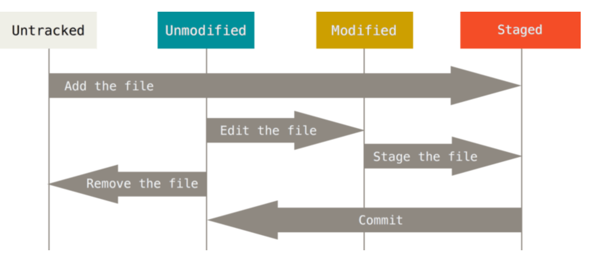
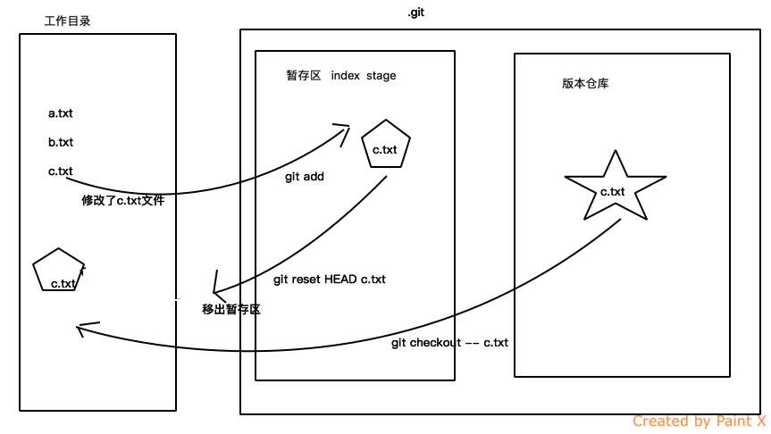
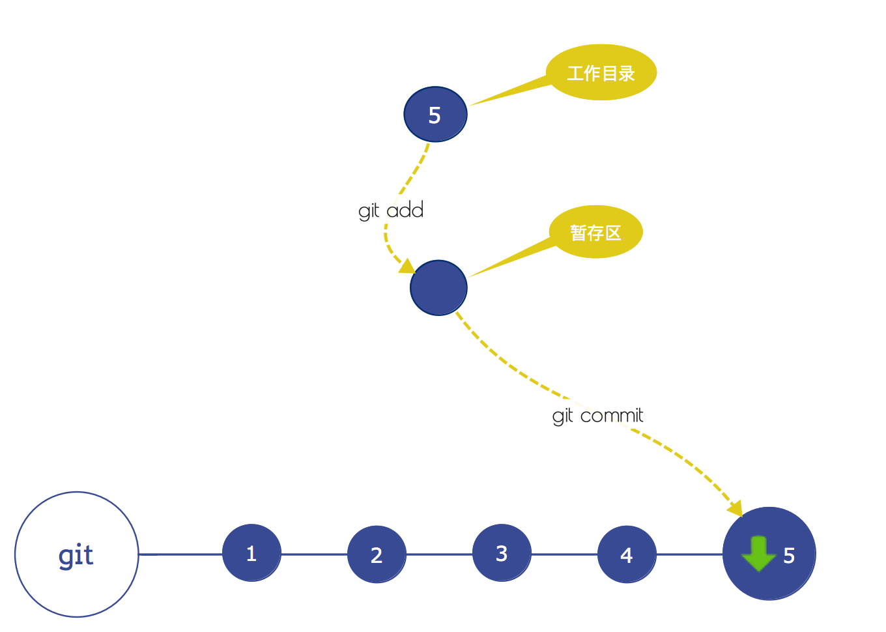
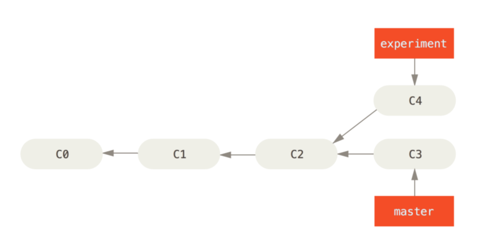
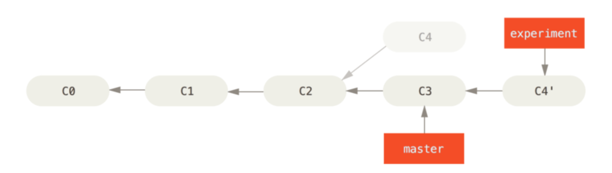
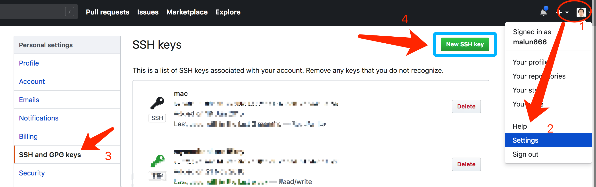
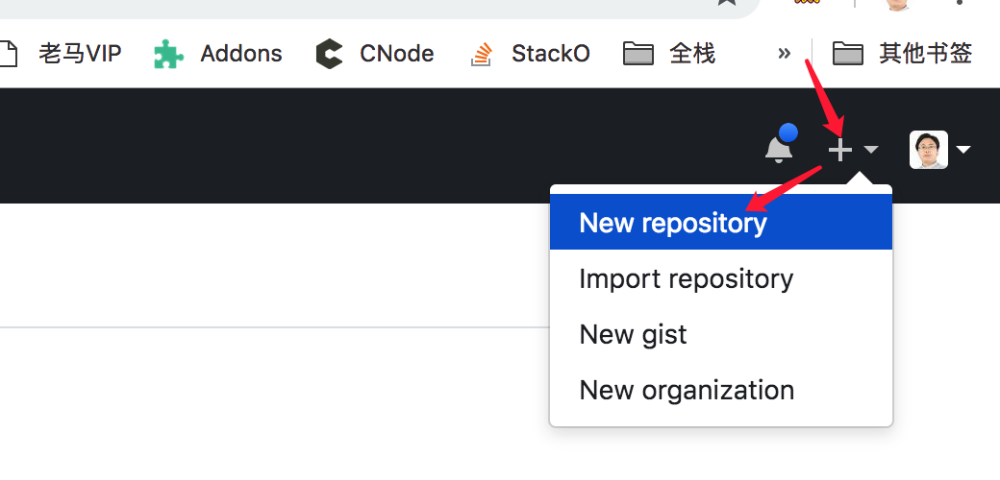
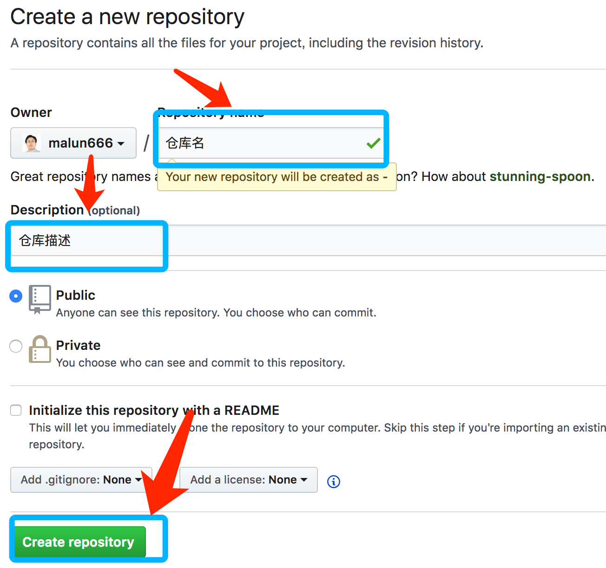
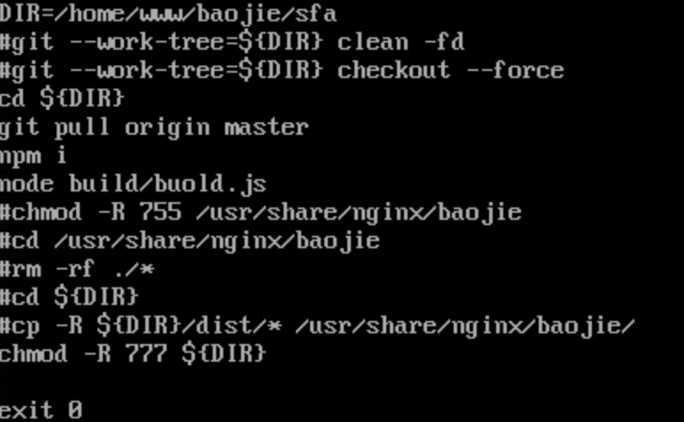

# Git入门到高级教程

## 为什么要进行项目文件的版本管理

1. 代码备份和恢复
1. 团队开发和协作流程
1. 项目分支管理和备份

## git 是什么？

git是一个分布式的版本控制软件。版本控制是一种记录一个或若干文件内容变化，以便将来查阅特定版本修订情况的系统。

最初由林納斯·托瓦茲創作，於2005年以GPL釋出。最初目的是為更好地管理Linux內核開發而設計。

> 2005年，安德鲁·垂鸠写了一个简单程序，可以连接BitKeeper的存储库，BitKeeper著作权拥有者拉里·麦沃伊认为安德鲁·垂鸠对BitKeeper内部使用的协议进行逆向工程，决定收回无偿使用BitKeeper的许可。Linux内核开发团队与BitMover公司进行磋商，但无法解决他们之间的歧见。林纳斯·托瓦兹决定自行开发版本控制系统替代BitKeeper，以十天的时间，编写出第一个git版本.

## 集中式和分布式版本控制软件

### 集中式版本控制软件

集中化的版本控制系统（`Centralized Version Control Systems`，简称 `CVCS`）应运而生。 这类系统，诸如 `CVS`、`Subversion` 以及 `Perforce` 等，都有一个单一的集中管理的服务器，保存所有文件的修订版本，而协同工作的人们都通过客户端连到这台服务器，取出最新的文件或者提交更新。

集中式管理的缺点：

1. 中央服务器的单点故障，导致整个版本管理瘫痪
1. 中央服务器故障导致所有的版本丢失
1. 当客户端和服务器端无法进行网络连接的时，客户端无法进行提交代码和保存版本，也不能恢复某个版本


### 分布式版本控制软件

分布式版本控制系统（`Distributed Version Control System`，简称 `DVCS`）.分布式就是每个人都有一份完整的仓库版本，提交和管理都是在本地进行，当然也可以进行远程的仓库之间进行合并提交等操作。


## git 安装

### Linux 上安装

如果你想在 Linux 上用二进制安装程序来安装 Git，可以使用发行版包含的基础软件包管理工具来安装。 如果 以 Fedora 上为例，你可以使用 yum:

```sh
$ sudo yum install git
```

如果你在基于 Debian 的发行版上，请尝试用 apt-get: 

```sh
$ sudo apt-get install git
```
要了解更多选择，Git 官方网站上有在各种 Unix 风格的系统上安装步骤，网址为 [http://git-scm.com/download/linux](http://git-scm.com/download/linux)。

### 在 Mac 上安装

方法一：

最简单的方法是安装 `Xcode Command Line Tools`,然后在 Terminal 里尝试首次运行 git 命令即可。 如果没有安装过命令行开发者工具，将会提示 你安装。

方法二：（推荐）

使用 [homebrew](https://github.com/mxcl/homebrew)

```sh
$ brew install git
```

### windows上安装

直接下载安装包：[https://gitforwindows.org/](https://gitforwindows.org/)

### 检测是否安装成功

windows请从开始菜单程序中打开`gitbash`,其他系统请打开终端工具或者shell命令行工具。

```sh
$ git --version

# 输出，仅供参考
git version 2.18.0
```

## git 快速上手和配置

### 用户名和邮箱配置

当安装完 Git 应该做的第一件事就是设置你的用户名称与邮件地址。 这样做很重要，因为每一个 Git 的提交都会 使用这些信息，并且它会写入到你的每一次提交中。

windows请从开始菜单程序中打开`gitbash`,其他系统请打开终端工具或者shell命令行工具。

```sh
$ git config --global user.name "aicoder"
$ git config --global user.email laoma@aicoder.com
```

**请把用户名和邮箱换成你自己的**

> 如果使用了 --global 选项，那么该命令只需要运行一次，因为之后无论你在该系统上做任何事 情， Git 都会使用那些信息。 当你想针对特定项目使用不同的用户名称与邮件地址时，可以在那个项目目录下运 行没有 --global 选项的命令来配置。

以上配置完成后，检测是否配置成功：

```sh
$ git config --list

# 输出以下内容，仅供参考
credential.helper=osxkeychain
user.name=aicoder
user.email=laoma@aicoder.com
color.status=auto
...
```

### 配置SSH

`Git` 服务器大部分都使用 `SSH` 公钥进行认证,其他认证方式都不方便，创建`SSH`公钥的方法。

**请打开用gitbash或者终端工具运行以下命令**

默认情况下，用户的 `SSH` 密钥存储在其 `~/.ssh` 目录下。 进入该目录并列出其中内容，你便可以快 速确认自己是否已拥有密钥:

```sh
$ cd ~/.ssh
$ ls
authorized_keys2  id_dsa       known_hosts
config            id_dsa.pub
```

> cd命令可以帮助我们进入系统的某个目录。 ls命令可以列出当前目录下面的所有文件和文件夹的信息。

如果已经存在`id_dsa`、`id_dsa.pub`，说明就已经生成果，后面的步骤可以省略。

> id_dsa 或 id_rsa 命名的文件，其中一个带有 .pub 扩展名。 .pub 文件是你的公钥，另 一个则是私钥。

```sh
$ ssh-keygen

# 一路回车回车即可，以下为输出内容，仅供参考
Generating public/private rsa key pair.
Enter file in which to save the key (/root/.ssh/id_rsa): 
/root/.ssh/id_rsa already exists.
Overwrite (y/n)? y
Enter passphrase (empty for no passphrase): 
Enter same passphrase again: 
Your identification has been saved in /root/.ssh/id_rsa.
Your public key has been saved in /root/.ssh/id_rsa.pub.
The key fingerprint is:
SHA256:xFntIEM+aKyuc5dJmCvq1xnccqCaMAcK3kBClYXc/J0 root@localhost.localdomain
The key's randomart image is:
+---[RSA 2048]----+
|..o.*. .. ..     |
|.. + + +oo. .    |
|o     = Bo.o     |
|o.   + o E  .    |
|+.o +oo S        |
|+..+o+.o         |
|.oo oo=o         |
| ooooo+          |
|ooo+ .           |
+----[SHA256]-----+
```

首先 ssh-keygen 会确认密钥的存储位置(默认是 .ssh/id_rsa)，然后它会要求你输入两次密钥口令。如 果你不想在使用密钥时输入口令，将其留空即可。

## git基本操作

### 在现有目录中初始化仓库

```sh
$ cd /path/to/init
$ git init
```

此时在目录中将创建一个名为 `.git` 的子目录,这里面存放当前仓库的所有的跟踪的信息。

此时当前文件夹下面的所有的文件都没有被跟踪，如果需要跟踪变化，必须添加到跟踪的参考中。

### 添加文件和提交信息

`git add 文件` 命令可以帮祝我们让git帮忙跟踪具体的文件。然后执行`git commit`提交信息，相当于确认跟踪。

```sh
$ git add ./*.js
$ git add a.txt
$ git commit -m 'first commit'
```

> 提交记录的时候必须添加消息，而且添加的消息还有一定的规范，每个公司的提交消息规范不一样，视情况而定。

参考：[你可能会忽略的 Git 提交规范](https://juejin.im/entry/5b429be75188251ac85830ff)


### 工作区和暂存区

- 工作区（Working Directory）

工作区，也称为工作目录，也就是要进行版本管理的文件夹。

- 暂存区（Stage或者Index）

暂时存放将要记录修改版本的文件的区域。


工作目录下的每一个文件都不外乎这两种状态:已跟踪或未跟踪。

`git add`可以把文件加入暂存区。
`git commit`命令可以把暂存区的文件更新变化记录到版本库中永久保存。

不在暂存区的文件，不会被追踪。



> 暂存区和版本库存放在 .git目录中。

### 检查当前文件状态

要查看哪些文件处于什么状态，可以用 git status 命令。 如果在克隆仓库后立即使用此命令，会看到类似这 样的输出:

```sh
$ git status
```

以下是没有任何修改和暂存的情况：

```sh
On branch master
Your branch is up to date with 'origin/master'.

nothing to commit, working tree clean
```

以下是有修改未提交，有新增加为加入暂存区的情况：

```sh
On branch master
Your branch is up to date with 'origin/master'.

Changes not staged for commit:
  (use "git add <file>..." to update what will be committed)
  (use "git checkout -- <file>..." to discard changes in working directory)

        modified:   docs/pages/vip_3git.md

Untracked files:
  (use "git add <file>..." to include in what will be committed)

        docs/images/0.jpeg
        docs/images/zc.png

no changes added to commit (use "git add" and/or "git commit -a")
```

### **状态简览**

`git status` 命令的输出十分详细，但其用语有些繁琐。 如果你使用 `git status -s` 命令或 `git status --short`命令，你将得到一种更为紧凑的格式输出。运行`git status -s`，状态报告输出如下:

```sh
$ git status -s
M README
MM Rakefile
A  lib/git.rb
M  lib/simplegit.rb
?? LICENSE.txt
```

### 查看文件的日志

`git log`命令帮助我们输出git的所有操作日志。

```sh
$ git log
commit ca82a6dff817ec66f44342007202690a93763949
Author: Scott Chacon <schacon@gee-mail.com>
Date:   Mon Mar 17 21:52:11 2008 -0700
    changed the version number
commit 085bb3bcb608e1e8451d4b2432f8ecbe6306e7e7
Author: Scott Chacon <schacon@gee-mail.com>
Date:   Sat Mar 15 16:40:33 2008 -0700
    removed unnecessary test
commit a11bef06a3f659402fe7563abf99ad00de2209e6
Author: Scott Chacon <schacon@gee-mail.com>
Date:   Sat Mar 15 10:31:28 2008 -0700
first commit
```

> 按q键可以退出查看日志，回车键查看更多。

- 查看修改的差异

`git log -p`

- 查看最近两次的差异

`git log -p -2`

- 查看每次提交的总结 

正如你所看到的，`--stat` 选项在每次提交的下面列出所有被修改过的文件、有多少文件被修改了以及被修改过 的文件的哪些行被移除或是添加了。 在每次提交的最后还有一个总结。

`git log --stat`

- 在一行内显示日志

`git log --oneline`

- 图形化输出

`git log --graph`

其他参数

选项|说明
---|---
-p|按补丁格式显示每个更新之间的差异。
--stat|显示每次更新的文件修改统计信息。
--shortstat|只显示 --stat 中最后的行数修改添加移除统计。
--name-only|仅在提交信息后显示已修改的文件清单。
--name-status|显示新增、修改、删除的文件清单。
--abbrev-commit|仅显示 SHA-1 的前几个字符，而非所有的 40 个字符。
--relative-date|使用较短的相对时间显示(比如，“2 weeks ago”)。
--graph|显示 ASCII 图形表示的分支合并历史。
--pretty|使用其他格式显示历史提交信息。可用的选项包括 oneline，short，full，fuller 和 format(后跟指定格式)

- 终极必杀技，找到被reset掉的提交

```sh
$ git log --reflog
```

### 取消新添加文件的暂存状态

如果你不小心添加了一个文件，但本不想让它进行跟踪管理，仅仅是临时使用，那么怎样才能从暂存区取消呢？

```sh
# 进入项目目录
$ cd /path/to
# 添加一个文件
$ touch a.txt
# 添加到暂存区
$ git add a.txt
```

此时查看git的情况：

```sh
$ git status
# 查看当前文件，在暂存区等待提交。
On branch master
Your branch is up to date with 'origin/master'.

Changes to be committed:
  (use "git reset HEAD <file>..." to unstage)

  new file:   a.txt
```

取消暂存：

```sh
$ git reset HEAD a.txt
$ git status
# 可以看到a.txt是未跟踪状态了。
```

### 取消已经跟踪文件的暂存状态

如果一个文件已经被跟踪过了，而且已经修改后被add到了暂存区现在想取消修改暂存状态。

```sh
$ git reset HEAD a.txt
$ git checkout -- a.txt
```

> git checkout -- [file]是一个危险的命令。你对那个文件做的任何修改都会消失 - 你只是拷贝了另一个文件来覆盖它。

全部回滚：

```sh
git reset --hard HEAD
```

**`--hard` 会让工作目录也会回滚到未修改之前的状态。**

### 回滚到上一个提交点

回滚到上一次提交，并且添加一次新的提交，提交信息不变。

```sh
# 然后HEAD指针回滚到上一次提交
$ git reset --soft HEAD^
$ git commit -a -m 'new commit'

# 类似于
$ git add .
$ git commit --amend
```

> 上一次提交：HEAD^, 上两次： HEAD~2  上三次： HEAD~3 ...    最好不要这么用！！！

### 回滚文件

让某个文件回滚到某个版本的状态。

```sh
$ git checkout -- filepath
```




### 忽略文件

一般我们总会有些文件无需纳入 Git 的管理，也不希望它们总出现在未跟踪文件列表。 通常都是些自动生成的文 件，比如日志文件，或者编译过程中创建的临时文件等。 在这种情况下，我们可以创建一个名为 `.gitignore` 的文件，列出要忽略的文件模式。

我们再看一个 .gitignore 文件的例子: '

```sh
# no .a files
*.a
# but do track lib.a, even though you're ignoring .a files above
!lib.a
# only ignore the TODO file in the current directory, not subdir/TODO
/TODO
# ignore all files in the build/ directory
build/
# ignore doc/notes.txt, but not doc/server/arch.txt
doc/*.txt
# ignore all .pdf files in the doc/ directory
doc/**/*.pdf
```

一般此文件会放到工作目录的根目录下，此文件中匹配的所有文件都会被git所有的命令忽略。

## git 清理

`git clean`命令用来从你的工作目录中删除所有没有tracked过的文件。

命令|说明
---|---
`git clean -n`|告诉你哪些文件会被删除. 记住他不会真正的删除文件, 只是一个提醒。
`git clean -d`|删除未跟踪的目录
`git clean -f`|删除当前目录下所有没有track过的文件。忽略文件不被删除！
`git clean -df`|-d代表删除目录，-f强制删除。
`git clean -xf`|删除当前目录下所有没有track过的文件. 不管他是否是.gitignore文件里面指定的文件夹和文件
`git clean -X`| 删除所有被忽略的文件

> 如果被删除的子文件夹中有 .git目录，那么会被忽略掉，如果想删除必须添加-f参数。

比如实例：让当前工作目录回滚到上一次提交的状况，新添加的文件也被删除掉。

```sh
# 让暂存区和工作目录把已经被跟踪的文件清理干净
$ git reset --hard
# 让未追踪的文件进行清理
$ git clean -f
```

## git分支管理

项目分支就是版本库的一个副本，有了分支后可以把你的工作从开发主线上分离开来， 以免影响开发主线。

### 创建分支

创建分支： `git branch  分支名字`命令，切换分支的命令使用 `git checkout 分支名字`

```sh
$ git branch dev
$ git checkout dev

# -b创建分支，checkout是切换分支
$ git checkout -b dev
```

### 删除分支

当一个分支完成了使命的时候，一般我们会把它删除掉。

```sh
# -d 命令是删除的意思，delete
$ git branch -d hotfix
```

### 查看所有的分支

```sh
$ git branch -v
  dev    eba9a31 update the a.txt by dev
* master d47fbfb update the a.txt by master;
```

带*的代表是当前的分支。

### 合并分支

合并分支就是把其他分支的代码合并到当前的分支中。git会自动将当前分支和要合并的分支找到共同的基点，然后将当前分支的所有变化和要合并分支的变化进行三方合并，并产生一个新的提交，此次提交有两个父提交。

例如操作：

```sh
# 进入主分支
$ git checkout master

# 合并dev分支
$ git merge dev
```

合并分支：

- 合并分支前，**确保当前分支已经提交状态**

- 快速合并： 如果两个分支之间没有分叉，要被合并的分支提交比当前分支更新，那么只是HEAD指针的移动。

- 冲突解决： 如果合并的两个分支有分叉，那么自动添加一个新的提交，如果有冲突需要先解决完冲突然后再提交。

解决冲突的办法：就是移除代码中的特殊符号，留下自己想要的代码。比如：冲突文件如下：

```sh
ssss
<<<<<<< HEAD
22222222
33333333
44444444
=======
devdevdevdev
>>>>>>> dev
```

移除上面的 `<<<<<<< HEAD`  和  `=======`  `>>>>>>> dev`然后留下自己想要的代码就完成了冲突解决，最后add和commit一下就可以了。

完整的解决冲突的流程：

```sh
# 切换到主分支
$ git checkout master

# 把dev分支的内容合并到主分支
$ git merge dev

# 如果产生冲突后,先修改文件，去掉冲突的符号。

# 最后提交修改到仓库
$ git add .
$ git commit -m '合并冲突'
```

> 合并过程中，随时都可以停止合并，只需要 git merge abort ,仓库和工作去会回到合并之前的状态。

## git标签

Git 可以给历史中的某一个提交打上标签。 比较有代表性的是人 们会使用这个功能来标记发布结点(v1.0 等等)。

### 列出标签

在 Git 中列出已有的标签是非常简单直观的。 只需要输入 `git tag`:

```sh
$ git tag
v0.1
v1.3
```

> 这个命令以字母顺序列出标签;    

你也可以使用特定的模式查找标签,如果只对 1.8.5
系列感兴趣，可以运行:

```sh
$ git tag -l 'v1.8.5*'
v1.8.5
v1.8.5-rc0
v1.8.5-rc1
v1.8.5-rc2
v1.8.5-rc3
v1.8.5.1
v1.8.5.2
v1.8.5.3
v1.8.5.4
v1.8.5.5
```

### 创建标签

Git 使用两种主要类型的标签:轻量标签(lightweight)与附注标签(annotated)。 一个轻量标签很像一个不会改变的分支 - 它只是一个特定提交的引用。

- 注标签

在 Git 中创建一个附注标签是很简单的。 最简单的方式是当你在运行 tag 命令时指定 -a 选项:

```sh
$ git tag -a v1.4 -m 'my version 1.4'
$ git tag
v0.1
v1.3
v1.4
```

> -m 选项指定了一条将会存储在标签中的信息。

通过使用git show命令可以看到标签信息与对应的提交信息:

```sh
$ git show v1.4
tag v1.4
Tagger: Ben Straub <ben@straub.cc>
Date:   Sat May 3 20:19:12 2014 -0700
my version 1.4
commit ca82a6dff817ec66f44342007202690a93763949
Author: Scott Chacon <schacon@gee-mail.com>
Date:   Mon Mar 17 21:52:11 2008 -0700
  changed the version number
```

输出显示了打标签者的信息、打标签的日期时间、附注信息，然后显示具体的提交信息。 

- 轻量标签

另一种给提交打标签的方式是使用轻量标签。 轻量标签本质上是将提交校验和存储到一个文件中 - 没有保存任 何其他信息。 创建轻量标签，不需要使用 -a、-s 或 -m 选项，只需要提供标签名字:

```sh
$ git tag v1.4-lw
$ git tag
v0.1
v1.3
v1.4
v1.4-lw
v1.5
```

### 后期打标签

你也可以对过去的提交打标签。

```sh
$ git tag -a v1.2 9fceb02
```

### 检出标签

在 Git 中你并不能真的检出一个标签，因为它们并不能像分支一样来回移动。 如果你想要工作目录与仓库中特定 的标签版本完全一样，可以使用git checkout -b [branchname] [tagname]在特定的标签上创建一个 新分支:

```sh
$ git checkout -b version2 v2.0.0
Switched to a new branch 'version2'
```

当然，如果在这之后又进行了一次提交，version2 分支会因为改动向前移动了，那么 version2 分支就会和 v2.0.0 标签稍微有些不同，这时就应该当心了。

## 变基

### 变基的基本操作

rebase 命令将提交到某一分支上的所有修改都移至另一分支上，就好像“重新 播放”一样。翻译成通俗的话： 找到参照的仓库和当前的仓库的相同的提交，然后把当前分支后续的提交挪动到参照仓库的提交的最后，形成一条线性的提交顺序。

例如：experiment分支参照master分支进行变基



```sh
$ git checkout experiment
$ git rebase master
```



> 远程分支的pull命令的时候的--base可以直接变基合并

### 改变提交历史

修改多个提交信息.如果想要修改最近三次提交信息，或者那组提交中的任意一个提交信息，将想要修改的最近一次提交的父 提交作为参数传递给git rebase -i命令，即HEAD~2^或HEAD~3。记住~3可能比较容易，因为你正尝试 修改最后三次提交;

```sh
$ git rebase -i HEAD~3
```

此时会进入vi的编辑器模式，这是需要你了解一点vi的快捷键不然没法继续操作。

```sh
pick f7f3f6d changed my name a bit
pick 310154e updated README formatting and added blame
pick a5f4a0d added cat-file
# Rebase 710f0f8..a5f4a0d onto 710f0f8
#
# Commands:
# p, pick <commit> = use commit
# r, reword <commit> = use commit, but edit the commit message
# e, edit <commit> = use commit, but stop for amending
# s, squash <commit> = use commit, but meld into previous commit
# f, fixup <commit> = like "squash", but discard this commit's log message
# x, exec <command> = run command (the rest of the line) using shell
# d, drop <commit> = remove commit
# l, label <label> = label current HEAD with a name
# t, reset <label> = reset HEAD to a label
# m, merge [-C <commit> | -c <commit>] <label> [# <oneline>]
# .       create a merge commit using the original merge commit's
# .       message (or the oneline, if no original merge commit was
# .       specified). Use -c <commit> to reword the commit message.
#
# These lines can be re-ordered; they are executed from top to bottom.
#
# If you remove a line here THAT COMMIT WILL BE LOST.

```

把最上面的pick对应改成你想要的效果，比如删除某个提交信息，则把pick改成 d为删除当前提交信息，e是修改，p默认就留下

## git远程仓库

远程仓库是指托管在因特网或其他网络中 的你的项目的版本库。

### 远程分支克隆

克隆远程仓库，就是把远程仓库拷贝一个副本下载到本地。

```sh
$ git clone https://github.com/malun666/aicoder_vip_doc
# 本地目录会增加一个文件，就是把远程仓库下载到本地了
```

查看远程仓库的远程的关联信息

```sh
$ git remote -v
origin  https://github.com/malun666/aicoder_vip_doc (fetch)
origin  https://github.com/malun666/aicoder_vip_doc (push)
```

origin - 这是 Git 给你克隆的仓库服务器的默认名字。origin就代表远程仓库的别名。

### 添加远程仓库

语法：`git remote add <shortname> <url>`

```sh
$ cd /path/to/gitresp
$ git remote add aicoder https://github.com/malun666/aicoder_vip_doc
$ git remote -v
```

### 远程分支拉取

一般先建立好远程仓库的别名后，然后用fetch命令进行拉取远程仓库的内容。

```sh
$ git fetch [remote-name]
```

> 如果你使用 clone 命令克隆了一个仓库，命令会自动将其添加为远程仓库并默认以 “origin” 为简写。

### 远程仓库的移除与重命名

如果想要重命名引用的名字可以运行 git remote rename 去修改一个远程仓库的简写名。 例如，想要将 pb 重命名为paul，可以用git remote rename这样做:

- 修改别名

```sh
$ git remote rename pb paul
$ git remote
origin
paul
```

- 删除别名

```sh
$ git remote rm paul
$ git remote
origin
```

### 查看远程仓库详情

如果想要查看某一个远程仓库的更多信息，可以使用 `git remote show [remote-name]` 命令。

```sh
$ git remote show origin
* remote origin
  Fetch URL: git@github.com:malun666/aicoder_egg.git
  Push  URL: git@github.com:malun666/aicoder_egg.git
  HEAD branch: master
  Remote branches:
    dev    tracked
    master tracked
  Local branches configured for 'git pull':
    dev    merges with remote dev
    master merges with remote master
  Local refs configured for 'git push':
    dev    pushes to dev    (up to date)
    master pushes to master (up to date)
```

### 推送到远程仓库

当你想分享你的项目时，必须将其推送到上游。 这个命令很简单:`git push [remote-name] [branch-name]`。 当你想要将 master 分支推送到 origin 服务器时(再次说明，克隆时通常会自动帮你设置好那两个 名字)，那么运行这个命令就可以将你所做的备份到服务器

具体语法：

```sh
$ git push <远程主机名> <本地分支名>:<远程分支名>
```

实例：

```sh
$ git push origin master
```

只有当你有所克隆服务器的写入权限，并且之前没有人推送过时，这条命令才能生效。

注意推送之前，必须先把远程分支的最新内容拉取下来合并或者变基成为最新的内容才可以推送。

设置关联，自动推送。

第一次执行推送的时候，添加 -u参数，例如：

```sh
$ git push -u origin master
# 后续的推送，就直接使用  git push即可，已经关联无需再指定 origin和master
```

### 远程分支拉取与合并

拉取之前，确保当前仓库为提交完成状态。

拉取所有的远程分支：

```sh
$ git fetch --all
$ git branch --all
# 此时可以看到所有的远程分支和当前分支内容
  aicoder
* master
  remotes/origin/HEAD -> origin/master
  remotes/origin/aicoder
  remotes/origin/master
```

此时remotes开头的都是远程的分支的最新的内容，可以用merge命令进行合并分支，也可以rebase变基。

例如：

```sh
# 切换到aicoder分支
$ git checkout aicoder

# 合并远程的aicoder分支
$ git merge remotes/origin/aicoder
```

以上操作都太麻烦，最简单的办法就是直接使用pull命令，是以上fetch命令和merge命令的合体：

```sh
# 获取远程的aicoder分支并与当前的aicoder分支进行合并。
$ git pull origin aicoder

# 如果合并的不同分支名字：  最后需要用 远程分支名:本地分支名
$ git pull origin aicoder:master
```

> 如果合并过程中有任何的冲突，需要手动修改冲突代码，最后git add  和git commit提交。

### 远程分支拉取与变基

远程拉取和合并可以只用git pull命令，变基也是可以的。

```sh
git pull --rebase origin master
# 简写
git pull -r origin master

# 从远程origin的master分支上拉取最新的结果并且让当前仓库依照远程仓库进行变基操作。
```

变基过程中可以随时进行 abort停止。

## github

GitHub 是最大的 Git 版本库在线托管商，是一个免费托管开源项目的远程仓库，非开源项目收费。

### 注册账号

直接访问 [https://github.com](https://github.com)

### 配置SSH 访问

第一步：登录github
第二步：点击github右上角头像，弹出菜单选择setting，然后选择`SSH and GPG keys`菜单，点击 `New SSH Key`按钮.



第三步：找到之前生成的ssh的公钥
打开终端或者命令行（gitbash)

```sh
$ cat ~/.ssh/id_rsa.pub
ssh-rsa AAAAB3NzaC1yc2EAAAADAQABAAABAQC/ssdfsfsdfadfadfasdfasdfaslajfdaljADFASdfkasdflasjflasjdflajA23ljlsdjfaljf
```

把`~/.ssh/id_rsa.pub`文件中的内容拷贝到github的秘钥框中。如下图所示：


### github 创建仓库并设置管理

在github的网站顶部点击 加号按钮。



然后输入仓库的名字和仓库的描述。


好的此时远程仓库创建好了，然后就可以进行远程关联和推送和拉取工作。

例如：

在本地新建仓库并进行关联：

```sh
echo "# gitlearn" >> README.md
git init
git add README.md
git commit -m "first commit"
git remote add origin git@github.com:malun666/gitlearn.git
git push -u origin master
```

在本地已有的仓库上进行关联：

```sh
git remote add origin git@github.com:malun666/gitlearn.git
git push -u origin master
```

## git工作流

详情请参考： [Git工作流指南](https://github.com/xirong/my-git/blob/master/git-workflow-tutorial.md)

### git集中式工作流

集中式工作流以中央仓库作为项目所有修改的单点实体。相比SVN缺省的开发分支trunk，Git叫做master，所有修改提交到这个分支上。


- 所有成员都以中央仓库为基础进行clone
- 所有成员代码提交到本地仓库，进行远程推送前先进行获取最新解决冲突后再push
- 可以选择merge模式也可以rebase模式

基本的开发模式：

1. 项目维护者推送到主仓库。
1. 贡献者克隆此住仓库，做出修改。
1. 贡献者将数据推送到自己的公开仓库。
1. 贡献者给维护者发送邮件，请求拉取自己的更新。
1. 维护者在自己本地的仓库中，将贡献者的仓库加为远程仓库并合并修改。 
1. 维护者将合并后的修改推送到主仓库。

本工作流比较简单，就不再概述。

### github的fork工作流

派生(Fork)项目,如果你想要参与某个项目，但是并没有推送权限，这时可以对这个项目进行“派生”。 派生的意思是 指，GitHub 将在你的空间中创建一个完全属于你的项目副本，且你对其具有推送权限。

流程通常如下:

1. 从 master 分支中创建一个新分支 
1. 提交一些修改来改进项目
1. 将这个分支推送到 GitHub 上
1. 创建一个合并请求(pr)
1. 讨论，根据实际情况继续修改
1. 项目的拥有者合并或关闭你的合并请求

### 项目分支管理模型

一般一个完整的项目都会有很多分支，每个分支都有一些管理的规则。


## git的钩子与自动化集成

Git 能在特定的重要动作发生时触发自定义脚本。这些特定的能注册执行脚本的事件就称为钩子。

### 客户端钩子

客户端钩子分为很多种。 下面把它们分为:提交工作流钩子、电子邮件工作流钩子和其它钩子。

#### 提交钩子

钩子名|作用
---|---
 pre-commit |钩子在键入提交信息前运行。 它用于检查即将提交的快照，例如，检查是否有所遗漏，确保测试 运行，以及核查代码。 如果该钩子以非零值退出，Git 将放弃此次提交，不过你可以用 git commit --no -verify 来绕过这个环节。 你可以利用该钩子，来检查代码风格是否一致(运行类似 lint 的程序)、尾随空 白字符是否存在(自带的钩子就是这么做的)，或新方法的文档是否适当。
 prepare-commit-msg |钩子在启动提交信息编辑器之前，默认信息被创建之后运行。 它允许你编辑提交者所 看到的默认信息。 该钩子接收一些选项:存有当前提交信息的文件的路径、提交类型和修补提交的提交的 SHA- 1 校验。 它对一般的提交来说并没有什么用;然而对那些会自动产生默认信息的提交，如提交信息模板、合并提 交、压缩提交和修订提交等非常实用。 你可以结合提交模板来使用它，动态地插入信息。
 commit-msg |钩子接收一个参数，此参数即上文提到的，存有当前提交信息的临时文件的路径。 如果该钩子脚本以非零值退出，Git 将放弃提交，因此，可以用来在提交通过前验证项目状态或提交信息。 在本章的最后一节，我们将展示如何使用该钩子来核对提交信息是否遵循指定的模板。
post-commit |钩子在整个提交过程完成后运行。 它不接收任何参数，但你可以很容易地通过运行 git log -1 HEAD来获得最后一次的提交信息。该钩子一般用于通知之类的事情。

例如： git提交的标签工具

[An emoji guide for your commit messages. 😜 ](https://gitmoji.carloscuesta.me)

其他钩子请直接参考官网。

### 服务器端钩子

服务器端的钩子可以帮我做很多事情，比如检测到提交好自动执行某些自动化部署的脚本，就能实现自动化的部署和提交。
所有服务器端的工作都将在你的 hooks 目录下的 update 脚本中完成。 update 脚本会为每一个提交的分支各
运行一次，它接受三个参数:
- 被推送的引用的名字
- 推送前分支的修订版本(revision) 
- 用户准备推送的修订版本(revision)

例如：




## git其他

### git命令别名

Git 并不会在你输入部分命令时自动推断出你想要的命令。 如果不想每次都输入完整的 Git 命令，可以通过 git
config 文件来轻松地为每一个命令设置一个别名。 这里有一些例子你可以试试:

```sh
$ git config --global alias.co checkout
$ git config --global alias.br branch
$ git config --global alias.ci commit
$ git config --global alias.st status
```

### git服务器端私有部署及权限管理

请直接参考： [CentOS搭建Git服务器及权限管理](https://www.jianshu.com/p/a0eb79fa5b8d)

### 搭建gitlab

直接参考：[4.8 服务器上的 Git - GitLab](https://git-scm.com/book/zh/v2/%E6%9C%8D%E5%8A%A1%E5%99%A8%E4%B8%8A%E7%9A%84-Git-GitLab)
