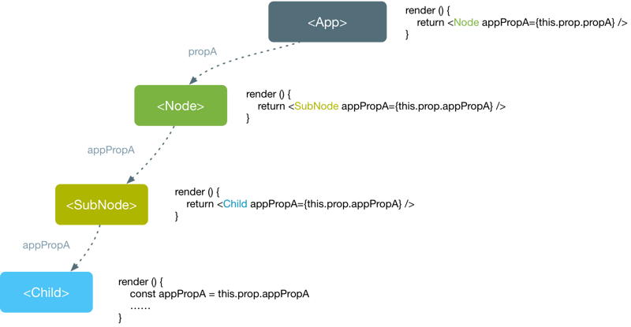

# react 教程

## react 一个UI框架

`React`用于构建用户界面的 `JavaScript` 库.

### react 特点

- mvvm
- 声明式
- 组件化
- 生态强大

## 学习前置基础

- [html\css\js](https://qtxh.ke.qq.com/?tuin=1eb4a0a4)免费视频教程
- [es6+](https://ke.qq.com/course/318503?tuin=1eb4a0a4)
- [webpack教程](https://ke.qq.com/course/321174?tuin=1eb4a0a4)
- [nodejs基础|sass|ajax|...](https://ke.qq.com/course/294595?tuin=1eb4a0a4)

## 简单html的方式编写react demo快速入门

我们可以直接把React的当做一个JS的库来用（**生产环境不要这么用**），如下是第一个`helloword demo`。

```html
<!DOCTYPE html>
<html lang="en">
<head>
  <meta charset="UTF-8">
  <meta name="viewport" content="width=device-width, initial-scale=1.0">
  <meta http-equiv="X-UA-Compatible" content="ie=edge">
  <!-- 第一步： 引入react的cdn的js库 -->
  <!-- react的核心库 -->
  <script crossorigin src="https://unpkg.com/react@16/umd/react.production.min.js"></script>
  <!-- react渲染到浏览器上的支持库（react可以渲染到其他的平台） -->
  <script crossorigin src="https://unpkg.com/react-dom@16/umd/react-dom.production.min.js"></script>
  <!-- babel的转换的js库，生产环境不要使用 -->
  <script src="https://unpkg.com/babel-standalone@6.15.0/babel.min.js"></script>
  <title>aicoder.com  reactdemos</title>
</head>
<body>

  <!-- 第二步：添加html容器 -->
  <!-- 这个是react的容器 -->
  <div id="app">

  </div>

  <!-- 第三步：添加babel的script脚本，这个是核心的React的核心 -->
  <!-- 注意：type必须是text/babel -->
  <script type="text/babel">
    ReactDOM.render(
      <h1>Hello, world! aicoder.com </h1>,
      document.getElementById('app')
    );
  </script>
</body>
</html>
```

`ReactDOM.render`方法是把`JSX`语法生成的dom渲染到页面上去。此方法接受两个参数，第一个参数是渲染的html标签，第二个参数是渲染到页面的哪个节点上。

这里牵扯到`JSX`语法，后续会讲到。

## React脚手架创建项目快速入门

快速构建一个React的前端项目最好的就是用脚手架快速生成一个项目架构目录，并做好基础的配置。建议使用[`Create React App`](https://github.com/facebook/create-react-app)。

### 安装`Create React App`

```sh
# 建议全局安装
$ npm install -g create-react-app

# yarn
$ yarn global add create-react-app
```

测试是否安装成功：

```sh
$ create-react-app -V
2.1.3
```

### 快速初始化一个react项目

```sh
npx create-react-app myapp
cd myapp
npm start
```


此时打开`http://localhost:3000/`就能看到基本的一个简单的web页面。

### 释放webpack的配置文件

由于create-react-app脚手架生成的项目所有的配置都内置在代码中，我们看不到webpack配置的细节，需要通过一个命令，把所有配置都显示的展现在项目中。

```sh
npm run eject
```

> 除非您对webpack已经非常熟悉，请不要这么操作！

### 其他的构建辅助脚本

```sh
# 构建项目
npm run build

yarn build

# 运行测试
npm run test
yarn test

# 另外一种构建方式
# required npm 6.0+
npm init react-app my-app

yarn create react-app my-app

```

## HelloWorld

项目的默认目录：

```sh
├── package.json
├── public                  # 这个是webpack的配置的静态目录
│   ├── favicon.ico
│   ├── index.html          # 默认是单页面应用，这个是最终的html的基础模板
│   └── manifest.json
├── src
│   ├── App.css             # App根组件的css
│   ├── App.js              # App组件代码
│   ├── App.test.js
│   ├── index.css           # 启动文件样式
│   ├── index.js            # 启动的文件（开始执行的入口）！！！！
│   ├── logo.svg
│   └── serviceWorker.js
└── yarn.lock

```

`index.js`就是项目启动启动的入口。

```js
import React from 'react';                           // 引入react核心库（必须）
import ReactDOM from 'react-dom';                    // 引入react在浏览器上运行的需要的支持库
import './index.css';
import App from './App';                             // 引入App组件
import * as serviceWorker from './serviceWorker';    // 注册serviceWork

// 此行代码的意思：把App组件的内容经过Ract的编译生成最终的html挂载到 root的dom节点生。
ReactDOM.render(<App />, document.getElementById('root'));  // !!!核心代码

// If you want your app to work offline and load faster, you can change
// unregister() to register() below. Note this comes with some pitfalls.
// Learn more about service workers: http://bit.ly/CRA-PWA
serviceWorker.unregister();
```

核心代码就是下面一行：把App组件的内容经过Ract的编译生成最终的html挂载到 root的dom节点生。

`ReactDOM.render(<App />, document.getElementById('root'));  // !!!核心代码`

那么我们看一下App组件的代码：

```js
import React, { Component } from 'react';   // 引入react的组件根对象
import logo from './logo.svg';
import './App.css';

class App extends Component {              // 创建App组件类型，继承Component
  render() {
    return (
      <div className="App">
        <header className="App-header">
          
          <p>
            Edit <code>src/App.js</code> and save to reload.
          </p>
          <a
            className="App-link"
            href="https://reactjs.org"
            target="_blank"
            rel="noopener noreferrer"
          >
            Learn React
          </a>
        </header>
      </div>
    );
  }
}
export default App;
```

> 您需要有[es6](https://ke.qq.com/course/318503?tuin=1eb4a0a4)的语法的基础。

在App.js中就做了以下几件事：

- 引入React库
- 定义App类型（继承自React.Component)
- 在App类中定义render方法
- 在render方法中返回要渲染的html（jsx语法）

然后我们修改如下App.js为：

```js
import React, { Component } from 'react';
import './App.css';

class App extends Component {
  render() {
    return (
      <div className="App">
        <h1>Hi, aicoder.com</h1>
      </div>
    );
  }
}

export default App;
```

此时页面会自动刷新为：

```sh
Hi, aicoder.com
```

## JSX语法

JSX， 一种 JavaScript 的语法扩展。JSX 用来声明 React 当中的元素。

比如定义一个变量：

```js
// jsx语法是js和html的组合，本质还是js，最终会编译成js
const element = <h1>Hello, world!</h1>;
```

JSX 的基本语法规则：遇到 HTML 标签（以 < 开头），就用 HTML 规则解析；遇到代码块（以 { 开头），就用 JavaScript 规则解析。

### JSX中使用表达式

如果JSX中的代码超过一行，我们一般用一个()进行分组处理，遇到html一般都会单独写在一个新行。

```js
const element = (
  <h1>
    Hello, {formatName(user)}!
  </h1>
);
```

再比如：

```js
// 用{}可以直接展示数据内容个，类似es6模板字符串中的 ${}
function getGreeting(user) {
  if (user) {
    return <h1>Hello, {user}!</h1>;
  }
  return <h1>Hello, Stranger.</h1>;
}
```

### JSX 属性与{}

你可以使用引号来定义以字符串为值的属性：

```js
const element = <div tabIndex="0"></div>;
```

也可以使用大括号来定义以 JavaScript 表达式为值的属性：

```js
const element = ;
```

### JSX 防注入攻击

你可以放心地在 JSX 当中使用用户输入：

```js
const title = <span>你好！</span>;
// 直接使用是安全的：
const element = <h1>{title}</h1>;
```

React DOM 在渲染之前默认会 过滤 所有传入的值。它可以确保你的应用不会被注入攻击。所有的内容在渲染之前都被转换成了字符串。这样可以有效地防止 XSS(跨站脚本) 攻击。

### 数组的展示

变量是一个数组，则会展开这个数组的所有成员。

```js
import React, { Component } from 'react';
import './App.css';

class App extends Component {
  render() {
    var arr = [
      <h1>hi, aicoder.com</h1>,
      <h2>React is awesome</h2>,
    ];
    return (
      <div className="App">
        {arr}
      </div>
    );
  }
}
export default App;
```

最终结果：

```sh
hi, aicoder.com
React is awesome
```

### 数组map输出一个列表

App.js如下：

```js
import React, { Component } from 'react';
import './App.css';

class App extends Component {
  render() {
    var arr = ['aicoder.com', 'hamkd.com']
    return (
      <div className="App">
        <h1>aicoder.com</h1>
        <ul>
          {
            arr.map((item, index) =>
              <li>{ index +1 } - { item }</li>
            )
          }
        </ul>
      </div>
    );
  }
}
export default App;

```

最终结果：

```sh
aicoder.com
1 - aicoder.com
2 - hamkd.com
```

### JSX的最终归宿

JSX 本质会被编译成JS，Babel 转译器会把 JSX 转换成一个名为 `React.createElement()` 的方法调用。

下面两种代码的作用是完全相同的：

```js
const element = (
  <h1 className="greeting">
    Hello, world!
  </h1>
);
const element = React.createElement(
  'h1',
  {className: 'greeting'},
  'Hello, world!'
);
```

```js
React.createElement() 这个方法首先会进行一些避免bug的检查，之后会返回一个类似下面例子的对象：

// 注意: 以下示例是简化过的（不代表在 React 源码中是这样）
const element = {
  type: 'h1',
  props: {
    className: 'greeting',
    children: 'Hello, world'
  }
};
```

这样的对象被称为 “React 元素”。它代表所有你在屏幕上看到的东西。React 通过读取这些对象来构建 DOM 并保持数据内容一致。

## React组件

组件可以将UI切分成一些独立的、可复用的部件，这样你就只需专注于构建每一个单独的部件。

组件从概念上看就像是函数，它可以接收任意的输入值（称之为“props”），并返回一个需要在页面上展示的React元素。

### 函数定义/类定义组件

定义一个组件最简单的方式是使用JavaScript函数：

```js
function Welcome(props) {
  return <h1>Hello, {props.name}</h1>;
}
```

该函数是一个有效的React组件，它接收一个单一的“props”对象并返回了一个React元素。我们之所以称这种类型的组件为函数定义组件，是因为从字面上来看，它就是一个JavaScript函数。

你也可以使用 [ES6 class](https://developer.mozilla.org/en/docs/Web/JavaScript/Reference/Classes) 来定义一个组件:

```js
class Welcome extends React.Component {
  render() {
    return <h1>Hello, {this.props.name}</h1>;
  }
}
```

上面两个组件在React中是相同的。

### 组件渲染

在前面，我们遇到的React元素都只是DOM标签：

```js
const element = <div />;
```

然而，React元素也可以是用户自定义的组件：

```js
const element = <Welcome name="Sara" />;
```

当React遇到的元素是用户自定义的组件，它会将JSX属性作为单个对象传递给该组件，这个对象称之为“props”。

例如,这段代码会在页面上渲染出"Hello,Sara":

```js
function Welcome(props) {
  return <h1>Hello, {props.name}</h1>;
}

// ...
class App extends Component {
  render() {
    return (
      <div className="App">
        <Welcome name="Sara" />
      </div>
    );
  }
}
// ...
```

我们来回顾一下在这个例子中发生了什么：

1. 我们对`<Welcome name="Sara" />`元素调用了`ReactDOM.render()`方法。
2. React将`{name: 'Sara'}`作为props传入并调用`Welcome`组件。
3. `Welcome`组件将`<h1>Hello, Sara</h1>`元素作为结果返回。
4. 将DOM更新为`<h1>Hello, Sara</h1>`。

>**警告:**
>
>组件名称必须以大写字母开头。
>
>例如，`<div />` 表示一个DOM标签，但 `<Welcome />` 表示一个组件，并且在使用该组件时你必须定义或引入它。

### 组合组件

组件可以在它的输出中引用其它组件，这就可以让我们用同一组件来抽象出任意层次的细节。在React应用中，按钮、表单、对话框、整个屏幕的内容等，这些通常都被表示为组件。

例如，我们可以创建一个`App`组件，用来多次渲染`Welcome`组件：

```js
function Welcome(props) {
  return <h1>Hello, {props.name}</h1>;
}

function App() {
  return (
    <div>
      <Welcome name="Sara" />
      <Welcome name="Cahal" />
      <Welcome name="Edite" />
    </div>
  );
}
```

通常，一个新的React应用程序的顶部是一个`App`组件。但是，如果要将React集成到现有应用程序中，则可以从下而上使用像`Button`这样的小组件作为开始，并逐渐运用到视图层的顶部。

>**警告:**
>
>组件的返回值只能有一个根元素。这也是我们要用一个`<div>`来包裹所有`<Welcome />`元素的原因。

### 提取组件

你可以将组件切分为更小的组件，这没什么好担心的。

例如，来看看这个`Comment`组件：

```js
function Comment(props) {
  return (
    <div className="Comment">
      <div className="UserInfo">
        
        <div className="UserInfo-name">
          {props.author.name}
        </div>
      </div>
      <div className="Comment-text">
        {props.text}
      </div>
      <div className="Comment-date">
        {formatDate(props.date)}
      </div>
    </div>
  );
}
```

这个组件接收`author`(对象)、`text`(字符串)、以及`date`(Date对象)作为props，用来描述一个社交媒体网站上的评论。

这个组件由于嵌套，变得难以被修改，可复用的部分也难以被复用。所以让我们从这个组件中提取出一些小组件。

首先，我们来提取`Avatar`组件：

```js
function Avatar(props) {
  return (
    
  );
}
```

`Avatar`作为`Comment`的内部组件，不需要知道是否被渲染。因此我们将`author`改为一个更通用的名字`user`。

我们建议从组件自身的角度来命名props，而不是根据使用组件的上下文命名。

现在我们可以对`Comment`组件做一些小小的调整：

```js
function Comment(props) {
  return (
    <div className="Comment">
      <div className="UserInfo">
        <Avatar user={props.author} />
        <div className="UserInfo-name">
          {props.author.name}
        </div>
      </div>
      <div className="Comment-text">
        {props.text}
      </div>
      <div className="Comment-date">
        {formatDate(props.date)}
      </div>
    </div>
  );
}
```

提取组件一开始看起来像是一项单调乏味的工作，但是在大型应用中，构建可复用的组件完全是值得的。当你的UI中有一部分重复使用了好几次（比如，`Button`、`Panel`、`Avatar`），或者其自身就足够复杂（比如，`App`、`FeedStory`、`Comment`），类似这些都是抽象成一个可复用组件的绝佳选择，这也是一个比较好的做法。

### Props的只读性

无论是使用[函数或是类](#函数定义/类定义组件)来声明一个组件，它决不能修改它自己的props。来看这个`sum`函数：

```js
function sum(a, b) {
  return a + b;
}
```

类似于上面的这种函数称为[“纯函数”](https://en.wikipedia.org/wiki/Pure_function)，它没有改变它自己的输入值，当传入的值相同时，总是会返回相同的结果。

与之相对的是非纯函数，它会改变它自身的输入值：

```js
function withdraw(account, amount) {
  account.total -= amount;
}
```

React是非常灵活的，但它也有一个严格的规则：

**所有的React组件必须像纯函数那样使用它们的props。**

当然，应用的界面是随时间动态变化的，后面会介绍一种称为“state”的新概念，State可以在不违反上述规则的情况下，根据用户操作、网络响应、或者其他状态变化，使组件动态的响应并改变组件的输出。

## 组件的生命周期

React组件的生命周期图解


组件会随着组件的props和state改变而发生变化，它的DOM也会有相应的变化。一个组件就是一个状态机：对于特定的输入，它总会返回一致的输出。

React组件提供了生命周期的钩子函数去响应组件不同时刻的状态，组件的生命周期如下：

- 实例化阶段
- 存在期阶段
- 销毁期阶段

### 实例化阶段

首次调用组件时，实例化阶段有以下方法会被调用（注意顺序，从上到下先后执行）：

#### `getDefaultProps`

这个方法是用来设置组件默认的props，组件生命周期只会调用一次。但是只适合`React.createClass`直接创建的组件，使用ES6/ES7创建的这个方法不可使用，ES6/ES7可以使用下面方式：

```js
//es7
class Component {
  static defaultProps = {}
}
```

#### `getInitialState`

设置state初始值，在这个方法中你已经可以访问到this.props。getDefaultProps只适合React.createClass使用。使用ES6初始化state方法如下：

```js
class Component extends React.Component {
  constructor(props){
    super(props);
    this.state = {
      render: true,
    }
  }
}
// 或者这样, es6 stage3

class Component extends React.Component{
  state = {
    render: true
  }
  render(){return false;}
}
```

#### `componentWillMount`

此方法会在组件首次渲染之前调用，这个是在render方法调用前可修改state的最后一次机会。这个方法很少用到。

#### `render`

这个方法以后大家都应该会很熟悉，JSX通过这里，解析成对应的虚拟DOM，渲染成最终效果。格式大致如下：

```js
class Component extends React.Component{
  render(){
    return (
       <div></div>
    )
  }
}
```

#### `componentDidMount`

这个方法在首次真实的DOM渲染后调用（仅此一次）当我们需要访问真实的DOM时，这个方法就经常用到。如何访问真实的DOM这里就不想说了。当我们需要请求外部接口数据，一般都在这里处理。

### 存在期

实例化后，当props或者state发生变化时，下面方法依次被调用：

#### `componentWillReceiveProps`

没当我们通过父组件更新子组件props时（这个也是唯一途径），这个方法就会被调用。

`componentWillReceiveProps(nextProps){}`

#### `shouldComponentUpdate`

字面意思，是否应该更新组件，默认返回true。当返回false时，后期函数就不会调用，组件不会在次渲染。

`shouldComponentUpdate(nextProps,nextState){}`

#### `componentWillUpdate`

字面意思组件将会更新，props和state改变后必调用。

#### `render`

跟实例化时的render一样，不多说

#### `componentDidUpdate`

这个方法在更新真实的DOM成功后调用，当我们需要访问真实的DOM时，这个方法就也经常用到。

### 销毁期

销毁阶段，只有一个函数被调用：

#### `componentWillUnmount`

没当组件使用完成，这个组件就必须从DOM中销毁，此时该方法就会被调用。当我们在组件中使用了setInterval，那我们就需要在这个方法中调用clearTimeout。

参考：[React组件生命周期](https://segmentfault.com/a/1190000006792687)

## React组件的状态state

我们可以通过`this.props`获取一个组件的属性，另外还可以通过`this.state`获取组件的私有状态（也就是私有数据）。

### 构造函数初始化内部的状态

```js
import React, { Component } from 'react'

class Clock extends Component {
  constructor(props) {
    super(props);
    // 构造函数中设置状态
    this.state = {
      DateStr: new Date().toLocaleDateString()
    };
  }
  
  render () {
    return (
      <div>
        <p>当前时间是： {this.state.DateStr}</p>
      </div>
    )
  }
}

export default Clock
```

关于 `setState()` 这里有三件事情需要知道

### 不要直接更新状态

例如，此代码不会重新渲染组件：

```js
// Wrong
this.state.comment = 'Hello';
```

应当使用 `setState()`:

```js
// Correct
this.setState({comment: 'Hello'});
```

构造函数是**唯一能够初始化** `this.state` 的地方。

### 状态更新可能是异步的

React 可以将多个`setState()` 调用合并成一个调用来提高性能。

因为 `this.props` 和 `this.state` 可能是异步更新的，你不应该依靠它们的值来计算下一个状态。

例如，此代码可能无法更新计数器：

```js
// Wrong
this.setState({
  counter: this.state.counter + this.props.increment,
});
```

要修复它，请使用第二种形式的 `setState()` 来接受一个函数而不是一个对象。 该函数将接收先前的状态作为第一个参数，将此次更新被应用时的props做为第二个参数：

```js
// Correct
this.setState((prevState, props) => ({
  counter: prevState.counter + props.increment
}));
```

上方代码使用了[箭头函数](https://developer.mozilla.org/en/docs/Web/JavaScript/Reference/Functions/Arrow_functions)，但它也适用于常规函数：

```js
// Correct
this.setState(function(prevState, props) {
  return {
    counter: prevState.counter + props.increment
  };
});
```

### 状态单独更新和自动合并

当你调用 `setState()` 时，React 将你提供的对象合并到当前状态。

例如，你的状态可能包含一些独立的变量：

```js
  constructor(props) {
    super(props);
    this.state = {
      posts: [],
      comments: []
    };
  }
```

你可以调用 `setState()` 独立地更新它们：

```js
  componentDidMount() {
    fetchPosts().then(response => {
      this.setState({
        posts: response.posts
      });
    });

    fetchComments().then(response => {
      this.setState({
        comments: response.comments
      });
    });
  }
```

这里的合并是浅合并，也就是说`this.setState({comments})`完整保留了`this.state.posts`，但完全替换了`this.state.comments`。

## 数据自顶向下流动

父组件或子组件都不能知道某个组件是有状态还是无状态，并且它们不应该关心某组件是被定义为一个函数还是一个类。

这就是为什么状态通常被称为局部或封装。 除了拥有并设置它的组件外，其它组件不可访问。

组件可以选择将其状态作为属性传递给其子组件：

```js
<h2>It is {this.state.date.toLocaleTimeString()}.</h2>
```

这也适用于用户定义的组件：

```js
<FormattedDate date={this.state.date} />
```

`FormattedDate` 组件将在其属性中接收到 `date` 值，并且不知道它是来自 `Clock` 状态、还是来自 `Clock` 的属性、亦或手工输入：

```js
function FormattedDate(props) {
  return <h2>It is {props.date.toLocaleTimeString()}.</h2>;
}
```

这通常被称为`自顶向下`或`单向`数据流。 任何状态始终由某些特定组件所有，并且从该状态导出的任何数据或 UI 只能影响树中`下方`的组件。

如果你想象一个组件树作为属性的瀑布，每个组件的状态就像一个额外的水源，它连接在一个任意点，但也流下来。

为了表明所有组件都是真正隔离的，我们可以创建一个 `App` 组件，它渲染三个`Clock`：

```js
function App() {
  return (
    <div>
      <Clock />
      <Clock />
      <Clock />
    </div>
  );
}

```

每个 `Clock` 建立自己的定时器并且独立更新。
在 React 应用程序中，组件是有状态还是无状态被认为是可能随时间而变化的组件的实现细节。 可以在有状态组件中使用无状态组件，反之亦然。

### 综合案例自动计时的时钟

```js
import React, { Component } from 'react'

class Clock extends Component {
  constructor(props) {
    super(props);
    this.state = {
      DateStr: new Date().toLocaleTimeString(),
      timer: null
    };
  }
  componentDidMount() {
    this.setState({
      timer: setInterval(() => {
        this.setState({
          DateStr: new Date().toLocaleTimeString()
        });
      }, 1000)
    });
  }

  componentWillUnmount() {
    clearInterval(this.state.timer);
  }
  
  render () {
    return (
      <div>
        <p>当前时间是： {this.state.DateStr}</p>
      </div>
    )
  }
}

export default Clock
```

## React的事件处理

React 元素的事件处理和 DOM元素的很相似。但是有一点语法上的不同:

- React事件绑定属性的命名采用驼峰式写法，而不是小写。
- 如果采用 JSX 的语法你需要传入一个函数作为事件处理函数，而不是一个字符串(DOM元素的写法)

> JSX语法中使用{}执行js代码。

例如，传统的 HTML：

```html
<button onclick="activateLasers()">
  Activate Lasers
</button>
```

React 中稍稍有点不同：

```js
<button onClick={activateLasers}>
  Activate Lasers
</button>
```

在 React 中另一个不同是你**不能**使用返回 `false` 的方式阻止默认行为。你必须明确的使用 `preventDefault`。例如，传统的 HTML 中阻止链接默认打开一个新页面，你可以这样写：

```html
<a href="#" onclick="console.log('The link was clicked.'); return false">
  Click me
</a>
```

在 React，应该这样来写：

```js
function ActionLink() {
  function handleClick(e) {
    e.preventDefault();
    console.log('The link was clicked.');
  }

  return (
    <a href="#" onClick={handleClick}>
      Click me
    </a>
  );
}
```

在这里，`e` 是一个合成事件。React 根据 [W3C spec](https://www.w3.org/TR/DOM-Level-3-Events/) 来定义这些合成事件，所以你不需要担心跨浏览器的兼容性问题。

使用 React 的时候通常你不需要使用 `addEventListener` 为一个已创建的 DOM 元素添加监听器。你仅仅需要在这个元素初始渲染的时候提供一个监听器。

当你使用 [ES6 class](https://developer.mozilla.org/en/docs/Web/JavaScript/Reference/Classes) 语法来定义一个组件的时候，事件处理器会成为类的一个方法。例如，下面的 `Toggle` 组件渲染一个让用户切换开关状态的按钮：

```js
class Toggle extends React.Component {
  constructor(props) {
    super(props);
    this.state = {isToggleOn: true};

    // This binding is necessary to make `this` work in the callback
    this.handleClick = this.handleClick.bind(this);
  }

  handleClick() {
    this.setState(prevState => ({
      isToggleOn: !prevState.isToggleOn
    }));
  }

  render() {
    return (
      <button onClick={this.handleClick}>
        {this.state.isToggleOn ? 'ON' : 'OFF'}
      </button>
    );
  }
}

ReactDOM.render(
  <Toggle />,
  document.getElementById('root')
);
```

你必须谨慎对待 JSX 回调函数中的 `this`，类的方法默认是不会[绑定](https://developer.mozilla.org/en/docs/Web/JavaScript/Reference/Global_objects/Function/bind) `this` 的。如果你忘记绑定 `this.handleClick` 并把它传入 `onClick`, 当你调用这个函数的时候 `this` 的值会是 `undefined`。

这并不是 React 的特殊行为；它是[函数如何在 JavaScript 中运行](https://www.smashingmagazine.com/2014/01/understanding-javascript-function-prototype-bind/)的一部分。通常情况下，如果你没有在方法后面添加 `()` ，例如 `onClick={this.handleClick}`，你应该为这个方法绑定 `this`。

如果使用 `bind` 让你很烦，这里有两种方式可以解决。如果你正在使用实验性的[属性初始化器语法](https://babeljs.io/docs/plugins/transform-class-properties/)，你可以使用属性初始化器来正确的绑定回调函数：

```js
class LoggingButton extends React.Component {
  // This syntax ensures `this` is bound within handleClick.
  // Warning: 最新的es的语法，暂时是在stage3
  handleClick = () => {
    console.log('this is:', this);
  }

  render() {
    return (
      <button onClick={this.handleClick}>
        Click me
      </button>
    );
  }
}
```

这个语法在 [Create React App](https://github.com/facebookincubator/create-react-app) 中默认开启。

如果你没有使用属性初始化器语法，你可以在回调函数中使用 [箭头函数](https://developer.mozilla.org/en/docs/Web/JavaScript/Reference/Functions/Arrow_functions)：

```js
class LoggingButton extends React.Component {
  handleClick() {
    console.log('this is:', this);
  }

  render() {
    // This syntax ensures `this` is bound within handleClick
    return (
      <button onClick={(e) => this.handleClick(e)}>
        Click me
      </button>
    );
  }
}
```

使用这个语法有个问题就是每次 `LoggingButton` 渲染的时候都会创建一个不同的回调函数。在大多数情况下，这没有问题。然而如果这个回调函数作为一个属性值传入低阶组件，这些组件可能会进行额外的重新渲染。我们通常建议在构造函数中绑定或使用属性初始化器语法来避免这类性能问题。

demo

```js
import React, { Component } from 'react';
class App extends Component {

  constructor(option) {
    super(option);
    this.handler = this.handler.bind(this);
  }

  handler(e) {
    console.log(e);
    console.log(this);
  }

  hanlderClick = (e) => {
     console.log(e);
     e.target.innerText = Date.now();
  };
  handlerButtonClick(e) {
    console.log('button click');
  }

  render() {
    return (
      <div className="App">
        <h1>aicoder.com</h1>
        <button onClick={this.hanlderClick}>类对象实例属性箭头函数</button>
        <button onClick={this.handler}>构造函数绑定this</button>
        <button onClick={this.handlerButtonClick.bind(this)}>直接bind的this</button>
        <p onMouseEnter={(e) => {console.log(this); console.log(3);}}>nihao</p>
      </div>
    );
  }
}

export default App;

```

### 向事件处理程序传递参数

通常我们会为事件处理程序传递额外的参数。例如，若是 `id` 是你要删除那一行的 id，以下两种方式都可以向事件处理程序传递参数：

```js
<button onClick={(e) => this.deleteRow(id, e)}>Delete Row</button>
<button onClick={this.deleteRow.bind(this, id)}>Delete Row</button>
```

上述两种方式是等价的，分别通过 [arrow functions](https://developer.mozilla.org/en-US/docs/Web/JavaScript/Reference/Functions/Arrow_functions) 和 [`Function.prototype.bind`](https://developer.mozilla.org/en-US/docs/Web/JavaScript/Reference/Global_objects/Function/bind) 来为事件处理函数传递参数。

上面两个例子中，参数 `e` 作为 React 事件对象将会被作为第二个参数进行传递。通过箭头函数的方式，事件对象必须显式的进行传递，但是通过 `bind` 的方式，事件对象以及更多的参数将会被隐式的进行传递。

值得注意的是，通过 `bind` 方式向监听函数传参，在类组件中定义的监听函数，事件对象 `e` 要排在所传递参数的后面，例如:

```js
class Popper extends React.Component{
    constructor(){
        super();
        this.state = {name:'Hello world!'};
    }
    preventPop(name, e){    //事件对象e要放在最后
        e.preventDefault();
        alert(name);
    }
    render(){
        return (
            <div>
                <p>hello</p>
                {/* Pass params via bind() method. */}
                <a href="https://reactjs.org" onClick={this.preventPop.bind(this,this.state.name)}>Click</a>
            </div>
        );
    }
}
```

## 条件渲染

在 React 中，你可以创建不同的组件来封装各种你需要的行为。然后还可以根据应用的状态变化只渲染其中的一部分。

React 中的条件渲染和 JavaScript 中的一致，使用 JavaScript 操作符 [`if`](https://developer.mozilla.org/en-US/docs/Web/JavaScript/Reference/Statements/if...else) 或[条件运算符](https://developer.mozilla.org/en/docs/Web/JavaScript/Reference/Operators/Conditional_Operator)来创建表示当前状态的元素，然后让 React 根据它们来更新 UI。

先来看两个组件:

```js
function UserGreeting(props) {
  return <h1>Welcome back!</h1>;
}

function GuestGreeting(props) {
  return <h1>Please sign up.</h1>;
}
```

我们将创建一个 `Greeting` 组件，它会根据用户是否登录来显示其中之一：

```javascript
function Greeting(props) {
  const isLoggedIn = props.isLoggedIn;
  if (isLoggedIn) {
    return <UserGreeting />;
  }
  return <GuestGreeting />;
}

ReactDOM.render(
  // Try changing to isLoggedIn={true}:
  <Greeting isLoggedIn={false} />,
  document.getElementById('root')
);
```

[在 CodePen 上试试。](https://codepen.io/gaearon/pen/ZpVxNq?editors=0011)

此示例根据 `isLoggedIn` 的值渲染不同的问候语。

### 元素变量

你可以使用变量来储存元素。它可以帮助你有条件的渲染组件的一部分，而输出的其他部分不会更改。

再来看两个新组件分别代表注销和登录：

```js
function LoginButton(props) {
  return (
    <button onClick={props.onClick}>
      Login
    </button>
  );
}

function LogoutButton(props) {
  return (
    <button onClick={props.onClick}>
      Logout
    </button>
  );
}
```

在下面的例子中，我们将要创建一个名为 `LoginControl` 的[有状态的组件](/docs/state-and-lifecycle.html#为一个类添加局部状态)。

它会根据当前的状态来渲染 `<LoginButton />` 或 `<LogoutButton />`，它也将渲染前面例子中的 `<Greeting />`。

```javascript
class LoginControl extends React.Component {
  constructor(props) {
    super(props);
    this.handleLoginClick = this.handleLoginClick.bind(this);
    this.handleLogoutClick = this.handleLogoutClick.bind(this);
    this.state = {isLoggedIn: false};
  }

  handleLoginClick() {
    this.setState({isLoggedIn: true});
  }

  handleLogoutClick() {
    this.setState({isLoggedIn: false});
  }

  render() {
    const isLoggedIn = this.state.isLoggedIn;

    let button = null;
    if (isLoggedIn) {
      button = <LogoutButton onClick={this.handleLogoutClick} />;
    } else {
      button = <LoginButton onClick={this.handleLoginClick} />;
    }

    return (
      <div>
        <Greeting isLoggedIn={isLoggedIn} />
        {button}
      </div>
    );
  }
}

ReactDOM.render(
  <LoginControl />,
  document.getElementById('root')
);
```

[在 CodePen 上试试。](https://codepen.io/gaearon/pen/QKzAgB?editors=0010)

声明变量并使用 `if` 语句是条件渲染组件的不错的方式，但有时你也想使用更简洁的语法，在 JSX 中有如下几种方法。

### 与运算符 &&

你可以通过用花括号包裹代码[在 JSX 中嵌入任何表达式](/docs/introducing-jsx.html#在JSX中使用表达式) ，也包括 JavaScript 的逻辑与 &&，它可以方便地条件渲染一个元素。

```js
function Mailbox(props) {
  const unreadMessages = props.unreadMessages;
  return (
    <div>
      <h1>Hello!</h1>
      {unreadMessages.length > 0 &&
        <h2>
          You have {unreadMessages.length} unread messages.
        </h2>
      }
    </div>
  );
}

const messages = ['React', 'Re: React', 'Re:Re: React'];
ReactDOM.render(
  <Mailbox unreadMessages={messages} />,
  document.getElementById('root')
);
```

[在 CodePen 上试试。](https://codepen.io/gaearon/pen/ozJddz?editors=0010)

之所以能这样做，是因为在 JavaScript 中，`true && expression` 总是返回 `expression`，而 `false && expression` 总是返回 `false`。

因此，如果条件是 `true`，`&&` 右侧的元素就会被渲染，如果是 `false`，React 会忽略并跳过它。

### 三目运算符

条件渲染的另一种方法是使用 JavaScript 的条件运算符 [`condition ? true : false`](https://developer.mozilla.org/en/docs/Web/JavaScript/Reference/Operators/Conditional_Operator)。

在下面的例子中，我们用它来有条件的渲染一小段文本。

```javascript
render() {
  const isLoggedIn = this.state.isLoggedIn;
  return (
    <div>
      The user is <b>{isLoggedIn ? 'currently' : 'not'}</b> logged in.
    </div>
  );
}
```

同样它也可以用在较大的表达式中，虽然不太直观：

```js
render() {
  const isLoggedIn = this.state.isLoggedIn;
  return (
    <div>
      {isLoggedIn ? (
        <LogoutButton onClick={this.handleLogoutClick} />
      ) : (
        <LoginButton onClick={this.handleLoginClick} />
      )}
    </div>
  );
}
```

像在 JavaScript 中一样，你可以根据团队的习惯选择更易读的方式。还要记住如果条件变得过于复杂，可能就是[提取组件](/docs/components-and-props.html#提取组件)的好时机了。

### 阻止组件渲染

在极少数情况下，你可能希望隐藏组件，即使它被其他组件渲染。让 `render` 方法返回 `null` 而不是它的渲染结果即可实现。

在下面的例子中，`<WarningBanner />` 根据属性 `warn` 的值条件渲染。如果 `warn` 的值是 `false`，则组件不会渲染：

```javascript
function WarningBanner(props) {
  if (!props.warn) {
    return null;
  }

  return (
    <div className="warning">
      Warning!
    </div>
  );
}

class Page extends React.Component {
  constructor(props) {
    super(props);
    this.state = {showWarning: true}
    this.handleToggleClick = this.handleToggleClick.bind(this);
  }

  handleToggleClick() {
    this.setState(prevState => ({
      showWarning: !prevState.showWarning
    }));
  }

  render() {
    return (
      <div>
        <WarningBanner warn={this.state.showWarning} />
        <button onClick={this.handleToggleClick}>
          {this.state.showWarning ? 'Hide' : 'Show'}
        </button>
      </div>
    );
  }
}

ReactDOM.render(
  <Page />,
  document.getElementById('root')
);
```

[在 CodePen 上试试。](https://codepen.io/gaearon/pen/Xjoqwm?editors=0010)

组件的 `render` 方法返回 `null` 并不会影响该组件生命周期方法的回调。例如，`componentWillUpdate` 和 `componentDidUpdate` 依然可以被调用。

## React列表 & Keys

首先，让我们看下在Javascript中如何转化列表

如下代码，我们使用[`map()`](https://developer.mozilla.org/en-US/docs/Web/JavaScript/Reference/Global_Objects/Array/map)函数让数组中的每一项翻倍,我们得到了一个新的数列`doubled`

```javascript
const numbers = [1, 2, 3, 4, 5];
const doubled = numbers.map((number) => number * 2);
console.log(doubled);
```

代码打印出`[2, 4, 6, 8, 10]`

在React中，把数组转化为数列[元素](/docs/rendering-elements.html)的过程是相似的

### 渲染多个组件

你可以通过使用`{}`在JSX内构建一个[元素集合](/docs/introducing-jsx.html#JSX嵌套)

下面，我们使用Javascript中的[`map()`](https://developer.mozilla.org/en-US/docs/Web/JavaScript/Reference/Global_Objects/Array/map)方法遍历`numbers`数组。对数组中的每个元素返回`<li>`标签，最后我们得到一个数组`listItems`

```javascript
const numbers = [1, 2, 3, 4, 5];
const listItems = numbers.map((number) =>
  <li>{number}</li>
);
```

我们把整个`listItems`插入到`ul`元素中，然后[渲染进DOM](/docs/rendering-elements.html#将元素渲染到DOM中):

```javascript
ReactDOM.render(
  <ul>{listItems}</ul>,
  document.getElementById('root')
);
```

[在 CodePen 上试试。](https://codepen.io/gaearon/pen/GjPyQr?editors=0011)

这段代码生成了一个1到5的数字列表

### 基础列表组件

通常你需要渲染一个列表到[组件](/docs/components-and-props.html)中

我们可以把前面的例子重构成一个组件。这个组件接收`numbers`数组作为参数，输出一个无序列表。

```javascript
function NumberList(props) {
  const numbers = props.numbers;
  const listItems = numbers.map((number) =>
    <li>{number}</li>
  );
  return (
    <ul>{listItems}</ul>
  );
}

const numbers = [1, 2, 3, 4, 5];
ReactDOM.render(
  <NumberList numbers={numbers} />,
  document.getElementById('root')
);
```

当我们运行这段代码，将会看到一个警告 `a key should be provided for list items` ，意思是当你创建一个元素时，必须包括一个特殊的 `key` 属性。我们将在下一节讨论这是为什么。

让我们来给每个列表元素分配一个 `key` 来解决上面的那个警告：

```javascript
function NumberList(props) {
  const numbers = props.numbers;
  const listItems = numbers.map((number) =>
    <li key={number.toString()}>
      {number}
    </li>
  );
  return (
    <ul>{listItems}</ul>
  );
}

const numbers = [1, 2, 3, 4, 5];
ReactDOM.render(
  <NumberList numbers={numbers} />,
  document.getElementById('root')
);
```

[在 CodePen 上试试。](https://codepen.io/gaearon/pen/jrXYRR?editors=0011)

## Keys

Keys可以在DOM中的某些元素被增加或删除的时候帮助React识别哪些元素发生了变化。因此你应当给数组中的每一个元素赋予一个确定的标识。

```js
const numbers = [1, 2, 3, 4, 5];
const listItems = numbers.map((number) =>
  <li key={number.toString()}>
    {number}
  </li>
);
```

一个元素的key最好是这个元素在列表中拥有的一个独一无二的字符串。通常，我们使用来自数据的id作为元素的key:

```js
const todoItems = todos.map((todo) =>
  <li key={todo.id}>
    {todo.text}
  </li>
);
```

当元素没有确定的id时，你可以使用他的序列号索引index作为key

```js
const todoItems = todos.map((todo, index) =>
  // Only do this if items have no stable IDs
  <li key={index}>
    {todo.text}
  </li>
);
```

如果列表项目的顺序可能会变化，我们不建议使用索引来用作键值，因为这样做会导致性能的负面影响，还可能引起组件状态问题。如果你想要了解更多，请点击[深度解析key的必要性](/docs/reconciliation.html#递归子节点)。如果你选择不指定显式的键值，那么React将默认使用索引用作为列表项目的键值。

这里有一篇文章 [in-depth explanation about why keys are necessary](https://reactjs.org/docs/reconciliation.html#recursing-on-children) ，要是你有兴趣了解更多的话。

### 用keys提取组件

元素的key只有放在其环绕数组的上下文中才有意义。

比方说，如果你提取出一个`ListItem`组件，你应该把key保存在数组中的这个`<ListItem />`元素上，而不是放在`ListItem`组件中的`<li>`元素上。

```javascript
function ListItem(props) {
  // 对啦！这里不需要指定key:
  return <li>{props.value}</li>;
}

function NumberList(props) {
  const numbers = props.numbers;
  const listItems = numbers.map((number) =>
    // 又对啦！key应该在数组的上下文中被指定
    <ListItem key={number.toString()}
              value={number} />
  );
  return (
    <ul>
      {listItems}
    </ul>
  );
}

const numbers = [1, 2, 3, 4, 5];
ReactDOM.render(
  <NumberList numbers={numbers} />,
  document.getElementById('root')
);
```

[在 CodePen 上试试。](https://codepen.io/rthor/pen/QKzJKG?editors=0010)

一个好的大拇指法则：元素位于`map()`方法内时需要设置键属性。

### 键（key）只是在兄弟之间必须唯一

数组元素中使用的key在其兄弟之间应该是独一无二的。然而，它们不需要是全局唯一的。当我们生成两个不同的数组时，我们可以使用相同的键

```js
function Blog(props) {
  const sidebar = (
    <ul>
      {props.posts.map((post) =>
        <li key={post.id}>
          {post.title}
        </li>
      )}
    </ul>
  );
  const content = props.posts.map((post) =>
    <div key={post.id}>
      <h3>{post.title}</h3>
      <p>{post.content}</p>
    </div>
  );
  return (
    <div>
      {sidebar}
      <hr />
      {content}
    </div>
  );
}

const posts = [
  {id: 1, title: 'Hello World', content: 'Welcome to learning React!'},
  {id: 2, title: 'Installation', content: 'You can install React from npm.'}
];
ReactDOM.render(
  <Blog posts={posts} />,
  document.getElementById('root')
);
```

[在 CodePen 上试试。](https://codepen.io/gaearon/pen/NRZYGN?editors=0010)

key会作为给React的提示，但不会传递给你的组件。如果您的组件中需要使用和`key`相同的值，请用其他属性名显式传递这个值：

```js
const content = posts.map((post) =>
  <Post
    key={post.id}
    id={post.id}
    title={post.title} />
);
```

上面例子中，`Post`组件可以读出`props.id`，但是不能读出`props.key`

### 在jsx中嵌入map()

在上面的例子中，我们声明了一个单独的`listItems`变量并将其包含在JSX中

```js
function NumberList(props) {
  const numbers = props.numbers;
  const listItems = numbers.map((number) =>
    <ListItem key={number.toString()}
              value={number} />
  );
  return (
    <ul>
      {listItems}
    </ul>
  );
}
```

JSX允许在大括号中嵌入任何表达式，所以我们可以在`map()`中这样使用：

```js
function NumberList(props) {
  const numbers = props.numbers;
  return (
    <ul>
      {numbers.map((number) =>
        <ListItem key={number.toString()}
                  value={number} />
      )}
    </ul>
  );
}
```

[在 CodePen 上试试。](https://codepen.io/gaearon/pen/BLvYrB?editors=0010)

这么做有时可以使你的代码更清晰，但有时这种风格也会被滥用。就像在JavaScript中一样，何时需要为了可读性提取出一个变量，这完全取决于你。但请记住，如果一个`map()`嵌套了太多层级，那可能就是你[提取出组件](/docs/components-and-props.html#提取组件)的一个好时机。

## 表单

HTML表单元素与React中的其他DOM元素有所不同,因为表单元素生来就保留一些内部状态。例如，下面这个表单只接受一个唯一的name。

```html
<form>
  <label>
    Name:
    <input type="text" name="name" />
  </label>
  <input type="submit" value="Submit" />
</form>
```

当用户提交表单时，HTML的默认行为会使这个表单跳转到一个新页面。在React中亦是如此。但大多数情况下，我们都会构造一个处理提交表单并可访问用户输入表单数据的函数。实现这一点的标准方法是使用一种称为“受控组件”的技术。

### 受控组件

在HTML当中，像`<input>`,`<textarea>`, 和 `<select>`这类表单元素会维持自身状态，并根据用户输入进行更新。但在React中，可变的状态通常保存在组件的状态属性中，并且只能用 `setState()`方法进行更新。

我们通过使react变成一种单一数据源的状态来结合二者。React负责渲染表单的组件仍然控制用户后续输入时所发生的变化。相应的，其值由React控制的输入表单元素称为“受控组件”。

例如，我们想要使上个例子中在提交表单时输出name,我们可以写成“受控组件”的形式:

```javascript
class NameForm extends React.Component {
  constructor(props) {
    super(props);
    this.state = {value: ''};

    this.handleChange = this.handleChange.bind(this);
    this.handleSubmit = this.handleSubmit.bind(this);
  }

  handleChange(event) {
    this.setState({value: event.target.value});
  }

  handleSubmit(event) {
    alert('A name was submitted: ' + this.state.value);
    event.preventDefault();
  }

  render() {
    return (
      <form onSubmit={this.handleSubmit}>
        <label>
          Name:
          <input type="text" value={this.state.value} onChange={this.handleChange} />
        </label>
        <input type="submit" value="Submit" />
      </form>
    );
  }
}
```

[在 CodePen 上尝试。](https://codepen.io/gaearon/pen/VmmPgp?editors=0010)

由于 `value` 属性是在我们的表单元素上设置的，因此显示的值将始终为 React数据源上`this.state.value` 的值。由于每次按键都会触发 `handleChange` 来更新当前React的state，所展示的值也会随着不同用户的输入而更新。

使用"受控组件",每个状态的改变都有一个与之相关的处理函数。这样就可以直接修改或验证用户输入。例如，我们如果想限制输入全部是大写字母，我们可以将`handleChange` 写为如下：

```javascript
handleChange(event) {
  this.setState({value: event.target.value.toUpperCase()});
}
```

### textarea 标签

在HTML当中，`<textarea>` 元素通过子节点来定义它的文本内容

```html
<textarea>
  Hello there, this is some text in a text area
</textarea>
```

在React中，`<textarea>`会用`value`属性来代替。这样的话，表单中的`<textarea>` 非常类似于使用单行输入的表单：

```javascript
class EssayForm extends React.Component {
  constructor(props) {
    super(props);
    this.state = {
      value: 'Please write an essay about your favorite DOM element.'
    };

    this.handleChange = this.handleChange.bind(this);
    this.handleSubmit = this.handleSubmit.bind(this);
  }

  handleChange(event) {
    this.setState({value: event.target.value});
  }

  handleSubmit(event) {
    alert('An essay was submitted: ' + this.state.value);
    event.preventDefault();
  }

  render() {
    return (
      <form onSubmit={this.handleSubmit}>
        <label>
          Name:
          <textarea value={this.state.value} onChange={this.handleChange} />
        </label>
        <input type="submit" value="Submit" />
      </form>
    );
  }
}
```

注意`this.state.value`是在构造函数中初始化，这样文本区域就能获取到其中的文本。

### select 标签

在HTML当中，`<select>`会创建一个下拉列表。例如这个HTML就创建了一个下拉列表的原型。

```html
<select>
  <option value="grapefruit">Grapefruit</option>
  <option value="lime">Lime</option>
  <option selected value="coconut">Coconut</option>
  <option value="mango">Mango</option>
</select>
```

请注意，Coconut选项最初由于`selected`属性是被选中的。在React中，并不使用之前的`selected`属性，而在根`select`标签上用`value`属性来表示选中项。这在受控组件中更为方便，因为你只需要在一个地方来更新组件。例如：

```javascript
class FlavorForm extends React.Component {
  constructor(props) {
    super(props);
    this.state = {value: 'coconut'};

    this.handleChange = this.handleChange.bind(this);
    this.handleSubmit = this.handleSubmit.bind(this);
  }

  handleChange(event) {
    this.setState({value: event.target.value});
  }

  handleSubmit(event) {
    alert('Your favorite flavor is: ' + this.state.value);
    event.preventDefault();
  }

  render() {
    return (
      <form onSubmit={this.handleSubmit}>
        <label>
          Pick your favorite La Croix flavor:
          <select value={this.state.value} onChange={this.handleChange}>
            <option value="grapefruit">Grapefruit</option>
            <option value="lime">Lime</option>
            <option value="coconut">Coconut</option>
            <option value="mango">Mango</option>
          </select>
        </label>
        <input type="submit" value="Submit" />
      </form>
    );
  }
}
```

[在 CodePen 上尝试。](https://codepen.io/gaearon/pen/JbbEzX?editors=0010)

总之，`<input type="text">`, `<textarea>`, 和 `<select>` 都十分类似 - 他们都通过传入一个`value`属性来实现对组件的控制。

### file input 标签

在HTML当中，`<input type="file">` 允许用户从他们的存储设备中选择一个或多个文件以提交表单的方式上传到服务器上, 或者通过 Javascript 的  [File API](https://developer.mozilla.org/en-US/docs/Web/API/File/Using_files_from_web_applications)  对文件进行操作 。

```html
<input type="file" />
```

由于该标签的  `value` 属性是只读的， 所以它是 React 中的一个**非受控组件**。我们会把它和其他非受控组件一起在[后面的章节](https://reactjs.org/docs/uncontrolled-components.html#the-file-input-tag)进行详细的介绍。

### 多个输入的解决方法

当你有处理多个受控的`input`元素时，你可以通过给每个元素添加一个`name`属性，来让处理函数根据 `event.target.name`的值来选择做什么。

例如:

```javascript
class Reservation extends React.Component {
  constructor(props) {
    super(props);
    this.state = {
      isGoing: true,
      numberOfGuests: 2
    };

    this.handleInputChange = this.handleInputChange.bind(this);
  }

  handleInputChange(event) {
    const target = event.target;
    const value = target.type === 'checkbox' ? target.checked : target.value;
    const name = target.name;

    this.setState({
      [name]: value
    });
  }

  render() {
    return (
      <form>
        <label>
          Is going:
          <input
            name="isGoing"
            type="checkbox"
            checked={this.state.isGoing}
            onChange={this.handleInputChange} />
        </label>
        <br />
        <label>
          Number of guests:
          <input
            name="numberOfGuests"
            type="number"
            value={this.state.numberOfGuests}
            onChange={this.handleInputChange} />
        </label>
      </form>
    );
  }
}
```

[在 CodePen 上尝试。](https://codepen.io/gaearon/pen/wgedvV?editors=0010)

注意我们如何使用ES6当中的[计算属性名](https://developer.mozilla.org/en/docs/Web/JavaScript/Reference/Operators/Object_initializer#Computed_property_names)语法来更新与给定输入名称相对应的状态键：

```js
this.setState({
  [name]: value
});
```

相当于如下ES5语法

```js
var partialState = {};
partialState[name] = value;
this.setState(partialState);
```

同样由于 `setState()` 自动将部分状态合并到当前状态，因此我们只需要使用发生变化的部分调用它。

### 受控组件的替代方法

有时使用受控组件可能很繁琐，因为您要为数据可能发生变化的每一种方式都编写一个事件处理程序，并通过一个组件来管理全部的状态。当您将预先存在的代码库转换为React或将React应用程序与非React库集成时，这可能变得特别烦人。在以上情况下，你或许应该看看非受控组件，这是一种表单的替代技术。

### 综合自定义表单校验案例

```js
import React, { Component } from 'react';

class FormSub extends Component {
  constructor(opt) {
    super(opt);
    this.state = {
      Title: 'hi',
      Validate: {
        Title: {
          required: true,
          minLen: 6,
          maxLen: 10,
          validate: true,
          msg: '*ToDo不能为空！'
        }
      }
    }
  }

  handlerChange = (e) => {
    // 设置状态：是异步执行。
    this.setState({
      [e.target.name]: e.target.value
    }, () => {
      this.validateInput();
    });
  }

  handlerSubmit = (e) => {
    e.preventDefault();
    // 第一： 做表单的校验
    this.validateInput();
    // 第二： 做表单提交到后台ajax请求
  };

  validateInput() {
    let { Title, Validate } = this.state;
    let tempValidate = false;
    const len = Title.length;
    const min = Validate.Title.minLen;
    const max = Validate.Title.maxLen;
    if(len >= min && len <= max) {
      tempValidate = true;
    }

    this.setState(preState => {
      return Object.assign({}, preState, {
        Validate: {
          Title: Object.assign({}, preState.Validate.Title,{
            validate: tempValidate,
          })
        }
      });
    })
  }

  render() {
    return (
      <form onSubmit={this.handlerSubmit}>
        <label>
          ToDo：
          <input 
            type="text"
            name="Title"
            onChange={this.handlerChange}
            value={this.state.Title}
          />
          {
            !this.state.Validate.Title.validate &&
            <span 
              style={{color: 'red'}}
            >
              {this.state.Validate.Title.msg}
            </span>
          }
        </label>
        <br/>
        <input type="submit" value="提交"/>
      </form>
    );
  }
}

export default FormSub;
```

## 状态提升

使用 react 经常会遇到几个组件需要共用状态数据的情况。这种情况下，我们最好将这部分共享的状态提升至他们最近的父组件当中进行管理。我们来看一下具体如何操作吧

我们一个计数的父组件，两个按钮组件，两个按钮组件分别对父组件中的数据进行添加和减少操作。

```js
// Counter.js 父组件
import React, { Component } from 'react';

import ButtonAdd from './ButtonAdd';
import ButtonMinus from './ButtonMinus';

class Counter extends Component {
  constructor(option) {
    super(option);
    this.state = { num: 0, age: 19 };
  }
  minusCount(num, e) {
    this.setState((preState) => {
      return { num: preState.num - num }
    });
  }
  addCount(num, e) {
    this.setState((preState) => {
      return { num: preState.num + num }
    });
  }
  render() {
    return (
      <div>
        <p>parent: { this.state.num } -{ this.state.age }</p>
        <hr />
        <ButtonAdd addCount={ this.addCount.bind(this) } num={ this.state.num } />
        <ButtonMinus minusCount={ this.minusCount.bind(this) } num={ this.state.num }  />
      </div>
    );
  }
}

export default Counter;


// 子组件 添加按钮组件
import React, { Component } from 'react';

class ButtonAdd extends Component {
  render() {
    return (
      <div>
        <span>child:state {this.props.num}</span>
        <button onClick={ () => {
          this.props.addCount(1);
        }}>
          +1
        </button>
      </div>
    );
  }
}

export default ButtonAdd;


// 子组件：  减少按钮组件
import React, { Component } from 'react';

class ButtonMinus extends Component {
  render() {
    return (
      <div>
        <span>child:state { this.props.num }</span>
        <button onClick={ () => {
          this.props.minusCount(1);
        }}>
          -1
        </button>
      </div>
    );
  }
}

export default ButtonMinus;
```

## 组合与`props.children`

React 具有强大的组合模型，我们建议使用组合而不是继承来复用组件之间的代码。

在本节中，我们将围绕几个 React 新手经常使用继承解决的问题，我们将展示如何用组合来解决它们。

### 包含关系

一些组件不能提前知道它们的子组件是什么。这对于 `Sidebar` 或 `Dialog` 这类通用容器尤其常见。

我们建议这些组件使用 `children` 属性将子元素直接传递到输出。

```js
function FancyBorder(props) {
  return (
    <div className={'FancyBorder FancyBorder-' + props.color}>
      {props.children}
    </div>
  );
}
```

这样做还允许其他组件通过嵌套 JSX 来传递子组件。

```js
function WelcomeDialog() {
  return (
    <FancyBorder color="blue">
      <h1 className="Dialog-title">
        Welcome
      </h1>
      <p className="Dialog-message">
        Thank you for visiting our spacecraft!
      </p>
    </FancyBorder>
  );
}
```

[在 CodePen 上试试。](http://codepen.io/gaearon/pen/ozqNOV?editors=0010)

`<FancyBorder>` JSX 标签内的任何内容都将通过 `children` 属性传入 `FancyBorder`。由于 `FancyBorder` 在一个 `<div>` 内渲染了 `{props.children}`，所以被传递的所有元素都会出现在最终输出中。

虽然不太常见，但有时你可能需要在组件中有多个入口，这种情况下你可以使用自己约定的属性而不是 `children`：

```js
function SplitPane(props) {
  return (
    <div className="SplitPane">
      <div className="SplitPane-left">
        {props.left}
      </div>
      <div className="SplitPane-right">
        {props.right}
      </div>
    </div>
  );
}

function App() {
  return (
    <SplitPane
      left={
        <Contacts />
      }
      right={
        <Chat />
      } />
  );
}
```

[在 CodePen 上试试。](http://codepen.io/gaearon/pen/gwZOJp?editors=0010)

类似 `<Contacts />` 和 `<Chat />` 这样的 React 元素都是对象，所以你可以像任何其他元素一样传递它们。

### 特殊实例

有时我们认为组件是其他组件的特殊实例。例如，我们会说 `WelcomeDialog` 是 `Dialog` 的特殊实例。

在 React 中，这也是通过组合来实现的，通过配置属性用较特殊的组件来渲染较通用的组件。

```js
function Dialog(props) {
  return (
    <FancyBorder color="blue">
      <h1 className="Dialog-title">
        {props.title}
      </h1>
      <p className="Dialog-message">
        {props.message}
      </p>
    </FancyBorder>
  );
}

function WelcomeDialog() {
  return (
    <Dialog
      title="Welcome"
      message="Thank you for visiting our spacecraft!" />
  );
}
```

[在 CodePen 上试试。](http://codepen.io/gaearon/pen/kkEaOZ?editors=0010)

组合对于定义为类的组件同样适用：

```js
function Dialog(props) {
  return (
    <FancyBorder color="blue">
      <h1 className="Dialog-title">
        {props.title}
      </h1>
      <p className="Dialog-message">
        {props.message}
      </p>
      {props.children}
    </FancyBorder>
  );
}

class SignUpDialog extends React.Component {
  constructor(props) {
    super(props);
    this.handleChange = this.handleChange.bind(this);
    this.handleSignUp = this.handleSignUp.bind(this);
    this.state = {login: ''};
  }

  render() {
    return (
      <Dialog title="Mars Exploration Program"
              message="How should we refer to you?">
        <input value={this.state.login}
               onChange={this.handleChange} />
        <button onClick={this.handleSignUp}>
          Sign Me Up!
        </button>
      </Dialog>
    );
  }

  handleChange(e) {
    this.setState({login: e.target.value});
  }

  handleSignUp() {
    alert(`Welcome aboard, ${this.state.login}!`);
  }
}
```

[在 CodePen 上试试。](http://codepen.io/gaearon/pen/gwZbYa?editors=0010)

## JSX高级

本质上来讲，JSX 只是为 `React.createElement(component, props, ...children) ` 方法提供的语法糖。比如下面的代码：

```jsx
<MyButton color="blue" shadowSize=>
  Click Me
</MyButton>
```

编译为：

```jsx
React.createElement(
  MyButton,
  {color: 'blue', shadowSize: 2},
  'Click Me'
)
```

如果没有子代，你还可以使用自闭合标签，比如：

```jsx
<div className="sidebar" />
```

编译为：

```jsx
React.createElement(
  'div',
  {className: 'sidebar'},
  null
)
```

如果你想彻底验证 JSX 是如何转换为 JavaScript 的，你可以尝试 [在线 Babel 编译器](https://babeljs.io/repl/#?babili=false&evaluate=true&lineWrap=false&presets=es2015%2Creact%2Cstage-0&code=function%20hello()%20%7B%0A%20%20return%20%3Cdiv%3EHello%20world!%3C%2Fdiv%3E%3B%0A%7D).

### 指定 React 元素类型

JSX 的标签的第一部分决定了 React 元素的类型。

首字母大写的类型表示 JSX 标签引用到一个 React 组件。这些标签将会被编译为直接引用同名变量，所以如果你使用了 `<Foo />` JSX 表达式，则 `Foo` 必须在作用域中。

#### React 必须在作用域中

由于 JSX 编译成`React.createElement`方法的调用，所以在你的 JSX 代码中，`React`库必须也始终在作用域中。

比如，下面两个导入都是必须的，尽管 `React` 和 `CustomButton` 都没有在代码中被直接调用。

```jsx
import React from 'react';
import CustomButton from './CustomButton';

function WarningButton() {
  // return React.createElement(CustomButton, {color: 'red'}, null);
  return <CustomButton color="red" />;
}
```

如果你没有使用JavaScript 打捆机，而是从`<script>`标签加载React，它已经在作用域中，以`React`全局变量的形式。

#### 点表示法用于JSX类型

你还可以使用 JSX 中的点表示法来引用 React 组件。你可以方便地从一个模块中导出许多 React 组件。例如，有一个名为 `MyComponents.DatePicker` 的组件，你可以直接在 JSX 中使用它：

```jsx
import React from 'react';

const MyComponents = {
  DatePicker: function DatePicker(props) {
    return <div>Imagine a {props.color} datepicker here.</div>;
  }
}

function BlueDatePicker() {
  return <MyComponents.DatePicker color="blue" />;
}
```

#### 用户定义组件必须首字母大写

当元素类型以小写字母开头时，它表示一个内置的组件，如 `<div>` 或 `<span>`，将导致字符串 `'div'` 或 `'span'` 传递给 `React.createElement`。 以大写字母开头的类型，如 `<Foo />` 编译为 `React.createElement(Foo)`，并且它正对应于你在 JavaScript 文件中定义或导入的组件。

我们建议用大写开头命名组件。如果你的组件以小写字母开头，请在 JSX 中使用之前其赋值给大写开头的变量。

例如，下面的代码将无法按预期运行：

```jsx
import React from 'react';

// 错误！组件名应该首字母大写:
function hello(props) {
  // 正确！div 是有效的 HTML 标签:
  return <div>Hello {props.toWhat}</div>;
}

function HelloWorld() {
  // 错误！React 会将小写开头的标签名认为是 HTML 原生标签:
  return <hello toWhat="World" />;
}
```

为了解决这个问题，我们将 `hello` 重命名为 `Hello`，然后使用 `<Hello />` 引用：

```jsx
import React from 'react';

// 正确！组件名应该首字母大写:
function Hello(props) {
  // 正确！div 是有效的 HTML 标签:
  return <div>Hello {props.toWhat}</div>;
}

function HelloWorld() {
  // 正确！React 能够将大写开头的标签名认为是 React 组件。
  return <Hello toWhat="World" />;
}
```

#### 在运行时选择类型

你不能使用一个通用的表达式来作为 React 元素的标签。如果你的确想使用一个通用的表达式来确定 React 元素的类型，请先将其赋值给大写开头的变量。这种情况一般发生于当你想基于属性值渲染不同的组件时：

```jsx
import React from 'react';
import { PhotoStory, VideoStory } from './stories';

const components = {
  photo: PhotoStory,
  video: VideoStory
};

function Story(props) {
  // 错误！JSX 标签名不能为一个表达式。
  return <components[props.storyType] story={props.story} />;
}
```

要解决这个问题，我们需要先将类型赋值给大写开头的变量。

```jsx
import React from 'react';
import { PhotoStory, VideoStory } from './stories';

const components = {
  photo: PhotoStory,
  video: VideoStory
};

function Story(props) {
  // 正确！JSX 标签名可以为大写开头的变量。
  const SpecificStory = components[props.storyType];
  return <SpecificStory story={props.story} />;
}
```

### JSX的属性(Props)

在 JSX 中有几种不同的方式来指定属性。

#### 使用 JavaScript 表达式作为属性

你可以传递JavaScript 表达式作为一个属性，再用大括号`{}`括起来。例如，在这个 JSX 中：

```jsx
<MyComponent foo={1 + 2 + 3 + 4} />
```

对于 `MyComponent`来说， `props.foo` 的值为 10，这是 `1 + 2 + 3 + 4` 表达式计算得出的。

`if` 语句和 `for` 循环在 JavaScript 中不是表达式，因此它们不能直接在 JSX 中使用，但是你可以将它们放在周围的代码中。例如：

```jsx
function NumberDescriber(props) {
  let description;
  if (props.number % 2 == 0) {
    description = <strong>even</strong>;
  } else {
    description = <i>odd</i>;
  }
  return <div>{props.number} is an {description} number</div>;
}
```

你可以在相关部分中了解有关 [条件渲染](/docs/conditional-rendering.html) 和 [循环](/docs/lists-and-keys.html) 的更多信息。

#### 字符串常量

你可以将字符串常量作为属性值传递。下面这两个 JSX 表达式是等价的：

```jsx
<MyComponent message="hello world" />

<MyComponent message={'hello world'} />
```

当传递一个字符串常量时，该值为HTML非转义的，所以下面两个 JSX 表达式是相同的：

```jsx
<MyComponent message="&lt;3" />

<MyComponent message={'<3'} />
```

这种行为通常是无意义的，提到它只是为了完整性。

#### 属性默认为“True”

如果你没有给属性传值，它默认为 `true`。因此下面两个 JSX 是等价的：

```jsx
<MyTextBox autocomplete />

<MyTextBox autocomplete={true} />
```

一般情况下，我们不建议这样使用，因为它会与 [ES6 对象简洁表示法](https://developer.mozilla.org/en/docs/Web/JavaScript/Reference/Operators/Object_initializer#New_notations_in_ECMAScript_2015) 混淆。比如 `{foo}` 是 `{foo: foo}` 的简写，而不是 `{foo: true}`。这里能这样用，是因为它符合 HTML 的做法。

#### 展开属性

如果你已经有了个 `props` 对象，并且想在 JSX 中传递它，你可以使用 `...` 作为“展开(spread)”操作符来传递整个属性对象。下面两个组件是等效的：

```jsx
function App1() {
  return <Greeting firstName="Ben" lastName="Hector" />;
}

function App2() {
  const props = {firstName: 'Ben', lastName: 'Hector'};
  return <Greeting {...props} />;
}
```

You can also pick specific props that your component will consume while passing all other props using the spread operator.

```jsx
const Button = props => {
  const { kind, ...other } = props;
  const className = kind === "primary" ? "PrimaryButton" : "SecondaryButton";
  return <button className={className} {...other} />;
};

const App = () => {
  return (
    <div>
      <Button kind="primary" onClick={() => console.log("clicked!")}>
        Hello World!
      </Button>
    </div>
  );
};
```

In the example above, the `kind` prop is safely consumed and *is not* passed on to the `<button>` element in the DOM. All other props are passed via the `...other`object making this component really flexible. You can see that it passes an `onClick` and `children` props.

展开属性非常有用。但是他们也容易传递不必要的属性给组件，而组件并不需要这些多余属性。或者传递无效的HTML熟悉给DOM。我们建议你谨慎使用此语法。

### JSX中的子代

在既包含开始标签又包含结束标签的 JSX 表达式中，这两个标签之间的内容被传递为专门的属性：`props.children`。有几种不同的方法来传递子代：

#### 字符串字面量

你可以在开始和结束标签之间放入一个字符串，则 `props.children` 就是那个字符串。这对于许多内置 HTML 元素很有用。例如：

```jsx
<MyComponent>Hello world!</MyComponent>
```

这是有效的 JSX，并且 `MyComponent` 的 `props.children` 值将会直接是 `"hello world!"`。因为 HTML 未转义，所以你可以像写 HTML 一样写 JSX：

```html
<div>This is valid HTML &amp; JSX at the same time.</div>
```

JSX 会移除空行和开始与结尾处的空格。标签邻近的新行也会被移除，字符串常量内部的换行会被压缩成一个空格，所以下面这些都等价：

```jsx
<div>Hello World</div>

<div>
  Hello World
</div>

<div>
  Hello
  World
</div>

<div>

  Hello World
</div>
```

#### JSX子代

你可以提供更多个 JSX 元素作为子代，这对于嵌套显示组件非常有用：

```jsx
<MyContainer>
  <MyFirstComponent />
  <MySecondComponent />
</MyContainer>
```

你可以混合不同类型的子代，同时使用字符串字面量和 JSX子代，这是 JSX 类似 HTML 的另一种形式，这在 JSX 和 HTML 中都是有效的：

```html
<div>
  Here is a list:
  <ul>
    <li>Item 1</li>
    <li>Item 2</li>
  </ul>
</div>
```

React 组件也可以返回包含多个元素的一个数组：

```jsx
render() {
  // 不需要使用额外的元素包裹数组中的元素！
  return [
    // 不要忘记 key :)
    <li key="A">First item</li>,
    <li key="B">Second item</li>,
    <li key="C">Third item</li>,
  ];
}
```

#### JavaScript 表达式作为子代

你可以将任何 `{}` 包裹的 JavaScript 表达式作为子代传递。例如，下面这些表达式是等价的：

```jsx
<MyComponent>foo</MyComponent>

<MyComponent>{'foo'}</MyComponent>
```

这对于渲染任意长度的 JSX 表达式的列表很有用。例如，下面将会渲染一个 HTML 列表：

```jsx
function Item(props) {
  return <li>{props.message}</li>;
}

function TodoList() {
  const todos = ['finish doc', 'submit pr', 'nag dan to review'];
  return (
    <ul>
      {todos.map((message) => <Item key={message} message={message} />)}
    </ul>
  );
}
```

JavaScript 表达式可以与其他类型的子代混合使用。这通常对于字符串模板非常有用：

```jsx
function Hello(props) {
  return <div>Hello {props.addressee}!</div>;
}
```

#### 布尔值、Null 和 Undefined 被忽略

`false`、`null`、`undefined` 和 `true` 都是有效的子代，只是它们不会被渲染。下面的JSX表达式将渲染为相同的东西：

```jsx
<div />

<div></div>

<div>{false}</div>

<div>{null}</div>

<div>{undefined}</div>

<div>{true}</div>
```

这在根据条件来确定是否渲染React元素时非常有用。以下的JSX只会在`showHeader`为`true`时渲染`<Header />`组件。

```jsx
<div>
  {showHeader && <Header />}
  <Content />
</div>
```

一个告诫是JavaScript中的一些 ["falsy" 值](https://developer.mozilla.org/en-US/docs/Glossary/Falsy)(比如数字`0`)，它们依然会被React渲染。例如，下面的代码不会像你预期的那样运行，因为当 `props.message` 为空数组时，它会打印`0`:

```jsx
<div>
  {props.messages.length &&
    <MessageList messages={props.messages} />
  }
</div>
```

要解决这个问题，请确保 `&&` 前面的表达式始终为布尔值：

```jsx
<div>
  {props.messages.length > 0 &&
    <MessageList messages={props.messages} />
  }
</div>
```

相反，如果你想让类似 `false`、`true`、`null` 或 `undefined` 出现在输出中，你必须先把它[转换成字符串](https://developer.mozilla.org/en-US/docs/Web/JavaScript/Reference/Global_Objects/String#String_conversion) :

```jsx
<div>
  My JavaScript variable is {String(myVariable)}.
</div>
```

## 使用 PropTypes 进行类型检查

使用 [`prop-types` ](https://www.npmjs.com/package/prop-types) 库帮助我们对组件的属性进行类型的控制。

随着应用日渐庞大，你可以通过类型检查捕获大量错误。 对于某些应用来说，你还可以使用 [Flow](https://flowtype.org/) 或 [TypeScript](https://www.typescriptlang.org/) 这样的 JavsScript 扩展来对整个应用程序进行类型检查。然而即使你不用它们，React 也有一些内置的类型检查功能。要检查组件的属性，你需要配置特殊的 `propTypes` 属性：

```javascript
import PropTypes from 'prop-types';

class Greeting extends React.Component {
  render() {
    return (
      <h1>Hello, {this.props.name}</h1>
    );
  }
}

Greeting.propTypes = {
  name: PropTypes.string
};
```

`PropTypes` 包含一整套验证器，可用于确保你接收的数据是有效的。在这个示例中，我们使用了 `PropTypes.string`。当你给属性传递了无效值时，JavsScript 控制台将会打印警告。出于性能原因，`propTypes` 只在开发模式下进行检查。

### PropTypes

下面是使用不同验证器的例子：

```javascript
import PropTypes from 'prop-types';

MyComponent.propTypes = {
  // 你可以将属性声明为以下 JS 原生类型
  optionalArray: PropTypes.array,
  optionalBool: PropTypes.bool,
  optionalFunc: PropTypes.func,
  optionalNumber: PropTypes.number,
  optionalObject: PropTypes.object,
  optionalString: PropTypes.string,
  optionalSymbol: PropTypes.symbol,

  // 任何可被渲染的元素（包括数字、字符串、子元素或数组）。
  optionalNode: PropTypes.node,

  // 一个 React 元素
  optionalElement: PropTypes.element,

  // 你也可以声明属性为某个类的实例，这里使用 JS 的
  // instanceof 操作符实现。
  optionalMessage: PropTypes.instanceOf(Message),

  // 你也可以限制你的属性值是某个特定值之一
  optionalEnum: PropTypes.oneOf(['News', 'Photos']),

  // 限制它为列举类型之一的对象
  optionalUnion: PropTypes.oneOfType([
    PropTypes.string,
    PropTypes.number,
    PropTypes.instanceOf(Message)
  ]),

  // 一个指定元素类型的数组
  optionalArrayOf: PropTypes.arrayOf(PropTypes.number),

  // 一个指定类型的对象
  optionalObjectOf: PropTypes.objectOf(PropTypes.number),

  // 一个指定属性及其类型的对象
  optionalObjectWithShape: PropTypes.shape({
    color: PropTypes.string,
    fontSize: PropTypes.number
  }),

  // 你也可以在任何 PropTypes 属性后面加上 `isRequired` 
  // 后缀，这样如果这个属性父组件没有提供时，会打印警告信息
  requiredFunc: PropTypes.func.isRequired,

  // 任意类型的数据
  requiredAny: PropTypes.any.isRequired,

  // 你也可以指定一个自定义验证器。它应该在验证失败时返回
  // 一个 Error 对象而不是 `console.warn` 或抛出异常。
  // 不过在 `oneOfType` 中它不起作用。
  customProp: function(props, propName, componentName) {
    if (!/matchme/.test(props[propName])) {
      return new Error(
        'Invalid prop `' + propName + '` supplied to' +
        ' `' + componentName + '`. Validation failed.'
      );
    }
  },

  // 不过你可以提供一个自定义的 `arrayOf` 或 `objectOf` 
  // 验证器，它应该在验证失败时返回一个 Error 对象。 它被用
  // 于验证数组或对象的每个值。验证器前两个参数的第一个是数组
  // 或对象本身，第二个是它们对应的键。
  customArrayProp: PropTypes.arrayOf(function(propValue, key, componentName, location, propFullName) {
    if (!/matchme/.test(propValue[key])) {
      return new Error(
        'Invalid prop `' + propFullName + '` supplied to' +
        ' `' + componentName + '`. Validation failed.'
      );
    }
  })
};
```

### 限制单个子代

使用 `PropTypes.element` 你可以指定只传递一个子代

```javascript
import PropTypes from 'prop-types';

class MyComponent extends React.Component {
  render() {
    // This must be exactly one element or it will warn.
    const children = this.props.children;
    return (
      <div>
        {children}
      </div>
    );
  }
}

MyComponent.propTypes = {
  children: PropTypes.element.isRequired
};
```

### 属性默认值

你可以通过配置 `defaultProps` 为 `props`定义默认值： 

```javascript
class Greeting extends React.Component {
  render() {
    return (
      <h1>Hello, {this.props.name}</h1>
    );
  }
}

// 为属性指定默认值:
Greeting.defaultProps = {
  name: 'Stranger'
};

// 渲染 "Hello, Stranger":
ReactDOM.render(
  <Greeting />,
  document.getElementById('example')
);
```

如果你在使用像 [transform-class-properties](https://babeljs.io/docs/plugins/transform-class-properties/) 的 Babel 转换器，你也可以在React 组件类中声明 `defaultProps` 作为静态属性。这个语法还没有最终通过，在浏览器中需要一步编译工作。更多信息，查看[类字段提议](https://github.com/tc39/proposal-class-fields)。

```javascript
class Greeting extends React.Component {
  static defaultProps = {
    name: 'stranger'
  }

  render() {
    return (
      <div>Hello, {this.props.name}</div>
    )
  }
}
```

`defaultProps` 用来确保 `this.props.name` 在父组件没有特别指定的情况下，有一个初始值。类型检查发生在 `defaultProps` 赋值之后，所以类型检查也会应用在 `defaultProps` 上面。

## Refs & DOM

Refs 提供了一种方式，用于访问在 render 方法中创建的 DOM 节点或 React 元素。

在典型的 React 数据流中, [属性（props）](/docs/components-and-props.html)是父组件与子组件交互的唯一方式。要修改子组件，你需要使用新的 props 重新渲染它。但是，某些情况下你需要在典型数据流外强制修改子组件。要修改的子组件可以是 React 组件的实例，也可以是 DOM 元素。对于这两种情况，React 提供了解决办法。

### 何时使用 Refs

下面是几个适合使用 refs 的情况：

- 处理焦点、文本选择或媒体控制。
- 触发强制动画。
- 集成第三方 DOM 库

如果可以通过声明式实现，则尽量避免使用 refs。

例如，不要在 `Dialog` 组件上直接暴露 `open()` 和 `close()` 方法，最好传递 `isOpen` 属性。

### 不要过度使用 Refs

你可能首先会想到在你的应用程序中使用 refs 来更新组件。如果是这种情况，请花一点时间，重新思考一下 state 属性在组件层中位置。通常你会想明白，提升 state 所在的组件层级会是更合适的做法。有关示例，请参考[状态提升](/docs/lifting-state-up.html).

> Note
>
> 下面的例子已经用 React v16.3 引入的 `React.createRef()` API 更新。如果你正在使用 React 更早的发布版，我们推荐使用[回调形式的 refs](#callback-refs)。

### 创建 Refs

使用 `React.createRef()` 创建 refs，通过 `ref` 属性来获得 React 元素。当构造组件时，refs 通常被赋值给实例的一个属性，这样你可以在组件中任意一处使用它们.

```javascript
class MyComponent extends React.Component {
  constructor(props) {
    super(props);
    this.myRef = React.createRef();
  }
  render() {
    return <div ref={this.myRef} />;
  }
}
```

### 访问 Refs

当一个 ref 属性被传递给一个 `render` 函数中的元素时，可以使用 ref 中的 `current` 属性对节点的引用进行访问。

```javascript
const node = this.myRef.current;
```

ref的值取决于节点的类型:

- 当 `ref` 属性被用于一个普通的 HTML 元素时，`React.createRef()` 将接收底层 DOM 元素作为它的 `current` 属性以创建 `ref` 。
- 当 `ref` 属性被用于一个自定义类组件时，`ref` 对象将接收该组件已挂载的实例作为它的 `current` 。
- **你不能在函数式组件上使用 `ref` 属性**，因为它们没有实例。

下面的例子说明了这些差异。

#### 为 DOM 元素添加 Ref

以下代码使用 `ref` 存储对 DOM 节点的引用：

```javascript
class CustomTextInput extends React.Component {
  constructor(props) {
    super(props);
    // 创建 ref 存储 textInput DOM 元素
    this.textInput = React.createRef();
    this.focusTextInput = this.focusTextInput.bind(this);
  }

  focusTextInput() {
    // 直接使用原生 API 使 text 输入框获得焦点
    // 注意：通过 "current" 取得 DOM 节点
    this.textInput.current.focus();
  }

  render() {
    // 告诉 React 我们想把 <input> ref 关联到构造器里创建的 `textInput` 上
    return (
      <div>
        <input
          type="text"
          ref={this.textInput} />
        <input
          type="button"
          value="Focus the text input"
          onClick={this.focusTextInput}
        />
      </div>
    );
  }
}
```

React 会在组件加载时将 DOM 元素传入 `current` 属性，在卸载时则会改回 `null`。`ref` 的更新会发生在`componentDidMount` 或 `componentDidUpdate` 生命周期钩子之前。

#### 为类组件添加 Ref

如果我们想要包装上面的 `CustomTextInput` ，来模拟挂载之后立即被点击的话，我们可以使用 ref 来访问自定义输入，并手动调用它的 `focusTextInput` 方法：

```javascript
class AutoFocusTextInput extends React.Component {
  constructor(props) {
    super(props);
    this.textInput = React.createRef();
  }

  componentDidMount() {
    this.textInput.current.focusTextInput();
  }

  render() {
    return (
      <CustomTextInput ref={this.textInput} />
    );
  }
}
```

需要注意的是，这种方法仅对 `class` 声明的 `CustomTextInput` 有效：

```js
class CustomTextInput extends React.Component {
  // ...
}
```

#### Refs 与函数式组件

**你不能在函数式组件上使用 `ref` 属性**，因为它们没有实例：

```javascript
function MyFunctionalComponent() {
  return <input />;
}

class Parent extends React.Component {
  constructor(props) {
    super(props);
    this.textInput = React.createRef();
  }
  render() {
    // 这将 *不会* 工作！
    return (
      <MyFunctionalComponent ref={this.textInput} />
    );
  }
}
```

如果你想使用 `ref`，就像你想使用生命周期方法或者 state 一样，应该将其转换为 `class` 组件。

但是，你可以在函数式组件内部使用 `ref`，只要它指向一个 DOM 元素或者 class 组件：

```javascript
function CustomTextInput(props) {
  // 这里必须声明 textInput，这样 ref 回调才可以引用它
  let textInput = null;

  function handleClick() {
    textInput.focus();
  }

  return (
    <div>
      <input
        type="text"
        ref={(input) => { textInput = input; }} />
      <input
        type="button"
        value="Focus the text input"
        onClick={handleClick}
      />
    </div>
  );  
}
```

### 对父组件暴露 DOM 节点

在极少数情况下，你可能希望从父组件访问子节点的 DOM 节点。通常不建议这样做，因为它会破坏组件的封装，但偶尔也可用于触发焦点或测量子 DOM 节点的大小或位置。

虽然你可以[向子组件添加 ref](#adding-a-ref-to-a-class-component)，但这不是一个理想的解决方案，因为你只能获取组件实例而不是 DOM 节点。并且，它还在函数式组件上无效。

如果你使用 React 16.3 或更高, 这种情况下我们推荐使用 [ref 转发](/docs/forwarding-refs.html)。 **Ref 转发使组件可以像暴露自己的 ref 一样暴露子组件的 ref**。关于怎样对父组件暴露子组件的 DOM 节点，[在 ref 转发文档](/docs/forwarding-refs.html#forwarding-refs-to-dom-components) 中有一个详细的例子。

如果你使用 React 16.2 或更低，或者你需要比 ref 转发更高的灵活性，你可以使用 [这个替代方案](https://gist.github.com/gaearon/1a018a023347fe1c2476073330cc5509) 将 ref 作为特殊名字的 prop 直接传递。

可能的话，我们不建议暴露 DOM 节点，但有时候它会成为救命稻草。注意这些方案需要你在子组件中增加一些代码。如果你对子组件的实现没有控制权的话，你剩下的选择是使用 [`findDOMNode()`](/docs/react-dom.html#finddomnode)，但是不推荐。

### 回调 Refs

React 也支持另一种设置 ref 的方式，称为“回调 ref”，更加细致地控制何时 ref 被设置和解除。

不同于传递 `createRef()` 创建的 `ref` 属性，你会传递一个函数。这个函数接受 React 组件的实例或 HTML DOM 元素作为参数，以存储它们并使它们能被其他地方访问。

下面的例子描述了一种通用的范例：使用 `ref` 回调函数，在实例的属性中存储对 DOM 节点的引用。

```javascript
class CustomTextInput extends React.Component {
  constructor(props) {
    super(props);

    this.textInput = null;

    this.setTextInputRef = element => {
      this.textInput = element;
    };

    this.focusTextInput = () => {
      // 直接使用原生 API 使 text 输入框获得焦点
      if (this.textInput) this.textInput.focus();
    };
  }

  componentDidMount() {
    // 渲染后文本框自动获得焦点
    this.focusTextInput();
  }

  render() {
    // 使用 `ref` 的回调将 text 输入框的 DOM 节点存储到 React
    // 实例上（比如 this.textInput）
    return (
      <div>
        <input
          type="text"
          ref={this.setTextInputRef}
        />
        <input
          type="button"
          value="Focus the text input"
          onClick={this.focusTextInput}
        />
      </div>
    );
  }
}
```

React 将在组件挂载时将 DOM 元素传入`ref` 回调函数并调用，当卸载时传入 `null` 并调用它。`ref` 回调函数会在 `componentDidMount` 和 `componentDidUpdate` 生命周期函数前被调用

你可以在组件间传递回调形式的 refs，就像你可以传递通过 `React.createRef()` 创建的对象 refs 一样。

```javascript
function CustomTextInput(props) {
  return (
    <div>
      <input ref={props.inputRef} />
    </div>
  );
}

class Parent extends React.Component {
  render() {
    return (
      <CustomTextInput
        inputRef={el => this.inputElement = el}
      />
    );
  }
}
```

在上面的例子中，`Parent` 传递给它的 ref 回调函数作为 `inputRef` 传递给 `CustomTextInput`，然后 `CustomTextInput` 通过 `ref`属性将其传递给 `<input>`。最终，`Parent` 中的 `this.inputElement` 将被设置为与 `CustomTextIput` 中的 `<input>` 元素相对应的 DOM 节点

### 旧版 API：String 类型的 Refs

如果你之前使用过 React ，你可能了解过之前的API中的 string 类型的 ref 属性，比如 "textInput" ，你可以通过 this.refs.textInput 访问DOM节点。我们不建议使用它，因为 String 类型的 refs [存在问题](https://github.com/facebook/pull/8333#issuecomment-271648615)。它已过时并**可能会在未来的版本被移除**。如果你目前还在使用 this.refs.textInput 这种方式访问 refs ，我们建议用回调函数的方式代替。

### 注意

如果 ref 回调以内联函数的方式定义，在更新期间它会被调用两次，第一次参数是 null ，之后参数是 DOM 元素。这是因为在每次渲染中都会创建一个新的函数实例。因此，React 需要清理旧的 ref 并且设置新的。通过将 ref 的回调函数定义成类的绑定函数的方式可以避免上述问题，但是大多数情况下无关紧要。

## ajax请求

react的组件中，一般我们在 `componentDidMount`事件中做ajax请求，并获得数据后修改state。

请求后台获取数据可以用任何的ajax库，建议使用： 原生的`fetch`或者`axios`库。

例如新闻案例：

```js
import React, { Component } from 'react'
import axios from 'axios';

class NewsList extends Component {
  constructor(opt) {
    super(opt);
    this.state = {
      newsList: []
    };
  }

  componentDidMount() {
    // 发送ajax请求到后台并获取数据
    axios
      .get('/db.json')
      .then(res => {
        // console.log(res.data.news);
        this.setState({newsList: res.data.news});
      });
  }

  delNews(id) {
    // 不模拟从后台ajax请求删除数据
    // 直接在当前数组中移除数据。
    if(window.confirm('您是否要真的删除吗？')) {
      this.setState(preState => {
        return {
          newsList: preState.newsList.filter( item => item.id !== id)
        }
      });
    }
  }

  render () {
    return (
      <div>
        <table className="table is-striped is-hoverable is-bordered is-fullwidth">
          <thead>
            <tr>
              <th>编号</th>
              <th>新闻标题</th>
              <th>编辑</th>
            </tr>
          </thead>
          <tbody>
          {
            this.state.newsList.map((item, index) => {
              return (
                <tr key={index}>
                  <td>{item.id}</td>
                  <td>{item.title}</td>
                  <td>
                    <button
                      className="button is-primary" 
                      onClick={ this.delNews.bind(this, item.id) }
                    >
                      删除
                    </button>
                  </td>
                </tr>
              )
            })
          }
          </tbody>
        </table>
      </div>
    )
  }
}

export default NewsList;
```

## React和DOM之间的属性区别

React实现了一套与浏览器无关的DOM系统，兼顾了性能和跨浏览器的兼容性。在React和Html之间有许多属性的行为是不同的。

### checked

`checked`属性受类型为`checkbox`或`radio`的`<input>`组件的支持。你可以用它来设定是否组件是被选中的。这对于构建受控组件很有用。与之相对`defaultChecked`这是非受控组件的属性，用来设定对应组件首次装载时是否选中状态。

### className

使用`className`属性指定一个CSS类。这个特性适用于所有的常规DOM节点和SVG元素，比如`<div>`，`<a>`和其它的元素。

如果你在React中使用Web组件（这是一种不常见的使用方式），请使用`class`属性来代替。

### dangerouslySetInnerHTML

`dangerouslySetInnerHTML`是React提供的替换浏览器DOM中的`innerHTML`接口的一个函数。一般而言，使用JS代码设置HTML文档的内容是危险的，因为这样很容易把你的用户信息暴露给[跨站脚本](https://en.wikipedia.org/wiki/Cross-site_scripting)攻击.所以，你虽然可以直接在React中设置html的内容，但你要使用 `dangerouslySetInnerHTML` 并向该函数传递一个含有`__html`键的对象，用来提醒你自己这样做很危险。例如：

```js
function createMarkup() {
  return {__html: 'First &middot; Second'};
}

function MyComponent() {
  return <div dangerouslySetInnerHTML={createMarkup()} />;
}
```

### htmlFor

因为`for`是在javascript中的一个保留字，React元素使用 `htmlFor`代替。

### onChange

`onChange`事件的行为正如你所期望的：无论一个表单字段何时发生变化，这个事件都会被触发。我们故意不使用浏览器已有的默认行为，因为`onChange`在浏览器中的行为和名字不相称，React依靠这个事件实时处理用户输入。

### selected

`selected`属性被`<option>`组件支持。你可以使用该属性设定组件是否被选择。这对构建受控组件很有用。

### style

`style`属性接受一个JavaScript对象，其属性用小驼峰命名法命名，而不是接受CSS字符串。这和DOM中`style` JavaScript 属性是一致性的，是更高效的，而且能够防止XSS的安全漏洞。例如：

```js
const divStyle = {
  color: 'blue',
  backgroundImage: 'url(' + imgUrl + ')',
};

function HelloWorldComponent() {
  return <div style={divStyle}>Hello World!</div>;
}
```

注意样式不会自动补齐前缀。为了支持旧的浏览器，你需要手动提供相关的样式属性：

```js
const divStyle = {
  WebkitTransition: 'all', // note the capital 'W' here
  msTransition: 'all' // 'ms' is the only lowercase vendor prefix
};

function ComponentWithTransition() {
  return <div style={divStyle}>This should work cross-browser</div>;
}
```

样式key使用小驼峰命名法是为了从JS中访问DOM节点的属性保持一致性（例如 `node.style.backgroundImage`）。供应商前缀[除了`ms`](http://www.andismith.com/blog/2012/02/modernizr-prefixed/)，都应该以大写字母开头。这就是为什么`WebkitTransition`有一个大写字母`W`。

React将自动添加一个"px"后缀到某些数字内联样式属性。如果你希望使用不同于"px"的其他单位，指定值为带渴望单位的字符串。例如：

```js
// Result style: '10px'
<div style={{ height: 10 }}>
  Hello World!
</div>

// Result style: '10%'
<div style={{ height: '10%' }}>
  Hello World!
</div>
```

不是所有样式属性被转化为像素字符串，尽管如此。某些个保持无单位(例如 `zoom`, `order`, `flex`)。A complete list of 无单位属性 can be seen [here](https://github.com/facebook/react/blob/4131af3e4bf52f3a003537ec95a1655147c81270/src/renderers/dom/shared/CSSProperty.js#L15-L59).

### value

`value`属性受到`<input>` 和 `<textarea>` 组件的支持。你可以使用它设置组件的值。这对构建受控组件非常有用。`defaultValue`属性对应的是非受控组件的属性，用来设置组件第一次装载时的值。

### 其他受支持的HTML属性

As of React 16, 任何标准的[或自定义的](/blog/2017/09/08/dom-attributes-in-react-16.html) DOM属性都被充分支持。

React 总是提供一个以 JavaScript为中心的API给DOM。因为React组件对于自定义和DOM相关的属性都经常采用。React使用小驼峰约定，正如DOM API：

```js
<div tabIndex="-1" />      // Just like node.tabIndex DOM API
<div className="Button" /> // Just like node.className DOM API
<input readOnly={true} />  // Just like node.readOnly DOM API
```

这些属性的工作类似于对应的HTML属性，除了上述文档的特例。

## （Context）上下文

Context 通过组件树提供了一个传递数据的方法，从而避免了在每一个层级手动的传递 props 属性。

在一个典型的 React 应用中，数据是通过 props 属性由上向下（由父及子）的进行传递的，但这对于某些类型的属性而言是极其繁琐的（例如：地区偏好，UI主题），这是应用程序中许多组件都所需要的。 Context 提供了一种在组件之间共享此类值的方式，而不必通过组件树的每个层级显式地传递 `props`。

> 简单说就是，当你不想在组件树中通过逐层传递props或者state的方式来传递数据时，可以使用Context来实现跨层级的组件数据传递。

- 使用props或者state传递数据，数据自顶下流。



- 使用Context，可以跨越组件进行数据传递


### 何时使用 Context

Context 设计目的是为共享那些被认为对于一个组件树而言是“全局”的数据，例如当前认证的用户、主题或首选语言。例如，在下面的代码中，我们通过一个“theme”属性手动调整一个按钮组件的样式：

```js
function ThemedButton(props) {
  return <Button theme={props.theme} />;
}

// 中间组件
function Toolbar(props) {
  // Toolbar 组件必须添加一个额外的 theme 属性
  // 然后传递它给 ThemedButton 组件
  return (
    <div>
      <ThemedButton theme={props.theme} />
    </div>
  );
}

class App extends React.Component {
  render() {
    return <Toolbar theme="dark" />;
  }
}
```

使用 context, 我可以避免通过中间元素传递 props：

```js
// 创建一个 theme Context,  默认 theme 的值为 light
const ThemeContext = React.createContext('light');

function ThemedButton(props) {
  // ThemedButton 组件从 context 接收 theme
  return (
    <ThemeContext.Consumer>
      {theme => <Button {...props} theme={theme} />}
    </ThemeContext.Consumer>
  );
}

// 中间组件
function Toolbar(props) {
  return (
    <div>
      <ThemedButton />
    </div>
  );
}

class App extends React.Component {
  render() {
    return (
      <ThemeContext.Provider value="dark">
        <Toolbar />
      </ThemeContext.Provider>
    );
  }
}
```

> 注意
>
> 不要仅仅为了避免在几个层级下的组件传递 props 而使用 context，它是被用于在多个层级的多个组件需要访问相同数据的情景。

### `React.createContext`

```js
const {Provider, Consumer} = React.createContext(defaultValue);
```

创建一对 `{ Provider, Consumer }`。当 React 渲染 context 组件 Consumer 时，它将从组件树的上层中最接近的匹配的 Provider 读取当前的 context 值。

如果上层的组件树没有一个匹配的 Provider，而此时你需要渲染一个 Consumer 组件，那么你可以用到 `defaultValue` 。这有助于在不封装它们的情况下对组件进行测试。

### `Provider`

```js
<Provider value={/* some value */}>
```

React 组件允许 Consumers 订阅 context 的改变。

接收一个 `value` 属性传递给 Provider 的后代 Consumers。一个 Provider 可以联系到多个 Consumers。Providers 可以被嵌套以覆盖组件树内更深层次的值。

### `Consumer`

```js
<Consumer>
  {value => /* render something based on the context value */}
</Consumer>
```

一个可以订阅 context 变化的 React 组件。

接收一个 [函数作为子节点](/docs/render-props.html#using-props-other-than-render). 函数接收当前 context 的值并返回一个 React 节点。传递给函数的 `value` 将等于组件树中上层 context 的最近的 Provider 的 `value` 属性。如果 context 没有 Provider ，那么 `value` 参数将等于被传递给 `createContext()` 的 `defaultValue` 。

> 注意
>
> 关于此案例的更多信息, 请看 [render props](/docs/render-props.html).

每当Provider的值发生改变时, 作为Provider后代的所有Consumers都会重新渲染。 从Provider到其后代的Consumers传播不受shouldComponentUpdate方法的约束，因此即使祖先组件退出更新时，后代Consumer也会被更新。

通过使用与[Object.is](//developer.mozilla.org/en-US/docs/Web/JavaScript/Reference/Global_Objects/Object/is#Description)相同的算法比较新值和旧值来确定变化。

> 注意
>
>（这在传递对象作为 `value` 时会引发一些问题[Caveats](#caveats).）

### 动态 Context

一个更加复杂的例子：

```js
import React from 'react';
import ReactDOM from 'react-dom';

const ThemeContext = React.createContext({
  background: 'red',
  color: 'white'
});
```

通过静态方法`React.createContext()`创建一个`Context`对象，这个Context对象包含两个组件，`<Provider />`和`<Consumer />`。

```js
class App extends React.Component {
  render () {
    return (
      <ThemeContext.Provider value={{background: 'green', color: 'white'}}>
        <Header />
      </ThemeContext.Provider>
    );
  }
}
```

复制代码`<Provider />`的value相当于现在的`getChildContext()`。

```js
class Header extends React.Component {
  render () {
    return (
      <Title>Hello React Context API</Title>
    );
  }
}
class Title extends React.Component {
  render () {
    return (
      <ThemeContext.Consumer>
        {context => (
          <h1 style={{background: context.background, color: context.color}}>
            {this.props.children}
          </h1>
        )}
      </ThemeContext.Consumer>
    );
  }
}
```

复制代码`<Consumer />`的`children`必须是一个函数，通过函数的参数获取`<Provider />`提供的`Context`。

### 几个可以直接获取Context的地方

实际上，除了实例的`context`属性(`this.context`)，`React`组件还有很多个地方可以直接访问父组件提供的`Context`。比如构造方法：

`constructor(props, context)`

比如生命周期：

```js
componentWillReceiveProps(nextProps, nextContext)
shouldComponentUpdate(nextProps, nextState, nextContext)
componetWillUpdate(nextProps, nextState, nextContext)
```

对于面向函数的无状态组件，可以通过函数的参数直接访问组件的Context。

```js
const StatelessComponent = (props, context) => (
  ......
)
```

### 作用于多个上下文

为了保持 context 快速进行二次渲染， React 需要使每一个 Consumer 在组件树中成为一个单独的节点。

```js
// 主题上下文, 默认light
const ThemeContext = React.createContext('light');

// 登陆用户上下文
const UserContext = React.createContext();

// 一个依赖于两个上下文的中间组件
function Toolbar(props) {
  return (
    <ThemeContext.Consumer>
      {theme => (
        <UserContext.Consumer>
          {user => (
            <ProfilePage user={user} theme={theme} />
          )}
        </UserContext.Consumer>
      )}
    </ThemeContext.Consumer>
  );
}

class App extends React.Component {
  render() {
    const {signedInUser, theme} = this.props;

    // App组件提供上下文的初始值
    return (
      <ThemeContext.Provider value={theme}>
        <UserContext.Provider value={signedInUser}>
          <Toolbar />
        </UserContext.Provider>
      </ThemeContext.Provider>
    );
  }
}
```

如果两个或者多个上下文的值经常被一起使用，也许你需要考虑你自己渲染属性的组件提供给它们。

### 在生命周期方法中访问 Context

在生命周期方法中从上下文访问值是一种相对常见的用例。而不是将上下文添加到每个生命周期方法中，只需要将它作为一个 props 传递，然后像通常使用 props 一样去使用它。

```js
class Button extends React.Component {
  componentDidMount() {
    // ThemeContext value is this.props.theme
  }

  componentDidUpdate(prevProps, prevState) {
    // Previous ThemeContext value is prevProps.theme
    // New ThemeContext value is this.props.theme
  }

  render() {
    const {theme, children} = this.props;
    return (
      <button className={theme ? 'dark' : 'light'}>
        {children}
      </button>
    );
  }
}

export default props => (
  <ThemeContext.Consumer>
    {theme => <Button {...props} theme={theme} />}
  </ThemeContext.Consumer>
);
```

## React-Router

## Redux

## Redux-thunk
