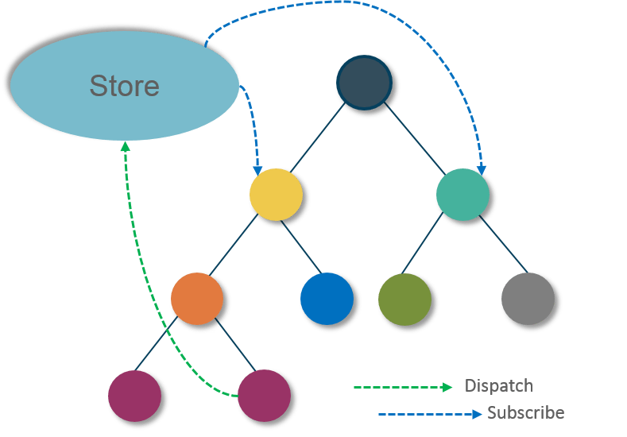
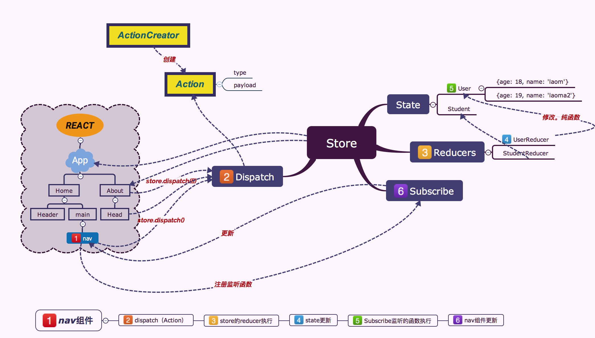

# Redux 教程

Redux 是 JavaScript 状态容器，提供可预测化的状态管理。 (如果你需要一个 WordPress 框架，请查看 Redux Framework。)

Redux 除了和 React 一起用外，还支持其它界面库。 它体小精悍（只有 2kB，包括依赖）。

## 在React项目中使用redux

安装：

```sh
npm install --save redux
yarn add redux
```

## 基本概念

Redux的设计理念：Web 应用是一个状态机，视图与状态是一一对应的。所有的状态，保存在一个对象里面。只能按照Redux提供的约定的方式对状态进行编辑。

### Store

Store 就是保存数据的地方，你可以把它看成一个容器。整个应用只能有一个 Store。另外Store是整个Redux的统一操作的入口。

Redux 提供createStore这个函数，用来生成 Store。

```js
import { createStore } from 'redux';
const store = createStore(fn);
```

上面代码中，createStore函数接受另一个函数作为参数，返回新生成的 Store 对象。

### State

Store对象包含所有数据。如果想得到某个时点的数据，就要对 Store 生成快照。这种时点的数据集合，就叫做 State。

当前时刻的 State，可以通过store.getState()拿到。

```js
import { createStore } from 'redux';
const store = createStore(fn);

const state = store.getState();
```

Redux 规定， 一个 State 对应一个 View。只要 State 相同，View 就相同。你知道 State，就知道 View 是什么样，反之亦然。

### Action

State 的变化，会导致 View 的变化。但是，用户接触不到 State，只能接触到 View。所以，State 的变化必须是 View 导致的。Action 就是 View 发出的通知，表示 State 应该要发生变化了。

Action 是一个对象。其中的type属性是必须的，表示 Action 的名称。其他属性可以自由设置，社区有一个规范可以参考。

```js
const action = {
  type: 'ADD_TODO',
  payload: 'Learn Redux'
};
```

上面代码中，Action 的名称是ADD_TODO，它携带的信息是字符串Learn Redux。

可以这样理解，Action 描述当前发生的事情。改变 State 的唯一办法，就是使用 Action。它会运送数据到 Store。

### Action Creator

View 要发送多少种消息，就会有多少种 Action。如果都手写，会很麻烦。可以定义一个函数来生成 Action，这个函数就叫 Action Creator。

```js
const ADD_TODO = '添加 TODO';

function addTodo(text) {
  return {
    type: ADD_TODO,
    text
  }
}

const action = addTodo('Learn Redux');
```

上面代码中，addTodo函数就是一个 Action Creator。

### Reducer

Store 收到 Action 以后，必须给出一个新的 State，这样 View 才会发生变化。这种 State 的计算过程就叫做 Reducer。

Reducer 是一个函数，它接受 Action 和当前 State 作为参数，返回一个新的 State

```js
const reducer = function (state, action) {
  // ...
  return new_state;
};
```

### Dispatcher

`store.dispatch()`是 View 发出 Action 的唯一方法。

```js

import { createStore } from 'redux';
const store = createStore(fn);

store.dispatch({
  type: 'ADD_TODO',
  payload: 'Learn Redux'
});
```

上面代码中，store.dispatch接受一个 Action 对象作为参数，将它发送出去。

结合 Action Creator，这段代码可以改写如下。

```js
store.dispatch(addTodo('Learn Redux'));
```

用一个图来完整的展现他们之间的关系：





### Subscribe

Store 允许使用store.subscribe方法设置监听函数，一旦 State 发生变化，就自动执行这个函数。

```js
import { createStore } from 'redux';
const store = createStore(reducer);

store.subscribe(listener);
显然，只要把 View 的更新函数（对于 React 项目，就是组件的render方法或setState方法）放入listen，就会实现 View 的自动渲染。

store.subscribe方法返回一个函数，调用这个函数就可以解除监听。


let unsubscribe = store.subscribe(() =>
  console.log(store.getState())
);

unsubscribe();
```


## Store高级

### 构建Store

store是整个Redux的操作的入口。构建Store的时候还可以指定中间件和Reducer及默认的state。

- 构建store

```js
import { createStore } from 'redux';
let store = createStore(reducer);
```

- 构建带默认state的store

```js
import { createStore } from 'redux';
let store = createStore(reducer, initialState);
```

- 构建带中间件的store

`applyMiddleware`

```js
import { applyMiddleware, createStore } from 'redux';
import createLogger from 'redux-logger'; // 日志中间件
const store = createStore(
  reducer,
  initial_state,
  applyMiddleware(logger)
);
```

当然可以构建带多个中间件的store

```js
const store = createStore(
  reducer,
  applyMiddleware(thunk, promise, logger)
);
```

### Stroe的方法

- `store.getState()` 获取整个状态数据对象。
- `store.dispatch()` 分发Action
- `store.subscribe()` 订阅状态数据的变化

```js
import { createStore } from 'redux';
let { subscribe, dispatch, getState } = createStore(reducer);
```

## 综合实例：计数器实例：

```js
import React, { Component } from 'react'
import  {createStore, combineReducers} from 'redux';

const ActionTypes = {
  ADD_NUM: 'ADD_NUM',
  MINUSE_NUM: 'MINUSE_NUM'
};

const ActionCreators = {
  AddNum(num) {
    return {
      type: ActionTypes.ADD_NUM,
      payload: num
    }
  },
  MinusNum(num) {
    return {
      type: ActionTypes.MINUSE_NUM,
      payload: num
    }
  }
}

// 状态树中就只有一个值 Num的值。
const numReducer = (state=0, action) => {
  switch(action.type) {
    case ActionTypes.ADD_NUM :
      return state + action.payload;
    case ActionTypes.MINUSE_NUM :
      return state - action.payload
    default:
      return state;
  }
};

const store = createStore(numReducer);

class Count extends Component {
  constructor (props, context) {
    super(props, context)
    this.state ={
      Num: 0
    }
  }
  
  componentDidMount() {
    // 订阅store的变化。
    store.subscribe(() => {
      this.setState({
        Num: store.getState() // 获取最新的state的状态
      })
    });
  }

  render () {
    return (
      <div>
        <p>{ store.getState() }</p>
        <p>{ this.state.Num }</p>
        <button
          onClick={ () => {
            store.dispatch(ActionCreators.AddNum(1))
          }}
        >
          +1
        </button>

        <button
          onClick={ () => {
            store.dispatch(ActionCreators.MinusNum(1))
          }}
        >
          -1
        </button>
      </div>
    )
  }
}

export default Count

```

## Reducer 的拆分

Reducer 函数负责生成 State。由于整个应用只有一个 State 对象，包含所有数据，对于大型应用来说，这个 State 必然十分庞大，导致 Reducer 函数也十分庞大。

redux提供了`combineReducers`方法协助我们把状态对应的Reducer进行拆分。单独状态对应的Reducer进行单独编写。`combineReducers`可以将各个子 Reducer 函数合成一个大的 Reducer。

```js
import { combineReducers } from 'redux';

const chatReducer = combineReducers({
  chatLog,
  statusMessage,
  userName
})

export default todoApp;
```

> 合并的Reducer中的key就是我们的状态树中的属性名。

例如：

```js
//首页得文字
function titleReducer(state = 'aicoder全栈实习', action) {
  if (action.type === 'EDIT_APP_TITLE') {
    return action.payload;
  } else {
    return state;
  }
}
function LoginUserReducer(state = null, action) {
  if (action.type === 'LOGIN') {
    return action.payload;
  } else {
    return state;
  }
}
import { combineReducers } from 'redux';

const chatReducer = combineReducers({
  Title: titleReducer,
  LoginUser: LoginUserReducer
})
....
```

## redux-thunk 中间件

[`redux-thunk`](https://github.com/reduxjs/redux-thunk)中间件改造了redux的dispatch方法允许我们用`store.dispatch(fn)`, `fn`可以是一个函数。而且此函数可以接受两个参数：`dispatch`、`getState`做为参数。

安装

```sh
npm install redux-thunk
```

配置中间件

```js
import { createStore, applyMiddleware } from 'redux';
import thunk from 'redux-thunk';
import reducer from './reducers';

// Note: this API requires redux@>=3.1.0
const store = createStore(
  reducer,
  applyMiddleware(thunk)
);

const INCREMENT_COUNTER = 'INCREMENT_COUNTER';

function increment() {
  return {
    type: INCREMENT_COUNTER
  };
}

function incrementAsync() {
  return dispatch => {
    setTimeout(() => {
      // Yay! Can invoke sync or async actions with `dispatch`
      dispatch(increment());
    }, 1000);
  };
}

store.dispatch(incrementAsync());
```

### redux-thunk中间件的返回值的处理

```js
import { createStore, applyMiddleware } from 'redux';
import thunk from 'redux-thunk';
import reducer from './reducers';

// Note: this API requires redux@>=3.1.0
const store = createStore(
  reducer,
  applyMiddleware(thunk)
);

// 异步删除的方法
function asyncDelStu(stuId) {
  return (dispatch, getState) => {
    return axios
      .post('http://yapi.demo.qunar.com/mock/7378/api/delstu')
      .then(res => {
        // getState
        dispatch(delStu(stuId));
      })
      .catch((res) => {
        console.log(res);
      });
  }
}

store
  .dispatch(asyncDelStu(33)) // 执行完成dispatch后，如果内部有返回值，此处还可以拿到返回值的结果。
  .then(res => {
    console.log(res.data)
  })
  .catch(e => {})
```

### 案例

```js
import React, {Component} from 'react'
import {createStore, applyMiddleware} from 'redux';
import thunk from 'redux-thunk'

const ActionTypes = {
  ADD_NUM: 'ADD_NUM',
  MINUSE_NUM: 'MINUSE_NUM',
  INIT_NUM: 'INIT_NUM'
};

const ActionCreators = {
  AddNum(num) {
    return {type: ActionTypes.ADD_NUM, payload: num}
  },
  MinusNum(num) {
    return {type: ActionTypes.MINUSE_NUM, payload: num}
  },
  AddNumAsync(num) {  // ** 核心： 添加异步增加的方法
    return (dispatch, getState) => {
      return new Promise((resolve, reject) => {
        setTimeout(() => {
          dispatch(ActionCreators.AddNum(num));
          resolve(num);
        }, 1000);
      });
    }
  }
}

const numReducer = (state = 0, action) => {
  switch (action.type) {
    case ActionTypes.ADD_NUM:
      return state + action.payload;
    case ActionTypes.MINUSE_NUM:
      return state - action.payload
    default:
      return state;
  }
};

const store = createStore(numReducer,applyMiddleware(thunk));

class Count extends Component {

  constructor(props, context) {
    super(props, context)
    this.state = {
      Num: 0
    }
  }

  componentDidMount() {
    store.subscribe(() => {
      this.setState({
        Num: store.getState()
      })
    });
  }

  render() {
    return (
      <div>
        <p>{store.getState()}</p>
        <p>{this.state.Num}</p>
        <button
          onClick={() => {
          store.dispatch(ActionCreators.AddNum(1))
        }}>
          +1
        </button>
        <button
          onClick={() => {
          store
            .dispatch(ActionCreators.AddNumAsync(2))  // dispatch一个函数
            .then(res => console.log(res))
            .catch(e => console.log(e))
        }}>
          async+1
        </button>

        <button
          onClick={() => {
          store.dispatch(ActionCreators.MinusNum(1))
        }}>
          -1
        </button>
      </div>
    )
  }
}

export default Count
```

## redux-promise中间件

redux-promise 中间件
既然 Action Creator 可以返回函数，当然也可以返回其他值。另一种异步操作的解决方案，就是让 Action Creator 返回一个 Promise 对象。

这就需要使用redux-promise中间件。

```js
import { createStore, applyMiddleware } from 'redux';
import promiseMiddleware from 'redux-promise';
import reducer from './reducers';

const store = createStore(
  reducer,
  applyMiddleware(promiseMiddleware)
);
```

这个中间件使得store.dispatch方法可以接受 Promise 对象作为参数。这时，Action Creator 有两种写法。写法一，返回值是一个 Promise 对象。

```js
const fetchPosts =
  (dispatch, postTitle) => new Promise(function (resolve, reject) {
     dispatch(requestPosts(postTitle));
     return fetch(`/some/API/${postTitle}.json`)
       .then(response => {
         type: 'FETCH_POSTS',
         payload: response.json()
       });
});
```

## redux-promise实例

```js
import React, {Component} from 'react'
import {createStore, combineReducers, applyMiddleware} from 'redux';
import thunk from 'redux-thunk'
import redudxPromise from 'redux-promise';
import {composeWithDevTools} from 'redux-devtools-extension';

const ActionTypes = {
  ADD_NUM: 'ADD_NUM',
  MINUSE_NUM: 'MINUSE_NUM',
  INIT_NUM: 'INIT_NUM'
};

const ActionCreators = {
  AddNum(num) {
    return {type: ActionTypes.ADD_NUM, payload: num}
  },
  MinusNum(num) {
    return {type: ActionTypes.MINUSE_NUM, payload: num}
  },
  AddNumAsync(num) {
    return (dispatch, getState) => {
      return new Promise((resolve, reject) => {
        setTimeout(() => {
          dispatch(ActionCreators.AddNum(num));
          resolve(num);
        }, 1000);
      });
    }
  },
  MinusNumAsyncPromise(num) {
    return new Promise((resolve, reject) => {
      setTimeout(() => {
        resolve(ActionCreators.MinusNum(num));
      }, 1000);
    })
  }
}

const numReducer = (state = 0, action) => {
  switch (action.type) {
    case ActionTypes.ADD_NUM:
      return state + action.payload;
    case ActionTypes.MINUSE_NUM:
      return state - action.payload
    default:
      return state;
  }
};

// 此处由于是开发阶段用了redex的开发工具所以不用考虑以下的变化。
const store = createStore(numReducer, composeWithDevTools(applyMiddleware(thunk, redudxPromise),
// other store enhancers if any
));

class Count extends Component {

  constructor(props, context) {
    super(props, context)
    this.state = {
      Num: 0
    }
  }

  componentDidMount() {
    store.subscribe(() => {
      this.setState({
        Num: store.getState()
      })
    });
  }

  render() {
    return (
      <div>
        <p>{store.getState()}</p>
        <p>{this.state.Num}</p>
        <button
          onClick={() => {
          store.dispatch(ActionCreators.AddNum(1))
        }}>
          +1
        </button>
        <button
          onClick={() => {
          store
            .dispatch(ActionCreators.AddNumAsync(2))
            .then(res => console.log(res))
            .catch(e => console.log(e))
        }}>
          async+1
        </button>

        <button
          onClick={() => {
          store.dispatch(ActionCreators.MinusNum(1))
        }}>
          -1
        </button>
        <button
          onClick={() => {
          store.dispatch(ActionCreators.MinusNumAsyncPromise(1))
          .then(res => console.log(res))
        }}>
          async Promise -1
        </button>
      </div>
    )
  }
}

export default Count
```

## React-Redux 的用法

这个库是可以选用的。实际项目中，你应该权衡一下，是直接使用 Redux，还是使用 React-Redux。后者虽然提供了便利，但是需要掌握额外的 API，并且要遵守它的组件拆分规范。
React-Redux 将所有组件分成两大类：UI 组件（presentational component）和容器组件（container component）。

### 安装

```sh
npm install --save react-redux
```

### UI 组件

UI 组件有以下几个特征。

- 只负责 UI 的呈现，不带有任何业务逻辑
- 没有状态（即不使用this.state这个变量）
- 所有数据都由参数（this.props）提供
- 不使用任何 Redux 的 API
- 下面就是一个 UI 组件的例子。

`const Title =
  value => <h1>{value}</h1>;`
因为不含有状态，UI 组件又称为"纯组件"，即它纯函数一样，纯粹由参数决定它的值。

### 容器组件

- 负责管理数据和业务逻辑，不负责 UI 的呈现
- 带有内部状态
- 使用 Redux 的 API
总之，只要记住一句话就可以了：UI 组件负责 UI 的呈现，容器组件负责管理数据和逻辑。

React-Redux 规定，所有的 UI 组件都由用户提供，容器组件则是由 React-Redux 自动生成。也就是说，用户负责视觉层，状态管理则是全部交给它。

### connect() 连接容器组件和UI组件

React-Redux 提供connect方法，用于从 UI 组件生成容器组件。connect的意思，就是将这两种组件连起来。

```js
import { connect } from 'react-redux'
const VisibleTodoList = connect()(TodoList);
```

上面代码中，TodoList是 UI 组件，VisibleTodoList就是由 React-Redux 通过connect方法自动生成的容器组件。

但是，因为没有定义业务逻辑，上面这个容器组件毫无意义，只是 UI 组件的一个单纯的包装层。为了定义业务逻辑，需要给出下面两方面的信息。

- （1）输入逻辑：外部的数据（即state对象）如何转换为 UI 组件的参数

- （2）输出逻辑：用户发出的动作如何变为 Action 对象，从 UI 组件传出去。

因此，connect方法的完整 API 如下。

```js
import { connect } from 'react-redux'

const VisibleTodoList = connect(
  mapStateToProps,
  mapDispatchToProps
)(TodoList)
```

上面代码中，connect方法接受两个参数：mapStateToProps和mapDispatchToProps。它们定义了 UI 组件的业务逻辑。前者负责输入逻辑，即将state映射到 UI 组件的参数（props），后者负责输出逻辑，即将用户对 UI 组件的操作映射成 Action。

### mapStateToProps()

mapStateToProps是一个函数。它的作用就是像它的名字那样，建立一个从（外部的）state对象到（UI 组件的）props对象的映射关系。

作为函数，mapStateToProps执行后应该返回一个对象，里面的每一个键值对就是一个映射。请看下面的例子。

```js
const mapStateToProps = (state) => {
  return {
    todos: getVisibleTodos(state.todos, state.visibilityFilter)
  }
}
```

上面代码中，mapStateToProps是一个函数，它接受state作为参数，返回一个对象。这个对象有一个todos属性，代表 UI 组件的同名参数，后面的getVisibleTodos也是一个函数，可以从state算出 todos 的值。

下面就是getVisibleTodos的一个例子，用来算出todos。

```js
const getVisibleTodos = (todos, filter) => {
  switch (filter) {
    case 'SHOW_ALL':
      return todos
    case 'SHOW_COMPLETED':
      return todos.filter(t => t.completed)
    case 'SHOW_ACTIVE':
      return todos.filter(t => !t.completed)
    default:
      throw new Error('Unknown filter: ' + filter)
  }
}
```

mapStateToProps会订阅 Store，每当state更新的时候，就会自动执行，重新计算 UI 组件的参数，从而触发 UI 组件的重新渲染。

mapStateToProps的第一个参数总是state对象，还可以使用第二个参数，代表容器组件的props对象。

```js
// 容器组件的代码
//    <FilterLink filter="SHOW_ALL">
//      All
//    </FilterLink>

const mapStateToProps = (state, ownProps) => {
  return {
    active: ownProps.filter === state.visibilityFilter
  }
}
```

使用ownProps作为参数后，如果容器组件的参数发生变化，也会引发 UI 组件重新渲染。

connect方法可以省略mapStateToProps参数，那样的话，UI 组件就不会订阅Store，就是说 Store 的更新不会引起 UI 组件的更新。

### mapDispatchToProps()

mapDispatchToProps是connect函数的第二个参数，用来建立 UI 组件的参数到store.dispatch方法的映射。也就是说，它定义了哪些用户的操作应该当作 Action，传给 Store。它可以是一个函数，也可以是一个对象。

如果mapDispatchToProps是一个函数，会得到dispatch和ownProps（容器组件的props对象）两个参数。

```js
const mapDispatchToProps = (
  dispatch,
  ownProps
) => {
  return {
    onClick: () => {
      dispatch({
        type: 'SET_VISIBILITY_FILTER',
        filter: ownProps.filter
      });
    }
  };
}
```

从上面代码可以看到，mapDispatchToProps作为函数，应该返回一个对象，该对象的每个键值对都是一个映射，定义了 UI 组件的参数怎样发出 Action。

如果mapDispatchToProps是一个对象，它的每个键名也是对应 UI 组件的同名参数，键值应该是一个函数，会被当作 Action creator ，返回的 Action 会由 Redux 自动发出。举例来说，上面的mapDispatchToProps写成对象就是下面这样。

```js
const mapDispatchToProps = {
  onClick: (filter) => {
    type: 'SET_VISIBILITY_FILTER',
    filter: filter
  };
}
```

### `<Provider>` 组件

connect方法生成容器组件以后，需要让容器组件拿到state对象，才能生成 UI 组件的参数。

一种解决方法是将state对象作为参数，传入容器组件。但是，这样做比较麻烦，尤其是容器组件可能在很深的层级，一级级将state传下去就很麻烦。

React-Redux 提供Provider组件，可以让容器组件拿到state。

```js
import { Provider } from 'react-redux'
import { createStore } from 'redux'
import todoApp from './reducers'
import App from './components/App'

let store = createStore(todoApp);

render(
  <Provider store={store}>
    <App />
  </Provider>,
  document.getElementById('root')
)
```

上面代码中，Provider在根组件外面包了一层，这样一来，App的所有子组件就默认都可以拿到state了。

store放在了上下文对象context上面。然后，子组件就可以从context拿到store，代码大致如下。

```js
class VisibleTodoList extends Component {
  componentDidMount() {
    const { store } = this.context;
    this.unsubscribe = store.subscribe(() =>
      this.forceUpdate()
    );
  }

  render() {
    const props = this.props;
    const { store } = this.context;
    const state = store.getState();
    // ...
  }
}

VisibleTodoList.contextTypes = {
  store: React.PropTypes.object
}
```

React-Redux自动生成的容器组件的代码，就类似上面这样，从而拿到store。

## React-Redux 完整demo

App.js代码

```js
import React, { Component } from 'react';
import RRDemo from './components/RRDemo';

class App extends Component {
  render() {
    return (
      <div>
        <RRDemo></RRDemo>
      </div>
    );
  }
}

export default App;
```

index.js代码

```js
import React from 'react';
import ReactDOM from 'react-dom';
import App from './App';
import {Provider} from 'react-redux';
import store from './store';

ReactDOM.render(
  <Provider store={store}>
    <App></App>
  </Provider>
  , document.getElementById('root'));
```

store.js代码

```js

import {createStore, applyMiddleware} from 'redux';
import thunk from 'redux-thunk'
import redudxPromise from 'redux-promise';
import {composeWithDevTools} from 'redux-devtools-extension';

export const ActionTypes = {
  ADD_NUM: 'ADD_NUM',
  MINUSE_NUM: 'MINUSE_NUM',
  INIT_NUM: 'INIT_NUM'
};

export const ActionCreators = {
  AddNum(num) {
    return {type: ActionTypes.ADD_NUM, payload: num}
  },
  MinusNum(num) {
    return {type: ActionTypes.MINUSE_NUM, payload: num}
  },
  AddNumAsync(num) {
    return (dispatch, getState) => {
      return new Promise((resolve, reject) => {
        setTimeout(() => {
          dispatch(ActionCreators.AddNum(num));
          resolve(num);
        }, 1000);
      });
    }
  },
  MinusNumAsyncPromise(num) {
    return new Promise((resolve, reject) => {
      setTimeout(() => {
        resolve(ActionCreators.MinusNum(num));
      }, 1000);
    })
  }
}

const numReducer = (state = 0, action) => {
  switch (action.type) {
    case ActionTypes.ADD_NUM:
      return state + action.payload;
    case ActionTypes.MINUSE_NUM:
      return state - action.payload
    default:
      return state;
  }
};

// const store = createStore(numReducer, window.__REDUX_DEVTOOLS_EXTENSION__ &&
// window.__REDUX_DEVTOOLS_EXTENSION__());
const store = createStore(numReducer, composeWithDevTools(applyMiddleware(thunk, redudxPromise),
// other store enhancers if any
));

export default store;
```

组件代码：

```js
import React, { Component } from 'react';
import { connect } from 'react-redux';
import { ActionCreators } from '../store';

function mapStateToProps(state) {
  return {
    Num: state
  };
}
function mapDispatchToProps(dispatch) {
  return {
    AddNum: (num) => dispatch(ActionCreators.AddNum(num)),
    MinusNum: (num) => dispatch(ActionCreators.MinusNum(num)),
    AddNumAsync: (num) => dispatch(ActionCreators.AddNumAsync(num)),
    MinusNumAsyn: (num) => dispatch(ActionCreators.MinusNumAsyncPromise(num))
  };
}

class RRDemo extends Component {
  render() {
    return (
      <div>
        { this.props.Num }
        <hr/>
        <button
          onClick={ () => this.props.AddNum(1)}>
          +1
        </button>
        <button
          onClick={() => {
            this.props.AddNumAsync(2)
            .then(res => console.log(res))
            .catch(e => console.log(e))
        }}>
          async+1
        </button>

        <button
          onClick={() => {
            this.props.MinusNum(1)
        }}>
          -1
        </button>
        <button
          onClick={() => {
            this.props.MinusNumAsyn(1)
              .then(res => console.log(res))
        }}>
          async Promise -1
        </button>
      </div>
    );
  }
}

export default connect(
  mapStateToProps,
  mapDispatchToProps
)(RRDemo);
```

## redux-devtools-extension 调试工具

[官网](http://extension.remotedev.io)


### 安装浏览器插件

- chrome 安装插件

地址： https://chrome.google.com/webstore/detail/redux-devtools/lmhkpmbekcpmknklioeibfkpmmfibljd

- firefox 安装插件

地址： https://addons.mozilla.org/en-US/firefox/addon/reduxdevtools/

### 基本使用

创建store的时候，添加如下代码

```diff
 const store = createStore(
   reducer, /* preloadedState, */
+  window.__REDUX_DEVTOOLS_EXTENSION__ && window.__REDUX_DEVTOOLS_EXTENSION__()
 );
```

### redux-devtools-extension辅助配置调试插件

安装：

```sh
npm install --save-dev redux-devtools-extension
```

```js
import { createStore, applyMiddleware } from 'redux';
import { composeWithDevTools } from 'redux-devtools-extension';

const store = createStore(reducer, composeWithDevTools(
  applyMiddleware(...middleware),
  // other store enhancers if any
));
```

## 参考：

1. [Redux 入门教程（一）：基本用法](http://www.ruanyifeng.com/blog/2016/09/redux_tutorial_part_one_basic_usages.html)
1. [Redux 入门教程（二）：中间件与异步操作](http://www.ruanyifeng.com/blog/2016/09/redux_tutorial_part_two_async_operations.html)
1. [Redux 入门教程（三）：React-Redux 的用法](http://www.ruanyifeng.com/blog/2016/09/redux_tutorial_part_three_react-redux.html)
1. [Redux 中文文档](http://cn.redux.js.org/)