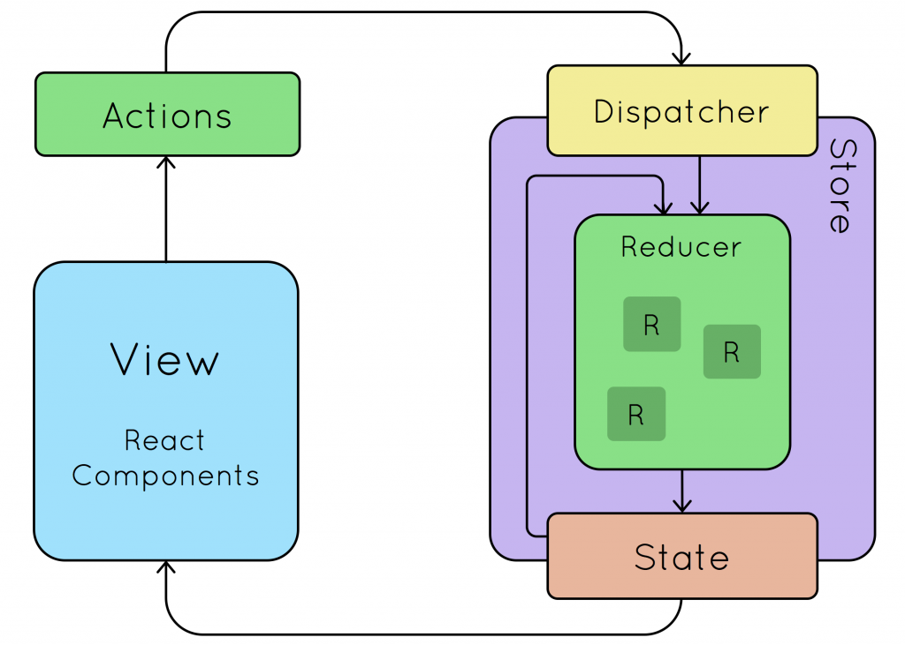

# Redux 教程

Redux 是 JavaScript 状态容器，提供可预测化的状态管理。 (如果你需要一个 WordPress 框架，请查看 Redux Framework。)

Redux 除了和 React 一起用外，还支持其它界面库。 它体小精悍（只有 2kB，包括依赖）。

## 在React项目中使用redux

安装：

```sh
npm install --save redux
yarn add redux
```

## 基本概念

Redux的设计理念：Web 应用是一个状态机，视图与状态是一一对应的。所有的状态，保存在一个对象里面。只能按照Redux提供的约定的方式对状态进行编辑。

### Store

Store 就是保存数据的地方，你可以把它看成一个容器。整个应用只能有一个 Store。另外Store是整个Redux的统一操作的入口。

Redux 提供createStore这个函数，用来生成 Store。

```js
import { createStore } from 'redux';
const store = createStore(fn);
```

上面代码中，createStore函数接受另一个函数作为参数，返回新生成的 Store 对象。

### State

Store对象包含所有数据。如果想得到某个时点的数据，就要对 Store 生成快照。这种时点的数据集合，就叫做 State。

当前时刻的 State，可以通过store.getState()拿到。

```js
import { createStore } from 'redux';
const store = createStore(fn);

const state = store.getState();
```

Redux 规定， 一个 State 对应一个 View。只要 State 相同，View 就相同。你知道 State，就知道 View 是什么样，反之亦然。

### Action

State 的变化，会导致 View 的变化。但是，用户接触不到 State，只能接触到 View。所以，State 的变化必须是 View 导致的。Action 就是 View 发出的通知，表示 State 应该要发生变化了。

Action 是一个对象。其中的type属性是必须的，表示 Action 的名称。其他属性可以自由设置，社区有一个规范可以参考。

```js
const action = {
  type: 'ADD_TODO',
  payload: 'Learn Redux'
};
```

上面代码中，Action 的名称是ADD_TODO，它携带的信息是字符串Learn Redux。

可以这样理解，Action 描述当前发生的事情。改变 State 的唯一办法，就是使用 Action。它会运送数据到 Store。

### Action Creator

View 要发送多少种消息，就会有多少种 Action。如果都手写，会很麻烦。可以定义一个函数来生成 Action，这个函数就叫 Action Creator。

```js
const ADD_TODO = '添加 TODO';

function addTodo(text) {
  return {
    type: ADD_TODO,
    text
  }
}

const action = addTodo('Learn Redux');
```

上面代码中，addTodo函数就是一个 Action Creator。

### Reducer

Store 收到 Action 以后，必须给出一个新的 State，这样 View 才会发生变化。这种 State 的计算过程就叫做 Reducer。

Reducer 是一个函数，它接受 Action 和当前 State 作为参数，返回一个新的 State

```js
const reducer = function (state, action) {
  // ...
  return new_state;
};
```

### Dispatcher

`store.dispatch()`是 View 发出 Action 的唯一方法。

```js

import { createStore } from 'redux';
const store = createStore(fn);

store.dispatch({
  type: 'ADD_TODO',
  payload: 'Learn Redux'
});
```

上面代码中，store.dispatch接受一个 Action 对象作为参数，将它发送出去。

结合 Action Creator，这段代码可以改写如下。

```js
store.dispatch(addTodo('Learn Redux'));
```

用一个图来完整的展现他们之间的关系：



### Subscribe

Store 允许使用store.subscribe方法设置监听函数，一旦 State 发生变化，就自动执行这个函数。

```js
import { createStore } from 'redux';
const store = createStore(reducer);

store.subscribe(listener);
显然，只要把 View 的更新函数（对于 React 项目，就是组件的render方法或setState方法）放入listen，就会实现 View 的自动渲染。

store.subscribe方法返回一个函数，调用这个函数就可以解除监听。


let unsubscribe = store.subscribe(() =>
  console.log(store.getState())
);

unsubscribe();
```

## Store高级

### 构建Store

store是整个Redux的操作的入口。构建Store的时候还可以指定中间件和Reducer及默认的state。

- 构建store

```js
import { createStore } from 'redux';
let store = createStore(reducer);
```

- 构建带默认state的store

```js
import { createStore } from 'redux';
let store = createStore(reducer, initialState);
```

- 构建带中间件的store

`applyMiddleware`

```js
import { applyMiddleware, createStore } from 'redux';
import createLogger from 'redux-logger'; // 日志中间件
const store = createStore(
  reducer,
  initial_state,
  applyMiddleware(logger)
);
```

当然可以构建带多个中间件的store

```js
const store = createStore(
  reducer,
  applyMiddleware(thunk, promise, logger)
);
```

### Stroe的方法

- `store.getState()` 获取整个状态数据对象。
- `store.dispatch()` 分发Action
- `store.subscribe()` 订阅状态数据的变化

```js
import { createStore } from 'redux';
let { subscribe, dispatch, getState } = createStore(reducer);
```

## 综合实例：计数器实例：

```js
import React, { Component } from 'react'
import  {createStore, combineReducers} from 'redux';

const ActionTypes = {
  ADD_NUM: 'ADD_NUM',
  MINUSE_NUM: 'MINUSE_NUM'
};

const ActionCreators = {
  AddNum(num) {
    return {
      type: ActionTypes.ADD_NUM,
      payload: num
    }
  },
  MinusNum(num) {
    return {
      type: ActionTypes.MINUSE_NUM,
      payload: num
    }
  }
}

// 状态树中就只有一个值 Num的值。
const numReducer = (state=0, action) => {
  switch(action.type) {
    case ActionTypes.ADD_NUM :
      return state + action.payload;
    case ActionTypes.MINUSE_NUM :
      return state - action.payload
    default:
      return state;
  }
};

const store = createStore(numReducer);

class Count extends Component {
  constructor (props, context) {
    super(props, context)
    this.state ={
      Num: 0
    }
  }
  
  componentDidMount() {
    // 订阅store的变化。
    store.subscribe(() => {
      this.setState({
        Num: store.getState() // 获取最新的state的状态
      })
    });
  }

  render () {
    return (
      <div>
        <p>{ store.getState() }</p>
        <p>{ this.state.Num }</p>
        <button
          onClick={ () => {
            store.dispatch(ActionCreators.AddNum(1))
          }}
        >
          +1
        </button>

        <button
          onClick={ () => {
            store.dispatch(ActionCreators.MinusNum(1))
          }}
        >
          -1
        </button>
      </div>
    )
  }
}

export default Count

```

## Reducer 的拆分

Reducer 函数负责生成 State。由于整个应用只有一个 State 对象，包含所有数据，对于大型应用来说，这个 State 必然十分庞大，导致 Reducer 函数也十分庞大。

redux提供了`combineReducers`方法协助我们把状态对应的Reducer进行拆分。单独状态对应的Reducer进行单独编写。`combineReducers`可以将各个子 Reducer 函数合成一个大的 Reducer。

```js
import { combineReducers } from 'redux';

const chatReducer = combineReducers({
  chatLog,
  statusMessage,
  userName
})

export default todoApp;
```

> 合并的Reducer中的key就是我们的状态树中的属性名。

例如：

```js
//首页得文字
function titleReducer(state = 'aicoder全栈实习', action) {
  if (action.type === 'EDIT_APP_TITLE') {
    return action.payload;
  } else {
    return state;
  }
}
function LoginUserReducer(state = null, action) {
  if (action.type === 'LOGIN') {
    return action.payload;
  } else {
    return state;
  }
}
import { combineReducers } from 'redux';

const chatReducer = combineReducers({
  Title: titleReducer,
  LoginUser: LoginUserReducer
})
....
```

## redux-thunk 中间件

[`redux-thunk`](https://github.com/reduxjs/redux-thunk)中间件改造了redux的dispatch方法允许我们用`store.dispatch(fn)`, `fn`可以是一个函数。而且此函数可以接受两个参数：`dispatch`、`getState`做为参数。

安装

```sh
npm install redux-thunk
```

配置中间件

```js
import { createStore, applyMiddleware } from 'redux';
import thunk from 'redux-thunk';
import reducer from './reducers';

// Note: this API requires redux@>=3.1.0
const store = createStore(
  reducer,
  applyMiddleware(thunk)
);

const INCREMENT_COUNTER = 'INCREMENT_COUNTER';

function increment() {
  return {
    type: INCREMENT_COUNTER
  };
}

function incrementAsync() {
  return dispatch => {
    setTimeout(() => {
      // Yay! Can invoke sync or async actions with `dispatch`
      dispatch(increment());
    }, 1000);
  };
}

store.dispatch(incrementAsync());
```

### redux-thunk中间件的返回值的处理

```js
import { createStore, applyMiddleware } from 'redux';
import thunk from 'redux-thunk';
import reducer from './reducers';

// Note: this API requires redux@>=3.1.0
const store = createStore(
  reducer,
  applyMiddleware(thunk)
);

// 异步删除的方法
function asyncDelStu(stuId) {
  return (dispatch, getState) => {
    return axios
      .post('http://yapi.demo.qunar.com/mock/7378/api/delstu')
      .then(res => {
        // getState
        dispatch(delStu(stuId));
      })
      .catch((res) => {
        console.log(res);
      });
  }
}

store
  .dispatch(asyncDelStu(33)) // 执行完成dispatch后，如果内部有返回值，此处还可以拿到返回值的结果。
  .then(res => {
    console.log(res.data)
  })
  .catch(e => {})
```

### 案例

```js
import React, {Component} from 'react'
import {createStore, applyMiddleware} from 'redux';
import thunk from 'redux-thunk'

const ActionTypes = {
  ADD_NUM: 'ADD_NUM',
  MINUSE_NUM: 'MINUSE_NUM',
  INIT_NUM: 'INIT_NUM'
};

const ActionCreators = {
  AddNum(num) {
    return {type: ActionTypes.ADD_NUM, payload: num}
  },
  MinusNum(num) {
    return {type: ActionTypes.MINUSE_NUM, payload: num}
  },
  AddNumAsync(num) {  // ** 核心： 添加异步增加的方法
    return (dispatch, getState) => {
      return new Promise((resolve, reject) => {
        setTimeout(() => {
          dispatch(ActionCreators.AddNum(num));
          resolve(num);
        }, 1000);
      });
    }
  }
}

const numReducer = (state = 0, action) => {
  switch (action.type) {
    case ActionTypes.ADD_NUM:
      return state + action.payload;
    case ActionTypes.MINUSE_NUM:
      return state - action.payload
    default:
      return state;
  }
};

const store = createStore(numReducer,applyMiddleware(thunk));

class Count extends Component {

  constructor(props, context) {
    super(props, context)
    this.state = {
      Num: 0
    }
  }

  componentDidMount() {
    store.subscribe(() => {
      this.setState({
        Num: store.getState()
      })
    });
  }

  render() {
    return (
      <div>
        <p>{store.getState()}</p>
        <p>{this.state.Num}</p>
        <button
          onClick={() => {
          store.dispatch(ActionCreators.AddNum(1))
        }}>
          +1
        </button>
        <button
          onClick={() => {
          store
            .dispatch(ActionCreators.AddNumAsync(2))  // dispatch一个函数
            .then(res => console.log(res))
            .catch(e => console.log(e))
        }}>
          async+1
        </button>

        <button
          onClick={() => {
          store.dispatch(ActionCreators.MinusNum(1))
        }}>
          -1
        </button>
      </div>
    )
  }
}

export default Count
```