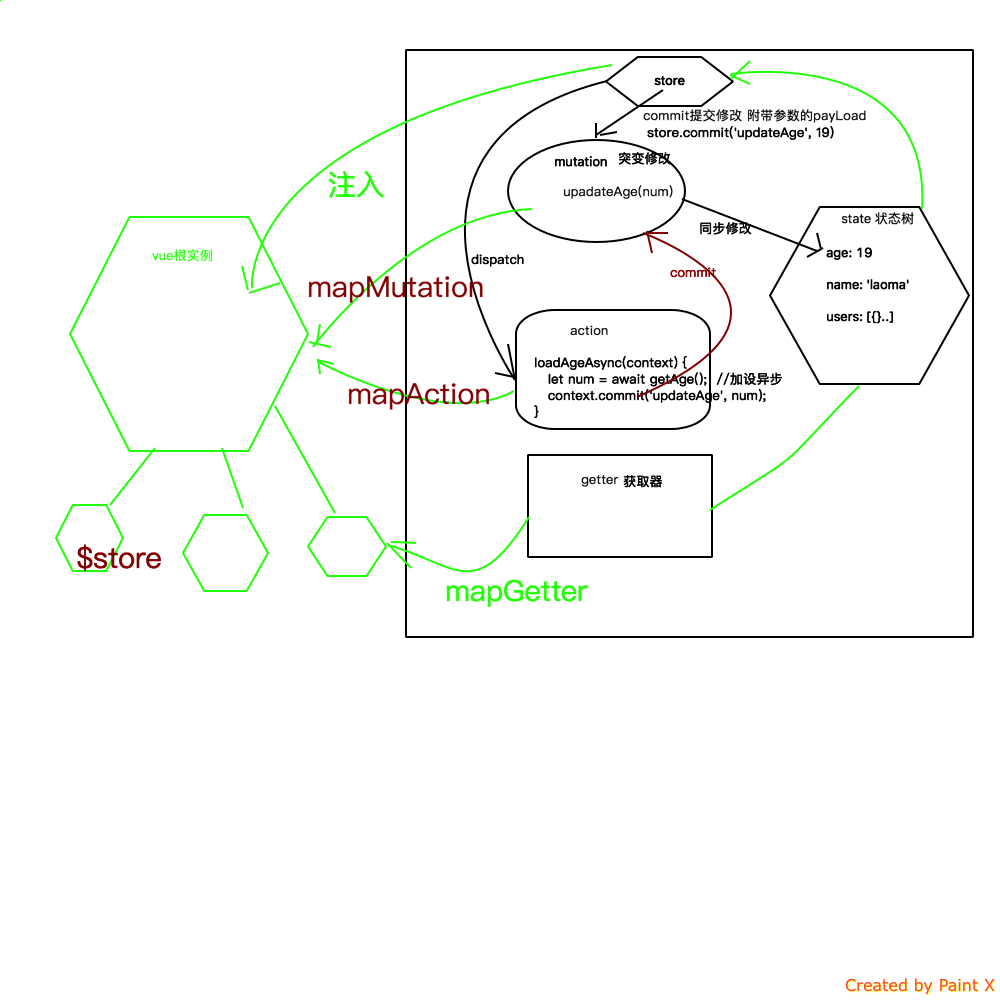

# Vue 入门之 Vuex 实战

## 引言

Vue 组件化做的确实非常彻底，它独有的 vue 单文件组件也是做的非常有特色。组件化的同时带来的是：组件之间的数据共享和通信的难题。
尤其 Vue 组件设计的就是，父组件通过子组件的 prop 进行传递数据，而且数据传递是`单向`的。也就是说：父组件可以把数据传递给子组件，但是
反之则不同。如下图所示：


## 单向数据流动

单方向的数据流动带来了非常简洁和清晰的数据流，纯展示性或者独立性较强的模块的开发确实非常方便和省事。
但是复杂的页面逻辑，组件之间的数据共享处理就会需要通过事件总线的方式解决或者使用 Vue 的 Vuex 框架了。

## 子组件通知父组件数据更新：事件方式的实现

子组件可以在子组件内触发事件，然后在父容器中添加子组件时绑定父容器的方法为事件响应方法的方式.如下图所示：


- 使用 v-on 绑定自定义事件

```
每个 Vue 实例都实现了事件接口(Events interface)，即：
使用 $on(eventName) 监听事件
使用 $emit(eventName) 触发事件
```

参考代码案例：

```html
<!DOCTYPE html>
<html lang="en">

<head>
  <meta charset="UTF-8">
  <title>Vue入门之event message</title>
  <!-- 新 Bootstrap 核心 CSS 文件 -->
  <link rel="stylesheet" href="http://cdn.bootcss.com/bootstrap/3.3.0/css/bootstrap.min.css">

  <!-- 可选的Bootstrap主题文件（一般不用引入） -->
  <link rel="stylesheet" href="http://cdn.bootcss.com/bootstrap/3.3.0/css/bootstrap-theme.min.css">

  <!-- jQuery文件。务必在bootstrap.min.js 之前引入 -->
  <script src="http://cdn.bootcss.com/jquery/1.11.1/jquery.min.js"></script>

  <!-- 最新的 Bootstrap 核心 JavaScript 文件 -->
  <script src="http://cdn.bootcss.com/bootstrap/3.3.0/js/bootstrap.min.js"></script>

  <script src="https://unpkg.com/vue/dist/vue.js"></script>
  <script src="https://unpkg.com/vue-router/dist/vue-router.js"></script>
</head>

<body>
  <div id="app">
    <p>推荐次数：{{ voteCount }}</p>
    <hr>
    <!--绑定两个自定义事件，当组件内部触发了事件后，会自定调用父容器绑定的methods的方法，达到了子容器向父容器数据进行通信同步的方法-->
    <vote-btn v-on:vote="voteAction" v-on:sendmsg="sendMsgAction"></vote-btn>
    <hr>
    <ul class="list-group">
      <li v-for="o in msg" class="list-group-item">{{o}}</li>
    </ul>
  </div>
  <script>
    Vue.component('vote-btn', {
      template: `
        <div>
          <button class="btn btn-success" v-on:click="voteArticle">推荐</button>
          <hr/>
          <input type="text" v-model="txtMsg" />
          <button v-on:click="sendMsg" class="btn btn-success">发送消息</button>
        </div>
      `,
      data: function () {
        return {
          txtMsg: ""
        }
      },
      methods: {
        voteArticle: function () {
          // 触发事件，vote
          this.$emit('vote')
        },
        sendMsg: function () {
          // 触发事件，sendmsg，并
          this.$emit('sendmsg', this.txtMsg)
        }
      }
    })

    var app = new Vue({
      el: '#app',
      data: {
        voteCount: 0,
        msg: []
      },
      methods: {
        voteAction: function() {  // 事件触发后，会直接执行此方法
          this.voteCount += 1
        },
        sendMsgAction: function (item) {
          this.msg.push(item)
        }
      }
    });
  </script>
</body>

</html>
```

## 事件总线方式解决非父子组件数据同步

如果非父子组件怎么通过事件进行同步数据，或者同步消息呢？Vue 中的事件触发和监听都是跟一个具体的 Vue 实例挂钩。
所以在不同的 Vue 实例中想进行事件的统一跟踪和触发，那就需要一个公共的 Vue 实例，这个实例就是公共的事件对象。


参考下面做的一个购物车的案例的代码：

```html
<!DOCTYPE html>
<html lang="en">

<head>
  <meta charset="UTF-8">
  <title>Vue入门之event message</title>
  <!-- 新 Bootstrap 核心 CSS 文件 -->
  <link rel="stylesheet" href="http://cdn.bootcss.com/bootstrap/3.3.0/css/bootstrap.min.css">

  <!-- 可选的Bootstrap主题文件（一般不用引入） -->
  <link rel="stylesheet" href="http://cdn.bootcss.com/bootstrap/3.3.0/css/bootstrap-theme.min.css">

  <!-- jQuery文件。务必在bootstrap.min.js 之前引入 -->
  <script src="http://cdn.bootcss.com/jquery/1.11.1/jquery.min.js"></script>

  <!-- 最新的 Bootstrap 核心 JavaScript 文件 -->
  <script src="http://cdn.bootcss.com/bootstrap/3.3.0/js/bootstrap.min.js"></script>

  <script src="https://unpkg.com/vue/dist/vue.js"></script>
  <script src="https://unpkg.com/vue-router/dist/vue-router.js"></script>
</head>

<body>
  <div id="app">
    <product-list :products="products" v-on:addpro="addToCarts"> </product-list>
    <hr>
    <cart :cart-products="carts"> </cart>
  </div>
  <script>
    var eventBus = new Vue();
    Vue.component('cart', {
      template: `
      <table class="table table-borderd table-striped table-hover">
      <thead>
        <tr>
          <th>商品编号</th>
          <th>商品名</th>
          <th>数量</th>
          <th>操作</th>
        </tr>
      </thead>
      <tbody>
        <tr v-for="item in cartProducts">
          <td>{{ item.id }}</td>
          <td>{{ item.name }}</td>
          <td>
            {{ item.count }}
          </td>
          <td>
            <button type="button" @click="removeCarts(item)" class="btn btn-success"><i class="glyphicon glyphicon-remove"></i></button>
          </td>
        </tr>
      </tbody>
    </table>
      `,
      data: function () {
        return {
        }
      },
      methods: {
        removeCarts: function (item) {
          eventBus.$emit('remo', item)
        }
      },
      props: ['cartProducts']
    })

    Vue.component('product-list', {
      template: `
      <table class="table table-borderd table-striped table-hover">
      <thead>
        <tr>
          <th>商品编号</th>
          <th>商品名</th>
          <th>操作</th>
        </tr>
      </thead>
      <tbody>
        <tr v-for="item in products">
          <td>{{ item.id }}</td>
          <td>{{ item.name }}</td>
          <td>
            <button type="button" v-on:click="addToCarts(item)" class="btn btn-success"><i class="glyphicon glyphicon-shopping-cart"></i></button>
          </td>
        </tr>
      </tbody>
    </table>
      `,
      data: function () {
        return {
        }
      },
      methods: {
        addToCarts: function (item) {
          this.$emit('addpro', item)
        }
      },
      props: ['products'],
    })

    var app = new Vue({
      el: '#app',
      data: {
        products: [
          { id: '1', name: '鳄鱼' },
          { id: '2', name: '蛇' },
          { id: '3', name: '兔子' },
          { id: '4', name: '驴' },
          { id: '5', name: '孔雀' }
        ],
        carts: []
      },
      methods: {
        addToCarts: function (item) {
          var isExist = false
          for(var i=0; i<this.carts.length; i++) {
            if( item.id === this.carts[i].id ) {
              item.count = this.carts[i].count + 1
              Vue.set(this.carts, i, item)
              isExist = true
            }
          }
          !isExist && (item.count = 1, this.carts.push(item))
        },
        removeCarts: function (item) {
          for(var i =0; i<this.carts.length; i++) {
            if( item.id === this.carts[i].id) {
              this.carts.splice(i,1)
            }
          }
        }
      },
      mounted: function () {
        self = this;
        eventBus.$on('remo', function (item) {
          self.removeCarts(item)
        })
      }
    });
  </script>
</body>
</html>
```

## Vuex 解决复杂单页面应用

上面的方式只能解决一些简单的页面中的组件的通信问题，但是如果是复杂的单页面应用就需要使用更强大的 Vuex 来帮我们进行状态的统一管理和同步。

当第一次接触 Vuex 的时候，眼前一亮，之前经过 Redux 之后，被它繁琐的使用令我痛苦不已，虽然思路很清晰，其实完全可以设计的更简单和高效。
当我接触到 Vuex 之后，发现这就是我想要的。的确简洁就是一种艺术。

其实本质上，Vuex 就是一个大的 EventBus 对象的升级版本，相当于一个特定的仓库，所有数据都在统一的仓库中，进行统一的管理。

几个核心的概念：

- **`State`**: `Vuex` 仓库中的数据。
- **`Getter`**: 类似于 Vue 实例中的计算属性，Getter 就是普通的获取 state 包装函数。
- **`Mutations`**: Vuex 的 store 中的状态的唯一方法是提交 mutation。Vuex 中的 mutations 非常类似于事件：每个 mutation 都有一个字符串的 事件类型 (type) 和 一个 回调函数 (handler)。
- **`Action`**: action 可以触发 Mutations，不能直接改变 state。

看下面一张图了解一下 Vuex 整体的数据流动：


再看一张具体点的：



## 创建Vuex实例 Vuex.Store

我们可以通过Vuex提供的`Vuex.Store`构造器来构造一个`Vuex`的`store`实例。

``` js
import Vuex from 'vuex'

const store = new Vuex.Store({ ...options })
```

以下是关于`Vuex.Store` 构造器选项的说明。

### state

- 类型: `Object | Function`

  Vuex store 实例的根 state 对象。

  如果你传入返回一个对象的函数，其返回的对象会被用作根 state。这在你想要重用 state 对象，尤其是对于重用 module 来说非常有用。

#### 单一状态树

Vuex 使用**单一状态树**——是的，用一个对象就包含了全部的应用层级状态。至此它便作为一个“唯一数据源 ([SSOT](https://en.wikipedia.org/wiki/Single_source_of_truth))”而存在。这也意味着，每个应用将仅仅包含一个 store 实例。单一状态树让我们能够直接地定位任一特定的状态片段，在调试的过程中也能轻易地取得整个当前应用状态的快照。

单状态树和模块化并不冲突——在后面的章节里我们会讨论如何将状态和状态变更事件分布到各个子模块中。

#### 在 Vue 组件中获得 Vuex 状态

那么我们如何在 Vue 组件中展示状态呢？由于 Vuex 的状态存储是响应式的，从 store 实例中读取状态最简单的方法就是在[计算属性](https://cn.vuejs.org/guide/computed.html)中返回某个状态：

``` js
// 创建一个 Counter 组件
const Counter = {
  template: `<div>{{ count }}</div>`,
  computed: {
    count () {
      return store.state.count
    }
  }
}
```

每当 `store.state.count` 变化的时候, 都会重新求取计算属性，并且触发更新相关联的 DOM。

然而，这种模式导致组件依赖全局状态单例。在模块化的构建系统中，在每个需要使用 state 的组件中需要频繁地导入，并且在测试组件时需要模拟状态。

Vuex 通过 `store` 选项，提供了一种机制将状态从根组件“注入”到每一个子组件中（需调用 `Vue.use(Vuex)`）：

``` js
const app = new Vue({
  el: '#app',
  // 把 store 对象提供给 “store” 选项，这可以把 store 的实例注入所有的子组件
  store,
  components: { Counter },
  template: `
    <div class="app">
      <counter></counter>
    </div>
  `
})
```

通过在根实例中注册 `store` 选项，该 store 实例会注入到根组件下的所有子组件中，且子组件能通过 `this.$store` 访问到。让我们更新下 `Counter` 的实现：

``` js
const Counter = {
  template: `<div>{{ count }}</div>`,
  computed: {
    count () {
      return this.$store.state.count
    }
  }
}
```

#### `mapState` 辅助函数

当一个组件需要获取多个状态时候，将这些状态都声明为计算属性会有些重复和冗余。为了解决这个问题，我们可以使用 `mapState` 辅助函数帮助我们生成计算属性，让你少按几次键：

``` js
// 在单独构建的版本中辅助函数为 Vuex.mapState
import { mapState } from 'vuex'

export default {
  // ...
  computed: mapState({
    // 箭头函数可使代码更简练
    count: state => state.count,

    // 传字符串参数 'count' 等同于 `state => state.count`
    countAlias: 'count',

    // 为了能够使用 `this` 获取局部状态，必须使用常规函数
    countPlusLocalState (state) {
      return state.count + this.localCount
    }
  })
}
```

当映射的计算属性的名称与 state 的子节点名称相同时，我们也可以给 `mapState` 传一个字符串数组。

``` js
computed: mapState([
  // 映射 this.count 为 store.state.count
  'count'
])
```

#### 对象展开运算符

`mapState` 函数返回的是一个对象。我们如何将它与局部计算属性混合使用呢？通常，我们需要使用一个工具函数将多个对象合并为一个，以使我们可以将最终对象传给 `computed` 属性。但是自从有了[对象展开运算符](https://github.com/sebmarkbage/ecmascript-rest-spread)（现处于 ECMASCript 提案 stage-4 阶段），我们可以极大地简化写法：

``` js
computed: {
  localComputed () { /* ... */ },
  // 使用对象展开运算符将此对象混入到外部对象中
  ...mapState({
    // ...
  })
}
```

#### 组件仍然保有局部状态

使用 Vuex 并不意味着你需要将**所有的**状态放入 Vuex。虽然将所有的状态放到 Vuex 会使状态变化更显式和易调试，但也会使代码变得冗长和不直观。如果有些状态严格属于单个组件，最好还是作为组件的局部状态。你应该根据你的应用开发需要进行权衡和确定。

### mutations

- 类型: `{ [type: string]: Function }`

  在 store 上注册 mutation，处理函数总是接受 `state` 作为第一个参数（如果定义在模块中，则为模块的局部状态），`payload` 作为第二个参数（可选）。
更改 Vuex 的 store 中的状态的唯一方法是提交 mutation。Vuex 中的 mutation 非常类似于事件：每个 mutation 都有一个字符串的 **事件类型 (type)** 和 一个 **回调函数 (handler)**。这个回调函数就是我们实际进行状态更改的地方，并且它会接受 state 作为第一个参数：

``` js
const store = new Vuex.Store({
  state: {
    count: 1
  },
  mutations: {
    increment (state) {
      // 变更状态
      state.count++
    }
  }
})
```

你不能直接调用一个 mutation handler。这个选项更像是事件注册：“当触发一个类型为 `increment` 的 mutation 时，调用此函数。”要唤醒一个 mutation handler，你需要以相应的 type 调用 **store.commit** 方法：

``` js
store.commit('increment')
```

#### 提交载荷（Payload）

你可以向 `store.commit` 传入额外的参数，即 mutation 的 **载荷（payload）**：

``` js
// ...
mutations: {
  increment (state, n) {
    state.count += n
  }
}
```
``` js
store.commit('increment', 10)
```

在大多数情况下，载荷应该是一个对象，这样可以包含多个字段并且记录的 mutation 会更易读：

``` js
// ...
mutations: {
  increment (state, payload) {
    state.count += payload.amount
  }
}
```

``` js
store.commit('increment', {
  amount: 10
})
```

#### 对象风格的提交方式

提交 mutation 的另一种方式是直接使用包含 `type` 属性的对象：

``` js
store.commit({
  type: 'increment',
  amount: 10
})
```

当使用对象风格的提交方式，整个对象都作为载荷传给 mutation 函数，因此 handler 保持不变：

``` js
mutations: {
  increment (state, payload) {
    state.count += payload.amount
  }
}
```

#### Mutation 需遵守 Vue 的响应规则

既然 Vuex 的 store 中的状态是响应式的，那么当我们变更状态时，监视状态的 Vue 组件也会自动更新。这也意味着 Vuex 中的 mutation 也需要与使用 Vue 一样遵守一些注意事项：

1. 最好提前在你的 store 中初始化好所有所需属性。

2. 当需要在对象上添加新属性时，你应该

  - 使用 `Vue.set(obj, 'newProp', 123)`, 或者

  - 以新对象替换老对象。例如，利用 stage-3 的[对象展开运算符](https://github.com/sebmarkbage/ecmascript-rest-spread)我们可以这样写：

    ``` js
    state.obj = { ...state.obj, newProp: 123 }
    ```

#### 使用常量替代 Mutation 事件类型

使用常量替代 mutation 事件类型在各种 Flux 实现中是很常见的模式。这样可以使 linter 之类的工具发挥作用，同时把这些常量放在单独的文件中可以让你的代码合作者对整个 app 包含的 mutation 一目了然：

``` js
// mutation-types.js
export const SOME_MUTATION = 'SOME_MUTATION'
```

``` js
// store.js
import Vuex from 'vuex'
import { SOME_MUTATION } from './mutation-types'

const store = new Vuex.Store({
  state: { ... },
  mutations: {
    // 我们可以使用 ES2015 风格的计算属性命名功能来使用一个常量作为函数名
    [SOME_MUTATION] (state) {
      // mutate state
    }
  }
})
```

用不用常量取决于你——在需要多人协作的大型项目中，这会很有帮助。但如果你不喜欢，你完全可以不这样做。

#### Mutation 必须是同步函数

一条重要的原则就是要记住 **mutation 必须是同步函数**。为什么？请参考下面的例子：

``` js
mutations: {
  someMutation (state) {
    api.callAsyncMethod(() => {
      state.count++
    })
  }
}
```

现在想象，我们正在 debug 一个 app 并且观察 devtool 中的 mutation 日志。每一条 mutation 被记录，devtools 都需要捕捉到前一状态和后一状态的快照。然而，在上面的例子中 mutation 中的异步函数中的回调让这不可能完成：因为当 mutation 触发的时候，回调函数还没有被调用，devtools 不知道什么时候回调函数实际上被调用——实质上任何在回调函数中进行的状态的改变都是不可追踪的。

#### 在组件中提交 Mutation

你可以在组件中使用 `this.$store.commit('xxx')` 提交 mutation，或者使用 `mapMutations` 辅助函数将组件中的 methods 映射为 `store.commit` 调用（需要在根节点注入 `store`）。

``` js
import { mapMutations } from 'vuex'

export default {
  // ...
  methods: {
    ...mapMutations([
      'increment', // 将 `this.increment()` 映射为 `this.$store.commit('increment')`

      // `mapMutations` 也支持载荷：
      'incrementBy' // 将 `this.incrementBy(amount)` 映射为 `this.$store.commit('incrementBy', amount)`
    ]),
    ...mapMutations({
      add: 'increment' // 将 `this.add()` 映射为 `this.$store.commit('increment')`
    })
  }
}
```

#### 下一步：Action

在 mutation 中混合异步调用会导致你的程序很难调试。例如，当你调用了两个包含异步回调的 mutation 来改变状态，你怎么知道什么时候回调和哪个先回调呢？这就是为什么我们要区分这两个概念。在 Vuex 中，**mutation 都是同步事务**：

``` js
store.commit('increment')
// 任何由 "increment" 导致的状态变更都应该在此刻完成。
```

### actions

- 类型: `{ [type: string]: Function }`

  在 store 上注册 action。处理函数总是接受 `context` 作为第一个参数，`payload` 作为第二个参数（可选）。

  `context` 对象包含以下属性：

  ``` js
  {
    state,      // 等同于 `store.state`，若在模块中则为局部状态
    rootState,  // 等同于 `store.state`，只存在于模块中
    commit,     // 等同于 `store.commit`
    dispatch,   // 等同于 `store.dispatch`
    getters,    // 等同于 `store.getters`
    rootGetters // 等同于 `store.getters`，只存在于模块中
  }
  ```

  同时如果有第二个参数 `payload` 的话也能够接收。

  [详细介绍](../guide/actions.md)

### getters

- 类型: `{ [key: string]: Function }`

在 store 上注册 getter，getter 方法接受以下参数：

  ```
  state,     // 如果在模块中定义则为模块的局部状态
  getters,   // 等同于 store.getters
  ```

  当定义在一个模块里时会特别一些：

  ```
  state,       // 如果在模块中定义则为模块的局部状态
  getters,     // 等同于 store.getters
  rootState    // 等同于 store.state
  rootGetters  // 所有 getters
  ```

  注册的 getter 暴露为 `store.getters`。

Getter 接受 state 作为其第一个参数：

``` js
const store = new Vuex.Store({
  state: {
    todos: [
      { id: 1, text: '...', done: true },
      { id: 2, text: '...', done: false }
    ]
  },
  getters: {
    doneTodos: state => {
      return state.todos.filter(todo => todo.done)
    }
  }
})
```

#### `mapGetters` 辅助函数

`mapGetters` 辅助函数仅仅是将 store 中的 getter 映射到局部计算属性：

``` js
import { mapGetters } from 'vuex'

export default {
  // ...
  computed: {
  // 使用对象展开运算符将 getter 混入 computed 对象中
    ...mapGetters([
      'doneTodosCount',
      'anotherGetter',
      // ...
    ])
  }
}
```

如果你想将一个 getter 属性另取一个名字，使用对象形式：

``` js
mapGetters({
  // 把 `this.doneCount` 映射为 `this.$store.getters.doneTodosCount`
  doneCount: 'doneTodosCount'
})
```

### modules

- 类型: `Object`

  包含了子模块的对象，会被合并到 store，大概长这样：

  ``` js
  {
    key: {
      state,
      namespaced?,
      mutations,
      actions?,
      getters?,
      modules?
    },
    ...
  }
  ```

  与根模块的选项一样，每个模块也包含 `state` 和 `mutations` 选项。模块的状态使用 key 关联到 store 的根状态。模块的 mutation 和 getter 只会接收 module 的局部状态作为第一个参数，而不是根状态，并且模块 action 的 `context.state` 同样指向局部状态。

### strict

- 类型: `Boolean`
- 默认值: `false`

  使 Vuex store 进入严格模式，在严格模式下，任何 mutation 处理函数以外修改 Vuex state 都会抛出错误。

  [详细介绍](../guide/strict.md)

## Vuex.Store 实例属性

### state

- 类型: `Object`

  根状态，只读。

### getters

- 类型: `Object`

  暴露出注册的 getter，只读。

## Vuex.Store 实例方法

### commit

- `commit(type: string, payload?: any, options?: Object)`
- `commit(mutation: Object, options?: Object)`

  提交 mutation。`options` 里可以有 `root: true`，它允许在[命名空间模块](../guide/modules.md#命名空间)里提交根的 mutation。[详细介绍](../guide/mutations.md)

### dispatch

- `dispatch(type: string, payload?: any, options?: Object)`
- `dispatch(action: Object, options?: Object)`

  分发 action。`options` 里可以有 `root: true`，它允许在[命名空间模块](../guide/modules.md#命名空间)里分发根的 action。返回一个解析所有被触发的 action 处理器的 Promise。[详细介绍](../guide/actions.md)

### replaceState

- `replaceState(state: Object)`

  替换 store 的根状态，仅用状态合并或时光旅行调试。

### watch

- `watch(fn: Function, callback: Function, options?: Object): Function`

  响应式地侦听 `fn` 的返回值，当值改变时调用回调函数。`fn` 接收 store 的 state 作为第一个参数，其 getter 作为第二个参数。最后接收一个可选的对象参数表示 Vue 的 `vm.$watch` 方法的参数。

  要停止侦听，调用此方法返回的函数即可停止侦听。

### subscribe

- `subscribe(handler: Function): Function`

  订阅 store 的 mutation。`handler` 会在每个 mutation 完成后调用，接收 mutation 和经过 mutation 后的状态作为参数：

  ``` js
  store.subscribe((mutation, state) => {
    console.log(mutation.type)
    console.log(mutation.payload)
  })
  ```

  要停止订阅，调用此方法返回的函数即可停止订阅。

  通常用于插件。[详细介绍](../guide/plugins.md)

### subscribeAction

- `subscribeAction(handler: Function): Function`

  > 2.5.0 新增

  订阅 store 的 action。`handler` 会在每个 action 分发的时候调用并接收 action 描述和当前的 store 的 state 这两个参数：

  ``` js
  store.subscribeAction((action, state) => {
    console.log(action.type)
    console.log(action.payload)
  })
  ```

  要停止订阅，调用此方法返回的函数即可停止订阅。

  该功能常用于插件。[详细介绍](../guide/plugins.md)

### registerModule

- `registerModule(path: string | Array<string>, module: Module, options?: Object)`

  注册一个动态模块。[详细介绍](../guide/modules.md#模块动态注册)

  `options` 可以包含 `preserveState: true` 以允许保留之前的 state。用于服务端渲染。

### unregisterModule

- `unregisterModule(path: string | Array<string>)`

  卸载一个动态模块。[详细介绍](../guide/modules.md#模块动态注册)

### hotUpdate

- `hotUpdate(newOptions: Object)`

  热替换新的 action 和 mutation。[详细介绍](../guide/hot-reload.md)

## 组件绑定的辅助函数

### mapState

- `mapState(namespace?: string, map: Array<string> | Object<string | function>): Object`

  为组件创建计算属性以返回 Vuex store 中的状态。[详细介绍](../guide/state.md#mapstate-辅助函数)

  第一个参数是可选的，可以是一个命名空间字符串。[详细介绍](../guide/modules.md#带命名空间的绑定函数)

  对象形式的第二个参数的成员可以是一个函数。`function(state: any)`

### mapGetters

- `mapGetters(namespace?: string, map: Array<string> | Object<string>): Object`

  为组件创建计算属性以返回 getter 的返回值。[详细介绍](../guide/getters.md#mapgetters-辅助函数)

  第一个参数是可选的，可以是一个命名空间字符串。[详细介绍](../guide/modules.md#带命名空间的绑定函数)

### mapActions

- `mapActions(namespace?: string, map: Array<string> | Object<string | function>): Object`

  创建组件方法分发 action。[详细介绍](../guide/actions.md#在组件中分发-action)

  第一个参数是可选的，可以是一个命名空间字符串。[详细介绍](../guide/modules.md#带命名空间的绑定函数)

  对象形式的第二个参数的成员可以是一个函数。`function(dispatch: function, ...args: any[])`

### mapMutations

- `mapMutations(namespace?: string, map: Array<string> | Object<string | function>): Object`

  创建组件方法提交 mutation。[详细介绍](../guide/mutations.md#在组件中提交-mutation)

  第一个参数是可选的，可以是一个命名空间字符串。[详细介绍](../guide/modules.md#带命名空间的绑定函数)

  对象形式的第二个参数的成员可以是一个函数。`function(commit: function, ...args: any[])`

### createNamespacedHelpers

- `createNamespacedHelpers(namespace: string): Object`

  创建基于命名空间的组件绑定辅助函数。其返回一个包含 `mapState`、`mapGetters`、`mapActions` 和 `mapMutations` 的对象。它们都已经绑定在了给定的命名空间上。[详细介绍](../guide/modules.md#带命名空间的绑定函数)


## Vuex 实例 demo

可能前面的图和概念都太多了，先看一个例子，简单了解一下 Vuex 中的仓库的数据 怎么整合到 Vue 的实例中去。

创建 Vuexdemo 的项目

```shell
# 通过vue-cli创建vuexdemo的项目，注意首先cd到你的存放项目代码的目录
vue init webpack vuexdemo

# 过程中，会有几个选项你可以选择输入Y或者n来开启或者关闭某些选项。

# 创建完成后，就可以通过以下命令，进行初始化和安装相关的依赖项了。
cd vuexdemo
npm install
npm run dev

# 然后安装 vuex
npm i vuex -S
```
# [回到vue.js知识列表首页](/pages/vip_2vue.md)